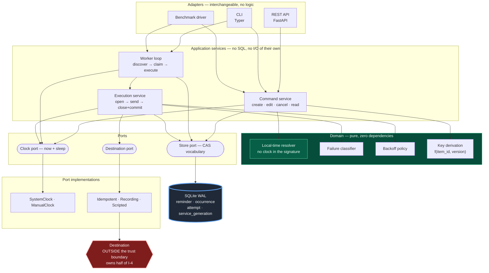
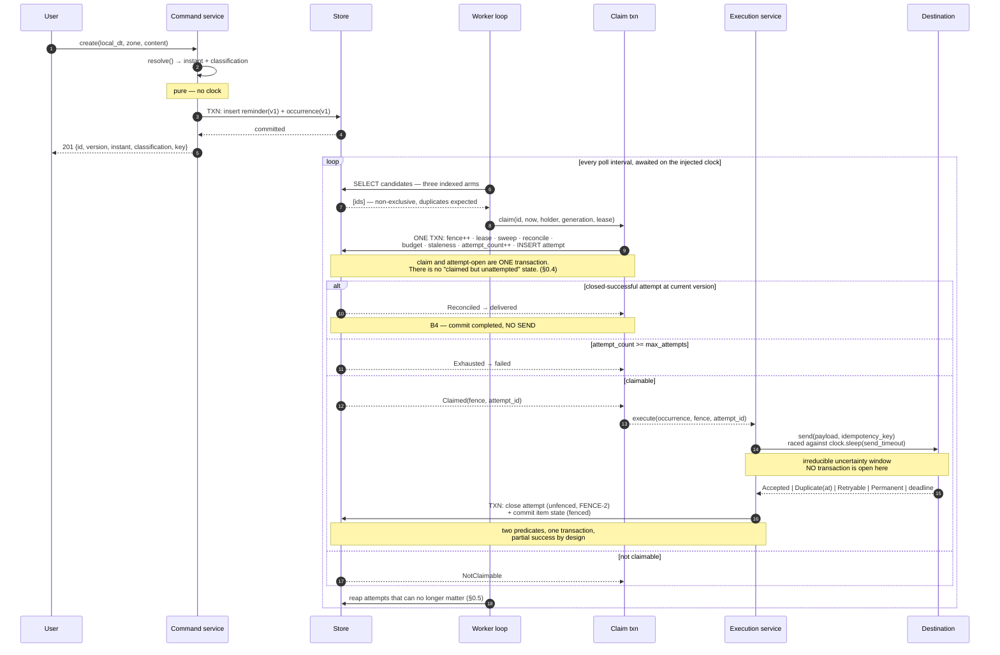
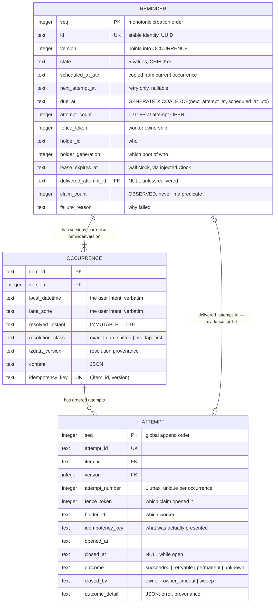
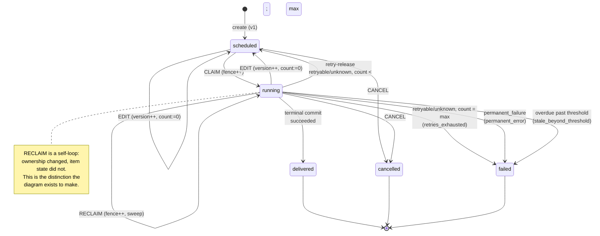
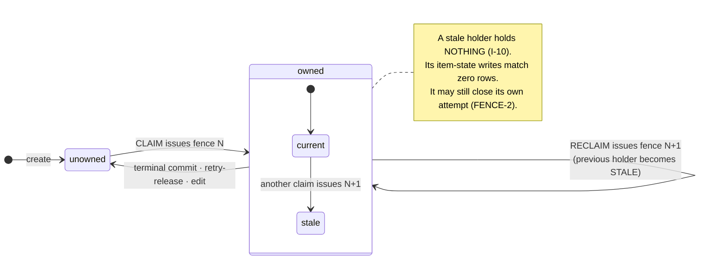
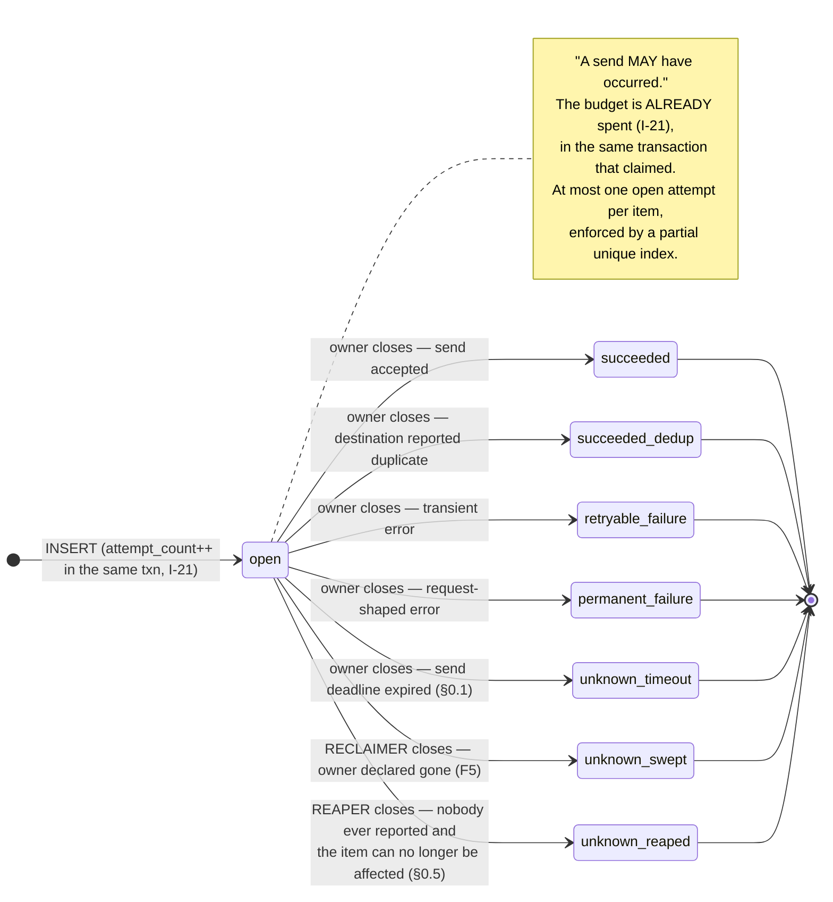

# Architecture and System Design — Durable Reminders and Follow-Ups

**Problem:** [problems/03-durable-reminders/README.md](problems/03-durable-reminders/README.md)
**Foundations:** [ANALYSIS.md](ANALYSIS.md) (why the problem is hard) · [CORRECTNESS_MODEL.md](CORRECTNESS_MODEL.md) (authoritative correctness model)

This document takes the correctness model as given and asks one question: **what is the smallest system that mechanically enforces it?**

The standing rule from the correctness model carries forward unchanged:

> **Every asserted invariant must name an explicit mechanism that enforces it, and the mechanism must be checkable at the persistence boundary.**

Architecture adds a second rule of its own:

> **Every mechanism must be reachable by a test that fails when the mechanism is removed.** A predicate nobody can break on purpose is a predicate nobody can trust.

---

## 0. Findings against the correctness model

The brief for this document says to surface genuine contradictions rather than quietly reinterpret them. Designing the implementation surfaced six: three extensions, one hole, and **two genuine over-claims** — one in §7's crash matrix and one in §12.2's headline conclusion.

| | Finding | Kind | Resolution |
| --- | --- | --- | --- |
| §0.1 | `unknown` has two producers, not one | extension | `closed_by` discriminates; send deadline is **clock-driven** |
| §0.2 | lease extension removed rather than fenced | narrowing | satisfies F3 vacuously |
| §0.3 | the store needs more than "conditional update" | extension | two further primitives named |
| §0.4 | §7's B0 marked `Terminates? yes` — **false under a crash loop** | **over-claim** | **fixed** — claim and attempt-open merged into one transaction; B0 ceases to exist |
| §0.5 | an open attempt is **stranded forever** when cancellation wins | **hole — violates I-16** | **fixed** — a reaper closes attempts that can no longer influence any decision |
| §0.6 | §12.2's *"lease duration is a performance parameter"* — **too strong** | **over-claim** | corrected: safety-neutral, **not** outcome-neutral |

### 0.1 `unknown` has a second producer, not only the reclaim sweep — **extension**

§8 of the correctness model defines `unknown` epistemically — *"we can never learn which world we were in"* — but enumerates exactly one producer: *"an attempt opened but not closed by its owner is swept to `unknown` by the reclaiming transaction."*

An **in-process send timeout** has identical epistemics. The request may have arrived; the acknowledgement may have been lost; we are in ANALYSIS §5.3's worlds A, B or C with no way to discriminate. Closing such an attempt as `retryable_failure` would make the history assert something we do not know.

**Resolution.** `unknown` is reachable by three producers, distinguished by a `closed_by` column: `sweep` (the reclaiming transaction), `owner_timeout` (the owner's own send deadline), and `reaper` (§0.5). The timed-out send is **cancelled, not abandoned** — the worker awaits that cancellation before closing the attempt, so one worker can never hold two overlapping sends for one occurrence.

**The deadline must come from the injected clock, not from the event loop.** `asyncio.timeout()` is measured by `loop.time()`, a monotonic real clock, so a send deadline expressed through it lives in a **different time domain** from every other temporal decision in the system. Under a `ManualClock` that makes the timeout path untestable, and it makes the startup assertion `send_timeout + margin < lease_duration` compare two incomparable quantities. The send is therefore raced against a clock-driven timer (§3.6), so the deadline is as advanceable as everything else. No invariant changes — the retry reuses the same key either way (§8 Q4), and the budget is consumed either way (§8 Q2). What changes is that the history becomes truthful about a case the model left to be mislabelled, and §20 decision 7 (single budget for `unknown`) now governs a non-crash path as well.

### 0.2 Lease extension is removed rather than fenced — **narrowing**

F3 and I-11 require lease extension to be fenced *if it exists*. This architecture does not implement it. Instead the send carries an explicit deadline, and startup validation enforces `send_timeout + margin < lease_duration`.

This is strictly safer than a fenced extension: it satisfies §5.1 row 5 vacuously. A mechanism that does not exist cannot be misused, cannot be forgotten in one code path, and cannot be exercised by a stale worker. Worker-owned state writes drop from five to four. The fenced form remains specified in the correctness model for any future destination whose execution time cannot be bounded.

### 0.3 The store requires more than "conditional update" — **extension**

§20 decision 8 states the storage requirement as *"conditional update and cross-process durability."* Implementation needs two more primitives:

1. **Multi-statement atomicity.** The reclaim transaction must take the fence, sweep open attempts to `unknown`, and apply the exhaustion rule as one unit (F5 + EXHAUST-1). Three statements, one commit.
2. **A rows-matched count.** Every CAS in this design is *decided* by whether it matched zero rows or one. A store that cannot report that turns every CAS into a read-then-write, which is the racy construction the model rejects (§16).

Both are ordinary SQL. The point is that the requirement list was incomplete, and an incomplete requirement list is how a store gets chosen that cannot express the model.

### 0.4 B0 in a crash loop does not terminate — **a genuine over-claim**

§7's crash matrix marks **B0** (crash after claim, before attempt open) as `Count++? no` — correct, nothing was attempted — and `Terminates? yes`.

`Terminates? yes` holds for a *single* B0 crash. It does not hold for a **crash loop**. A process that dies deterministically between claiming and opening an attempt consumes no budget, so the item is reclaimed after every lease expiry, forever. `attempt_count` never moves. I-2 is not reached, because I-2's bound `(max_attempts × max_backoff) + (reclaims × lease_duration)` silently assumes `reclaims` is bounded — and it is bounded only because reclaims normally sweep an open attempt and consume budget. B0 is the one case that does not.

**The tempting fix is wrong.** Bounding *claims* rather than attempts would make a healthy service whose lease is shorter than its execution time exhaust items for no reason — putting lease duration back into the correctness path, which is the one place a timing guess must never live.

**The correct fix is to delete the boundary.** B0 exists only because claiming and opening an attempt are two transactions. Merge them:

```
   BEFORE                              AFTER
   TX1: claim, sweep, reconcile        TX1: claim, sweep, reconcile,
   COMMIT           ← B0 lives here          check budget, count++, INSERT attempt
   TX2: count++, INSERT attempt        COMMIT
   COMMIT                              send
   send
```

There is now no instant at which an item is claimed but unattempted. The earliest crash is **B1**, where the attempt row exists and the budget is already spent, so a crash loop consumes budget and terminates at `failed`. **B0 ceases to exist rather than being tolerated**, and the claim transaction becomes one coherent operation: *take ownership and begin an attempt, or resolve whatever the previous owner left behind.* §9.3 has the merged statement; §12 is one durable state shorter as a result.

Two things this also buys, neither of which was the goal:

- **The version pre-check becomes unnecessary.** Previously the claim returned a version and attempt-open asserted it had not moved. Now the claim reads the current version and opens the attempt for it atomically, so there is no stale-version window to check. The mechanism that caught an edit landing between claim and send is replaced by that window not existing.
- **`claim_count` stops being load-bearing, and stops meaning what it meant.** Before the merge, a claim without an attempt *was* a B0 crash, so `claim_count - attempt_count` counted them. After the merge that gap measures something else entirely (§4.2), and §0.6 — not a counter — is where lease tuning genuinely bites.

### 0.5 An open attempt is stranded forever when cancellation wins — **a hole, and it violates I-16**

```
   worker claims → attempt #1 opens → send in flight
   USER CANCELS       → state = 'cancelled'   (terminal)
   worker CRASHES     → attempt #1 never closes
```

The attempt stays `closed_at IS NULL` **forever**. The sweep that closes orphaned attempts lives inside the claim transaction, and a terminal item is returned by no discovery arm and can never be claimed again (I-8). Nothing will ever close it.

That is a direct violation of **I-16**, which states that an attempt left open by a dead worker *"is swept to `unknown` by the reclaiming transaction — history never lies by omission."* The invariant's mechanism assumes a reclaim will happen. Under cancellation, none ever does.

**The correctness model shares the hole.** Its §18 race matrix works through all twelve cancel-and-edit orderings and discusses only the *item's* final state; rows 8–11 never say what becomes of the attempt record. The hole was inherited, not introduced.

Cancellation is the only terminal transition that is both performed by a non-owner and not preceded by a sweep — `delivered` and `failed` are written by the owner in the same transaction that closes the attempt, and the staleness transition happens in the claim transaction *after* the sweep. A weaker form also affects **edit**: an edit sets the item back to `scheduled` with a possibly far-future instant, so an orphaned attempt can sit open until that instant arrives. Bounded, but the bound is a month if the user rescheduled by a month.

**Resolution: a reaper, not a sweep on cancel.** Having `cancel` close the attempt would be wrong — the worker may still return with a real answer, and FENCE-2 explicitly permits a fenced-out worker to close its own attempt. That is the *good* path (§15.3 cases 8–10) and it must not be pre-empted.

> **Rule REAP-1.** An open attempt becomes reapable once it can no longer influence any item-state decision — the item is terminal, **or** the attempt's version is no longer the item's current version — **and** `opened_at <= now - lease_duration`, giving the owner its full lease to report honestly first. A reaper closes it as `unknown` with `closed_by = 'reaper'`.

The lease-length delay is what answers the objection: we do not overwrite an attempt whose owner might still speak. We wait exactly as long as a reclaim would have waited, and apply the same inference.

**Why this cannot be folded into the claim, and why that does not break §2.3's principle.** Closing an attempt writes no item state, so it needs no fence (FENCE-2), so it cannot come from a claim — and a terminal item is unclaimable by construction. The principle *"recovery is a property of the claim"* was derived from the fencing rule, so where the fencing rule does not apply, neither does the principle. This sharpens it rather than contradicting it: **recovery of item state is a property of the claim; recovery of attempt records is not, because it requires no ownership.**

### 0.6 "Lease duration is a performance parameter" is too strong — **an over-claim**

§12.2 of the correctness model concludes:

> *"Fencing converts lease duration from a correctness parameter into a performance one. Choose it wrongly and the system is wasteful or slow to recover; it is never incorrect."*

The first half is right. The second half is false, and the design's own retry model is what breaks it:

```
   short lease → more reclaims → more attempts swept to `unknown`
               → `unknown` consumes the budget (§8 Q2)
               → the budget exhausts → state = 'failed'
```

```
   max_attempts = 3,  lease shorter than the send
   attempt #1 swept → unknown          count 1
   attempt #2 swept → unknown          count 2
   attempt #3 swept → unknown          count 3  →  FAILED
```

The destination may have been perfectly healthy and would have succeeded on any of them. **Lease duration therefore determines which terminal state an item reaches**, which is an outcome, not a latency.

**The corrected statement:**

> **Fencing makes lease duration irrelevant to *safety*, not to *outcome*.** At any lease value, no stale write commits, no duplicate logical effect occurs, and no invariant is violated. But because `unknown` consumes the retry budget, lease duration influences liveness and the terminal state reached. It is a safety-neutral, outcome-relevant parameter.

**The coupling is irreducible, which is why this is a correction and not a bug.** A separate budget for `unknown` outcomes (§20 decision 7's rejected alternative) does not remove it — a short lease would burn the `unknown` budget instead, relocating the coupling rather than eliminating it. Not counting swept unknowns at all *does* remove it, and §8 Q9 proves that reintroduces unbounded retries under a crash loop. Given bounded retries and lease-based reclaim, the coupling follows.

**What actually contains it is a configuration assertion that already exists** — and whose real purpose this finding reveals:

```
   assert send_timeout + margin < lease_duration
```

Its job is not lease hygiene. It is **budget protection**: it makes reclaim of a *live* worker rare, so spurious `unknown` outcomes do not consume the budget that real failures need. Stating that is the difference between an assertion someone might relax and one they will not.

Everything else in the correctness model is adopted verbatim.

---

## 1. Design goals

Derived from the correctness model, in the order they constrain the design. Each goal names the invariants it discharges, because a goal that cannot be traced to an invariant is a preference.

### 1.1 Correctness goals

| # | Goal | Invariants | Architectural consequence |
| ---: | --- | --- | --- |
| **C1** | Every decision that can be wrong is made by a **conditional write**, never by a read followed by a write | I-7, I-8, I-10, I-12, I-20 | The store port's vocabulary is CAS operations returning a matched-row count. There is no `save(item)` method. |
| **C2** | The **three concurrency dimensions stay separate** — intent, ownership, effect | §3, §4 | Three distinct columns, three distinct predicate positions, three distinct test suites. No code path may check one in place of another. |
| **C3** | **Occurrence facts are immutable by construction**, not by discipline | I-19 | Occurrence facts live in an append-only table with zero `UPDATE` statements against it. |
| **C4** | The terminal commit is **one statement** carrying version, fence, state and attempt evidence | I-6, I-7, I-8, I-12 | §21.3's one-line predicate is literally one SQL statement in one file. |
| **C5** | **No transaction spans an external call** | ANALYSIS §5.2 | The send happens between two transactions, never inside one. Enforced by the execution service's shape: `open_attempt()` → `await send()` → `close_and_commit()`. |
| **C6** | We claim **at-least-once execution** and **exactly-once logical effect**, and never conflate them | I-4, I-5 | The destination is modelled as outside the trust boundary, with our half and its half tested by separate suites. |

### 1.2 Durability goals

| # | Goal | Consequence |
| ---: | --- | --- |
| **D1** | The durable store is the **sole** source of truth. No in-memory structure is required for correctness. | Restart is modelled as "discard the entire object graph." Nothing needs rebuilding. |
| **D2** | Every value a predicate reads is persisted. | `version`, `state`, `fence_token`, `lease_expires_at`, `holder_id`, `holder_generation`, `attempt_count`, `next_attempt_at` are all columns. None is derived at runtime. |
| **D3** | Creation returns only after commit. | I-1. The API's `201` is a durability statement, not an acknowledgement. |
| **D4** | The scheduler holds **no** state. | Discovery is a read-only query. Losing a discovery batch costs one poll interval and nothing else. |

### 1.3 Concurrency goals

| # | Goal | Consequence |
| ---: | --- | --- |
| **N1** | Discovery, claiming and execution are **three separate operations** with different exclusivity. | Discovery: non-exclusive, read-only, duplicates expected. Claiming: exclusive, conditional. Execution: owned. |
| **N2** | Duplicate discovery and duplicate execution are **designed for**, not prevented. | The brief states duplicate firing as a premise. Claiming reduces frequency; the key removes observable effect. |
| **N3** | Worker count is a **deployment parameter**, not an architectural one. | One process with N tasks and N processes with one task each must be the same code with the same guarantees. The benchmark runs both. |
| **N4** | Lease duration is **safety-neutral but outcome-relevant**. | Changing it must not violate a safety invariant at any value. But lease expiry generates `unknown` attempts, `unknown` consumes retry budget, and an exhausted budget is `failed` — so it *does* change terminal outcomes (§0.6). The benchmark therefore varies the lease and asserts the **safety** set, never identical terminal counts. |

### 1.4 Recovery goals

| # | Goal | Consequence |
| ---: | --- | --- |
| **R1** | **Recovery of item state is a property of the claim.** No reconciler process, no startup sweep, no recovery mode. | Every item-state recovery case is resolved by the ordinary claim transaction (§2.3). Recovery of *attempt records* is the one exception, and for a principled reason: it needs no fence, so it cannot come from a claim (§0.5). |
| **R2** | Recovery never re-sends when a successful attempt for the current occurrence already exists. | §7 B4 / F7, implemented inside the claim transaction. |
| **R3** | Restart latency is bounded and stated. | Overdue `scheduled`: one poll interval. Orphaned `running`: one lease duration, or ≈0 for our own previous generation. |

### 1.5 Observability and audit goals

| # | Goal | Consequence |
| ---: | --- | --- |
| **O1** | *"Why did this reminder not arrive?"* is answerable from stored rows alone. | Attempt history with outcome, `closed_by` provenance, fence, holder and key on every row. |
| **O2** | The difference between **intent** and **reality** is visible. | I-18. A superseded-but-succeeded attempt is a first-class, queryable record. |
| **O3** | The idempotency boundary's work is **counted**, not assumed. | A `duplicate_suppressed` counter. A benchmark run that never increments it has not exercised AC4. |
| **O4** | Pathologies deliberately left unenforced are still **visible**. | `late_close_rejected` and `swept_attempts` (lease thrash — and per §0.6 that costs retry budget, not just noise), `reclaim_of_live_holder`, `reaped_attempts`. |

### 1.6 Simplicity constraints

Stated as prohibitions, because simplicity is enforced by what you refuse to add.

| # | Constraint | Rationale |
| ---: | --- | --- |
| **S1** | **No component becomes a process** unless a process boundary is required for correctness. | The only boundaries that matter are the store and the destination, and both are already outside the process. |
| **S2** | **No message broker, no external queue, no workflow engine.** | The brief excludes them, and §3.7 shows each adds a second source of truth — which is the failure this problem is about. |
| **S3** | **No mechanism whose only purpose is to satisfy an invariant a predicate already satisfies.** | Cancel does not bump the version (model §10.1). Lease extension is removed (§0.2). |
| **S4** | **No SQL default reads the database's clock.** | `DEFAULT CURRENT_TIMESTAMP` silently bypasses the injected clock and makes every timestamp non-deterministic. All times are supplied by the caller from `Clock.now()`. |
| **S5** | **No abstraction without a caller.** | A port exists because two implementations exist: `Clock` (system, manual), `Destination` (recording, idempotent, scripted), `Store` (the CAS vocabulary is itself the interesting artefact). Nothing else is a port. |

---

## 2. Architecture overview

### 2.1 The shape of the system, in one paragraph

A **command layer** turns user intent into occurrences and writes them durably. A **resolver** converts local intent into an instant exactly once per occurrence, with no access to a clock. A **discovery query** reads the store for candidates and holds nothing. A **claim transaction** is the system's single arbitration and reconciliation point: it issues a fence, closes orphaned history, applies the retry budget, and completes any commit a crash left unfinished. An **execution service** opens an attempt, sends through a destination port, then closes the attempt and the item's state in one final transaction whose predicate carries version, fence and evidence. Everything else is an adapter.

### 2.2 Logical components

Eight logical modules. **All of them run in one process by default.** The last column is the only place process boundaries are discussed.

| Component | Responsibility | Holds state? | Separate process? |
| --- | --- | --- | --- |
| **Command service** | create / edit / cancel / read. Owns version CAS. | no | no — a library, called by both adapters |
| **Local-time resolver** | `(local_datetime, zone) → (instant, classification)`. Pure. | no | no — a pure function |
| **Store** | the only component containing SQL. Exposes a CAS vocabulary. | **yes — all of it** | no — a library over a database |
| **Discovery** | one read-only query returning candidate ids | no | no |
| **Claim / reconciliation** | the arbitration point: fence issue, sweep, exhaustion, B4 completion | no (writes the store) | no |
| **Execution service** | send → close + commit (the attempt is opened by the claim) | no | no |
| **Attempt reaper** | closes attempts that can no longer influence any decision (§0.5) | no | no — one query and one statement in the worker loop |
| **Destination** | the external boundary | n/a | **yes, conceptually** — it is the other party to I-4 |
| **Worker loop** | drives discovery → claim → execute → reap on the injected clock | no | optionally — `--worker-only` |

Two components deserve emphasis, because the temptation to split them is strong and wrong:

- **Discovery is not a scheduler.** It owns no timers, no priority queue, no in-memory heap. It is a `SELECT`. Promoting it to a service would create a component whose availability affects correctness, which D4 forbids. If discovery stops, nothing is lost; work is found on the next poll.
- **Claim is not a lock service.** It is one `UPDATE` with a compound predicate. A lock service would be a *second source of truth* about ownership, and the entire point of fencing is that ownership is a column **in the same row as the state it guards**, mutated by the same atomic write.

### 2.3 The structural decision: recovery of item state is a property of the claim

Every **item-state** recovery requirement in the brief and in §14 of the correctness model resolves inside the ordinary claim transaction. There is no recovery subsystem.

| Recovery case (model §14) | Resolved by |
| --- | --- |
| `scheduled`, overdue | discovery arm 1 (`due_at <= now`), then an ordinary claim |
| `running`, lease expired | discovery arm 2, then the reclaim branch of the same claim |
| `running`, held by our own previous generation | discovery arm 3, then the same reclaim branch |
| orphaned open attempt, item **still claimable** | the sweep statement inside the claim transaction |
| closed-successful attempt whose commit was missed (B4) | the reconciliation branch inside the claim transaction |
| retryable failure awaiting retry | discovery arm 1 (`due_at` = `next_attempt_at`), then an ordinary claim |
| exhausted item | the exhaustion branch inside the claim transaction |
| **orphaned open attempt, item terminal or superseded** | **the reaper — see below** |

**The one exception, and why it is a sharpening rather than a leak.** An item that reached a terminal state through *cancellation* can never be claimed again (I-8), so a sweep inside the claim will never reach its orphaned attempt — it would stay open forever, violating I-16 (§0.5). Closing that attempt writes no item state, so it needs no fence (FENCE-2), so it *cannot* come from a claim.

> **Recovery of item state is a property of the claim, because item state needs a fence. Recovery of attempt records is not, because attempt records do not.**

The principle was always a consequence of the fencing rule. Where the fencing rule does not apply, the principle does not either — and noticing that is what turns a leaky generalisation into an exact one.

Three consequences of the claim-side half, each a direct answer to a question a reviewer will ask.

1. **Restart needs no special code path.** A restarted process runs the same loop it ran before. AC2 is satisfied by the *absence* of a feature.
2. **Recovery correctness is exercised by every normal claim.** A separate recovery path would be code that runs only after a crash — the least-tested code in any system, doing the most delicate work. Here the delicate work is on the hot path, executed thousands of times per benchmark run.
3. **Every hard case is decided in one place.** The claim's result type is a four-way union, and those four arms *are* the recovery matrix. There is exactly one function to review.

### 2.4 Component diagram



Two things the diagram asserts deliberately:

- **The domain box has no outgoing edges.** Resolution, classification, backoff and key derivation depend on nothing — not the clock, not the store. That is what makes I-13's "no clock in the signature" a structural property instead of a rule someone must remember.
- **The destination sits outside every box.** It is the only component that can break I-4 without a bug on our side. Drawing it inside the system would be the diagram telling a lie.

### 2.5 Control flow, end to end



The send is the only place in the system where an external call happens, and it is the only place where no transaction is open. That is not a coincidence; it is C5.

---

## 3. Concrete technology choice

### 3.1 The choices

| Concern | Choice | One-line reason |
| --- | --- | --- |
| Primary database | **SQLite, WAL mode**, one file | The model needs exactly one exotic primitive — a conditional `UPDATE` reporting rows matched — and SQLite has it with zero setup |
| API framework | **FastAPI** + Pydantic v2 | Typed request/response models are the API contract; OpenAPI is generated, which a reviewer can click |
| CLI | **Typer** | The benchmark must run without an HTTP server; the CLI calls the same application services in-process |
| Worker model | **asyncio**, N tasks per process, N processes optional | Deterministic single-threaded interleaving is what makes race tests provable rather than flaky (§3.4) |
| Scheduler | **Polling the store**, interval awaited on the injected clock | Durable state as the only source of truth. No timer object anywhere. |
| Delivery | A `Destination` **port** with three implementations | Our half of I-4 and the destination's half must be testable independently (§10) |
| Testing clock | **`Clock` port owning both `now()` and `sleep()`** | A clock that only tells the time is insufficient — anything that waits must wait *on the clock* (§3.6) |
| Language / tooling | Python 3.14, mypy strict, ruff, pytest + pytest-asyncio | Already validated in this repository; `zoneinfo` + `tzdata` is the reference IANA implementation |

### 3.2 Why SQLite, stated as a requirements argument

The correctness model, plus §0.3, defines the complete storage requirement:

1. Conditional `UPDATE` with a compound predicate, reporting rows matched
2. Multi-statement atomic transactions
3. Cross-process durability (survives `kill -9` and process exit)
4. An index on an integer/timestamp column for the due-work query
5. A uniqueness constraint and a `CHECK` constraint
6. A partial (filtered) unique index — for "at most one open attempt per item" (§4.5)

That is the whole list. It is satisfied by SQLite, PostgreSQL, MySQL and every other SQL database. **It is not satisfied by Redis** (no compound conditional update without Lua, no durable transactions by default), **not by a JSON file** (no atomicity), and **not by an in-memory dict** (fails requirement 3, which is the entire problem).

Given that the list is satisfied by all of them, the tiebreaker is reviewability:

| Property | SQLite | PostgreSQL |
| --- | --- | --- |
| Setup for a reviewer | `pip install -e .` — nothing else | Install a server, create a role, create a database, or run Docker |
| Test isolation | a fresh file, or `:memory:`, per test | a schema or database per test, plus teardown |
| Restart proof | delete the object graph, reopen the same file | same, plus a running server |
| Inspect state after a failed benchmark | `sqlite3 bench.db` on the artefact file | requires the server to still be up |
| Concurrent writers | serialised, one at a time (WAL: one writer, many readers) | true concurrent writers with row-level locks |
| `SKIP LOCKED` batch claiming | not available | available |

The last two rows are the honest costs, and both are irrelevant at this problem's scale and relevant at production scale. See §3.3.

**The decisive argument is not convenience, it is that the *predicates* do not depend on the choice.** Every `WHERE` clause in §7–§9 is standard SQL. The `Store` port exists so the dependency is explicit.

**But the migration is not one file, and claiming otherwise would be the easy lie.** Three layers port differently:

| Layer | Portable? | What actually changes |
| --- | --- | --- |
| **CAS predicates** | **yes, verbatim** | nothing — `WHERE version=? AND fence_token=? AND state='running'` is ANSI |
| **DDL and triggers** | **no** | `INTEGER PRIMARY KEY AUTOINCREMENT` → `GENERATED ALWAYS AS IDENTITY`; `RAISE(ABORT)` triggers → a `plpgsql` function plus a trigger; `json_object()` → `jsonb_build_object()`; `BEGIN IMMEDIATE` → nothing (PostgreSQL has no equivalent and needs none) |
| **The correctness *argument*** | **no — and this is the one that matters** | see below |

Partial indexes, `ON CONFLICT DO UPDATE`, `RETURNING` and stored generated columns all exist in PostgreSQL and port unchanged. The trap is elsewhere:

> **The CAS semantics are sound on SQLite because writers serialise. On PostgreSQL they are sound because `READ COMMITTED` re-evaluates an `UPDATE`'s predicate after waiting on a row lock.** Same observable behaviour, **different proof.** Porting means re-deriving the argument, not translating the syntax.

That is not a formality. Under PostgreSQL's `REPEATABLE READ` the same statement raises a serialisation failure instead of matching zero rows, so "0 rows means someone else won" — the assumption every one of these operations is built on — becomes "an exception means someone else won," and every call site changes shape. The isolation level is part of the contract, and it is invisible in the SQL.

So: SQLite is the right choice here and the design is honestly portable at the predicate layer. "One adapter" was an overstatement.

### 3.3 The two honest costs of SQLite, and why they are acceptable here

**Cost 1 — writers serialise.** In WAL mode SQLite permits one writer and many concurrent readers. Under contention a writer receives `SQLITE_BUSY`.

Why it is acceptable, and partly *desirable*:

- Every transaction in this system is one or two statements over one row and **never** spans an external call (C5). Write transactions are microseconds. `busy_timeout` of a few seconds absorbs contention entirely at any plausible benchmark scale.
- Serialised writers make the CAS semantics trivially correct: there is no isolation-level subtlety, no phantom read, no `SERIALIZABLE` retry loop to get wrong. The model's predicates work under the strongest isolation available, for free.
- It is a *scaling* limit, not a correctness limit. The distinction matters: the system does not become *incorrect* under contention, it becomes *slower*.

**Cost 2 — no `SKIP LOCKED`.** PostgreSQL's `SELECT ... FOR UPDATE SKIP LOCKED` lets N workers each grab a disjoint batch in one round trip. Without it, N workers discover overlapping candidates and N−1 lose each claim race.

Why it is acceptable: **losing a claim race is free.** It is one failed conditional `UPDATE` — no rollback of external effect, no compensating action, no backoff required. This is a direct consequence of N1/N2: because the design already assumes duplicate discovery, it does not need a mechanism to prevent it. A cheap mitigation (shuffle the candidate batch locally before claiming, §8.4) removes the lockstep entirely without any coordination.

### 3.4 Why asyncio, and why this is not a fashion argument

The usual argument ("the workload is I/O-bound") is true and weak. The real argument is **testability of races**.

The correctness model's §18 enumerates twelve edit/cancel-versus-execution orderings and asserts each resolves deterministically. A design is only credible if those orderings can be *constructed* in a test, not hoped for.

| Model | How you construct "cancel lands between the send starting and the send returning" |
| --- | --- |
| **Threads** | Sleep in the destination and hope the scheduler cooperates. Flaky; fails under load; passes for the wrong reason. |
| **asyncio** | The destination awaits an `asyncio.Event`. The test performs the cancel, then sets the event. The interleaving is **specified, not sampled.** |

Single-threaded cooperative scheduling means every suspension point is visible in the source as an `await`, and a test can interpose at exactly the suspension point it cares about. That converts §18 from a table of claims into a table of executable proofs, which is the difference between a design document and a verified one.

Secondary benefits: the injected clock's `sleep()` integrates naturally with `await`, and virtual time requires cooperative scheduling to be deterministic at all.

**What asyncio does not buy us:** protection from genuine multi-process concurrency. Two OS processes racing on the same SQLite file are genuinely concurrent, and no amount of single-threaded reasoning helps. That case is arbitrated exclusively by the store's conditional writes — which is the point of putting the arbitration there.

### 3.5 Why not Redis, Kafka, Temporal, Celery, or a workflow engine

Each is evaluated against one question: **does it remove a mechanism this design needs, or add a second source of truth?**

| Technology | What it would provide | Why it is rejected |
| --- | --- | --- |
| **Redis** (as a queue or lock) | Fast claiming; `SETNX` locks; sorted-set delay queues | Two sources of truth. The item's state lives in SQL and its claim lives in Redis, so a Redis failure or eviction desynchronises ownership from state — and fencing specifically requires ownership to be **in the same row as the state it guards**, mutated by the same atomic write. A Redis lock is the textbook example of the distributed lock that *needs* a fencing token bolted on. We already have the fencing token, and having it in the database makes the lock redundant. |
| **Redis** (as the primary store) | Speed | Fails the requirements list: durability is configurable-and-lossy by default, and a compound conditional update needs Lua. Choosing a store whose default is "maybe durable" for a problem titled *durable* reminders is a category error. |
| **Kafka** | Durable log, consumer groups, partition-exclusive consumption | A log is the wrong shape for this problem. Reminders are **mutable and cancellable before execution**; a log is append-only and consumed in offset order. Editing a reminder becomes a tombstone-plus-compaction exercise, and "deliver at 08:00 local" is not an offset. Partition-exclusive consumption would replace claiming — but only at the partition level, which does not give per-item leases or expiry. Every hard part of this problem would remain, plus a broker. |
| **Temporal / Cadence** | Durable timers, automatic retries, workflow state persistence, replay-based recovery | It would solve the problem almost entirely — **which is why it is excluded.** The brief says a distributed workflow platform is not expected, and the exercise is explicitly evaluating whether the candidate can build the durable-state, idempotency and fencing machinery. Delegating the assessed skill to a platform answers a different question. Worth stating honestly: in production, Temporal is a defensible choice for this feature, and the trade-off is that its execution model becomes load-bearing for correctness. |
| **Celery / RQ / Dramatiq** | Task queues with `countdown`/`eta` scheduling | The `eta` lives in the broker, so the broker becomes a second source of truth for *when*, while the database owns *what*. Cancelling means revoking a task the broker may already have dispatched — precisely the race this design solves with a state predicate. Also: most task queues reset their retry counters on worker restart, reintroducing ANALYSIS failure mode "in-memory attempt counter" through a dependency. |
| **APScheduler** (in-process) | Cron-like and date triggers | Its job store can be SQL, so it looks compatible. But its scheduling model is an in-memory timer set rebuilt from the store at boot, and a job that fires while the process is down is either missed or coalesced depending on `misfire_grace_time` — making AC2's policy a library setting rather than our documented decision. Polling on an instant column gives us the policy explicitly. |
| **A cron process + a script** | Simplicity | No claiming, no leases. Two overlapping cron runs produce two unarbitrated executions. It would work only by making duplicate execution impossible, which §5 proves is not achievable. |

**The general principle:** every one of these adds a component that knows *when work should run*. That knowledge already lives in `reminder.due_at`, and the correctness model's central commitment is that durable state — not a timer, not a broker offset, not a scheduler's memory — is the sole source of truth. Adding any of them creates a second answer to the same question, and the failure mode of two answers is that they disagree.

### 3.6 The clock port owns `sleep`, and why that is load-bearing

A `Clock` with only `now()` is insufficient, and the reason is not subtle:

```
   while True:
       work = discover(clock.now())      # uses the injected clock — testable
       ...
       await asyncio.sleep(poll_interval) # uses the REAL clock — untestable
```

The poll interval is the system's heartbeat. If it waits on real time, then advancing a fake clock by six hours does not cause six hours of polling, and the benchmark's *"advance an injected clock until processing settles"* cannot work. Worse, a test that "passes" would be passing because of a real 50 ms sleep, which is ANALYSIS §9.9's failure repeated one layer down.

```python
class Clock(Protocol):
    def now(self) -> datetime: ...              # tz-aware UTC, always
    async def sleep(self, seconds: float) -> None: ...

class ManualClock(Clock):
    # sleep() registers a waiter with a deadline and parks.
    # advance(delta) moves `now` and releases waiters in deadline order,
    # yielding to the event loop between each so work triggered by an
    # earlier wakeup completes before a later wakeup is released.
    def advance(self, delta: timedelta) -> None: ...
    def advance_to(self, instant: datetime) -> None: ...
    def next_deadline(self) -> datetime | None: ...
```

Releasing waiters **in deadline order with a yield between each** is the detail that makes virtual time faithful. Releasing them all at once would let a wakeup scheduled for `t+60` observe work that should have happened at `t+10` as already complete — an ordering real time would never produce, and therefore a source of tests that pass under virtual time and fail in production.

**The corollary is a lint rule:** `asyncio.sleep`, `time.sleep`, `datetime.now`, `datetime.utcnow` and `date.today` appear in exactly one file — `SystemClock` — and nowhere else. Enforced by a ruff `flake8-tidy-imports` ban plus one grep-based test, so it is a mechanism rather than a convention.

**`asyncio.timeout` is on that banned list, and the reason is easy to miss.** It is the obvious way to bound the send, and it is measured by `loop.time()` — a monotonic *real* clock. Using it would put the send deadline in a **second time domain**:

```
   scheduling, leases, backoff, polling  →  ManualClock      (advanceable)
   send deadline via asyncio.timeout     →  event loop clock (real)
```

Two consequences, both fatal to the testing story. The `timeout → unknown → retry` path becomes either a real ten-second wait or a race. And the startup assertion `send_timeout + margin < lease_duration` compares a real-clock quantity against a fake-clock one, so under a `ManualClock` — the mode every test runs in — it is not merely weak, it is **meaningless**.

The deadline is therefore a race against a clock-driven timer:

```python
async def send_within(dest, envelope, clock, timeout_s) -> DeliveryOutcome:
    send  = asyncio.create_task(dest.send(envelope))
    timer = asyncio.create_task(clock.sleep(timeout_s))   # the INJECTED clock
    done, _ = await asyncio.wait({send, timer}, return_when=asyncio.FIRST_COMPLETED)
    if send in done:
        timer.cancel()
        return send.result()
    send.cancel()                       # cancel, never abandon
    await asyncio.gather(send, return_exceptions=True)   # and WAIT for it to unwind
    raise SendDeadlineExceeded
```

Two rules travel with it. The send is **cancelled and awaited**, never abandoned — otherwise one worker can hold two overlapping sends for one occurrence, which corrupts `late_close_rejected` accounting and lets a close land after a retry has opened the next attempt. And nothing on this path catches `BaseException`: `CancelledError` derives from it, and swallowing a cancellation is how a worker becomes unstoppable.

Under `SystemClock`, `clock.sleep` *is* `asyncio.sleep`, so production behaviour is unchanged. The only thing that changed is that the deadline is now as advanceable as everything else — which §18.4 turns out to depend on in a way that is not obvious.

### 3.7 Deployment topologies

One binary, three modes, no new components.

```
   Mode A  (default)     one process: API + N worker tasks        ← development, demo, tests
   Mode B                one API process + M worker processes     ← proves N3 with real OS concurrency
   Mode C                worker-only, run once and exit           ← the benchmark's restart phases
```

Mode B exists specifically so that "what changes with multiple workers?" (a question the brief requires answering) is demonstrated by running it, not by arguing about it.

---

## 4. Data model

### 4.1 Four tables, and the reason there are four

The naive model is one table. It fails I-19: if the resolved instant lives on a mutable row, immutability is a rule someone must remember rather than a property of the schema. The split is driven entirely by **mutability class**.

| Table | Mutability | Enforces |
| --- | --- | --- |
| `occurrence` | **insert-only.** Zero `UPDATE` statements exist against it. | I-19 — occurrence facts (instant, classification, key, content, local intent) cannot move |
| `attempt` | **insert, then exactly one `UPDATE`** (open → closed), then frozen | I-16, I-18 — history is append-only and never rewritten |
| `reminder` | **fully mutable** — but only through named CAS statements | I-7, I-8, I-12, I-20 — every write carries a predicate |
| `service_generation` | one row per holder identity, incremented at boot | fast reclaim (§9.5) |

The decisive property: **`reminder` holds no occurrence facts.** It holds a `version` that points into `occurrence`. So the question *"could an edit or a worker move a resolved instant?"* has a structural answer — there is no statement that can.



### 4.2 `reminder` — current state

```sql
CREATE TABLE reminder (
    -- identity ────────────────────────────────────────────────────────────
    seq                  INTEGER PRIMARY KEY AUTOINCREMENT,   -- monotonic order
    id                   TEXT    NOT NULL UNIQUE,             -- stable identity
    client_request_id    TEXT    UNIQUE,                      -- optional, §16.7
    request_fingerprint  TEXT,                                -- hash of the CREATE payload;
                                                              -- immutable, never reflects edits

    -- intent currency ─────────────────────────────────────────────────────
    version              INTEGER NOT NULL CHECK (version >= 1),

    -- lifecycle ───────────────────────────────────────────────────────────
    state                TEXT    NOT NULL CHECK (state IN
                            ('scheduled','running','delivered','cancelled','failed')),
    failure_reason       TEXT    CHECK (failure_reason IS NULL OR failure_reason IN
                            ('retries_exhausted','permanent_error','stale_beyond_threshold')),

    -- scheduling index — authority is occurrence.resolved_instant ──────────
    scheduled_at_utc     TEXT    NOT NULL,                    -- copied at create/edit
    next_attempt_at      TEXT,                                -- written only by retry-release
    due_at               TEXT    GENERATED ALWAYS AS
                            (COALESCE(next_attempt_at, scheduled_at_utc)) STORED,

    -- retry state ─────────────────────────────────────────────────────────
    attempt_count        INTEGER NOT NULL DEFAULT 0 CHECK (attempt_count >= 0),
    max_attempts         INTEGER NOT NULL CHECK (max_attempts >= 1),

    -- worker ownership ────────────────────────────────────────────────────
    fence_token          INTEGER NOT NULL DEFAULT 0,
    holder_id            TEXT,
    holder_generation    INTEGER,
    lease_expires_at     TEXT,

    -- delivery evidence — I-6 ─────────────────────────────────────────────
    delivered_attempt_id TEXT,

    -- observed, never enforced — §0.4 ─────────────────────────────────────
    claim_count          INTEGER NOT NULL DEFAULT 0,

    created_at           TEXT    NOT NULL,
    updated_at           TEXT    NOT NULL,

    -- structural invariants ───────────────────────────────────────────────
    CHECK ( (state = 'running') = (lease_expires_at  IS NOT NULL
                               AND holder_id         IS NOT NULL
                               AND holder_generation IS NOT NULL) ),
    CHECK ( (state = 'delivered') = (delivered_attempt_id IS NOT NULL) ),
    CHECK ( (state = 'failed')    = (failure_reason      IS NOT NULL) ),
    CHECK ( (client_request_id IS NULL) = (request_fingerprint IS NULL) ),

    -- the current occurrence exists …
    FOREIGN KEY (id, version)
            REFERENCES occurrence(item_id, version),
    -- … and the scheduling index AGREES with it.  This is the mechanism, not a convention.
    FOREIGN KEY (id, version, scheduled_at_utc)
            REFERENCES occurrence(item_id, version, resolved_instant),
    -- delivery evidence belongs to THIS occurrence, not a superseded one
    FOREIGN KEY (id, version, delivered_attempt_id)
            REFERENCES attempt(item_id, version, attempt_id)
);

CREATE INDEX idx_due         ON reminder(due_at)                    WHERE state = 'scheduled';
CREATE INDEX idx_lease       ON reminder(lease_expires_at)          WHERE state = 'running';
CREATE INDEX idx_holder_gen  ON reminder(holder_id, holder_generation) WHERE state = 'running';
```

Five design points, each answering a question a reviewer will actually ask.

**Why `seq INTEGER PRIMARY KEY AUTOINCREMENT` alongside a UUID `id`?** Under a `ManualClock`, twenty reminders created in one benchmark phase share the *identical* `created_at`. Any ordering by timestamp is therefore ambiguous, and any report sorted by it is non-deterministic. A monotonic sequence is the only stable tiebreak. This is a trap that exists **only** because time is injected — a real clock hides it behind microsecond jitter, which means it would have surfaced as an intermittently-reordered benchmark report rather than as a design question.

**Why is `due_at` a generated column and not application-maintained?** Because two writers would otherwise maintain one meaning. `scheduled_at_utc` is written only by create/edit (copied from the occurrence); `next_attempt_at` is written only by the retry-release. Each has exactly one writer. `due_at` is derived by the database from both, so **divergence is not possible**, rather than being prevented by a convention. The alternative — a third column updated by both paths — is one forgotten `UPDATE` away from an item that is never discovered again. (Portability: PostgreSQL has the same feature; a store that lacks it uses `COALESCE(next_attempt_at, scheduled_at_utc)` inline in the discovery query, with the same result and a slightly less useful index.)

**Why the composite FK on `scheduled_at_utc`?** Because the paragraph above only removed *half* the duplication problem. `due_at` cannot diverge from its two inputs — but `scheduled_at_utc` is a **copy** of `occurrence.resolved_instant`, and the document elsewhere calls the occurrence the authority. "Single-writer discipline" is precisely the kind of argument the standing rule rejects: a bug in the edit path could leave the scheduler following an instant the occurrence does not contain, and every other invariant would still hold.

```sql
FOREIGN KEY (id, version, scheduled_at_utc)
        REFERENCES occurrence(item_id, version, resolved_instant)
```

The database now **refuses to store** a reminder whose scheduling index disagrees with its current occurrence. It costs one extra unique index on `occurrence` (§4.3), it is declarative rather than a trigger, and it is the same technique already used for `delivered_attempt_id` — which is what makes leaving this one to discipline an inconsistency rather than merely an omission.

One consequence for the edit path: the new `occurrence` row must be inserted **before** the reminder CAS, so that the FK target exists (§7.2). That is not a cost; it turns the `occurrence` primary key into a second, independent arbiter of concurrent edits.

**Why the `(state='running') = (lease fields NOT NULL)` CHECK?** This closes an I-2 hole found while designing §7. Transitions *out* of `running` clear the lease fields, because a claim no longer exists. If any path could leave `state='running'` with a `NULL` lease, the reclaim predicate `lease_expires_at <= now` would never match and the item would be stranded forever — a liveness violation invisible to every other check. The `CHECK` makes it impossible to write that row.

**Why the composite FK on `delivered_attempt_id`?** F6 requires the terminal commit to reference a closed-successful attempt; §7.1 adds that the attempt's version must equal the item's current version, or a superseded occurrence's success would be recorded as delivery. `FOREIGN KEY (id, version, delivered_attempt_id) → attempt(item_id, version, attempt_id)` makes the **version agreement** structural: the database refuses to link an attempt belonging to another occurrence. The remaining part — that the outcome is `succeeded` — is in the commit predicate (§9.6) and in a trigger, since a foreign key cannot express it.

**Why is `claim_count` here if nothing reads it?** It is pure observability, and after §0.4's fix it is no longer load-bearing for anything.

**What it does *not* measure is worth stating, because an earlier draft got it backwards.** That draft read the gap `claim_count - attempt_count` as a lease-thrash signal. It is not one, and the reason is the merge itself: under thrash, worker A claims (both counters +1), its lease expires, worker B reclaims — and B's claim transaction sweeps A's attempt *and opens its own*, so **both counters increment again**. Lease thrash moves the gap not at all. It is not a weak signal; it is silent.

The gap moves only on the three paths where a claim short-circuits into a terminal decision before step 6 runs:

```
   claim → reconcile (B4) → delivered     claim_count++   attempt_count unchanged
   claim → exhaustion      → failed       claim_count++   attempt_count unchanged
   claim → staleness       → failed       claim_count++   attempt_count unchanged
```

Each is terminal, so each item contributes at most one to the gap, ever. `claim_count - attempt_count` is therefore a **recovery-activity** count — *"how many claims resolved a partial state instead of doing work"* — which is a useful number and is the opposite of what the draft labelled it.

**The error is worth naming, because it is the class §23.5 describes.** Before the merge, a claim with no attempt genuinely *was* a B0 crash, and the gap counted them. The merge deleted B0; the metric was carried across and re-justified rather than re-derived. The lesson applies to observability as much as to predicates: **a metric's meaning is a property of the code that increments it, so changing that code invalidates the meaning even when the counter still compiles.** §20.6 has the counters that actually measure thrash.

### 4.3 `occurrence` — version and occurrence identity

`occurrence = (item_id, version)` is the primary key. That is the whole representation: **occurrence identity is the primary key of a table, not a convention applied to a composite value.**

```sql
CREATE TABLE occurrence (
    item_id           TEXT    NOT NULL,
    version           INTEGER NOT NULL CHECK (version >= 1),

    -- the user's intent, retained verbatim — never recomputed
    local_datetime    TEXT    NOT NULL,   -- '2026-03-08T02:30:00', no offset, no zone
    iana_zone         TEXT    NOT NULL,   -- 'America/New_York'

    -- the resolution: computed once at version creation, immutable — I-19
    resolved_instant  TEXT    NOT NULL,   -- '2026-03-08T07:30:00Z'
    resolution_class  TEXT    NOT NULL CHECK (resolution_class IN
                          ('exact','gap_shifted','overlap_first')),
    tzdata_version    TEXT    NOT NULL,   -- '2026d' — resolution provenance

    content           TEXT    NOT NULL,   -- JSON {"body": ..., "recipient": ...}

    -- external-effect identity: our half of I-4
    idempotency_key   TEXT    NOT NULL UNIQUE,

    created_at        TEXT    NOT NULL,
    created_by        TEXT    NOT NULL CHECK (created_by IN ('create','edit')),

    PRIMARY KEY (item_id, version)
    -- NO foreign key back to reminder(id).  See "Why there is no back-reference" below.
);

-- FK targets, so that the copies on `reminder` and `attempt` are constrained
-- to agree with the occurrence rather than merely intended to.
CREATE UNIQUE INDEX occ_instant_target ON occurrence(item_id, version, resolved_instant);
CREATE UNIQUE INDEX occ_key_target     ON occurrence(item_id, version, idempotency_key);
```

**Why there is no back-reference foreign key.** `occurrence.item_id → reminder.id` plus `reminder.(id, version) → occurrence` is a **circular** pair, and the create transaction inserts both rows — so neither can be first under immediate enforcement. The usual remedy is `DEFERRABLE INITIALLY DEFERRED` on both, which SQLite supports.

The better remedy is to notice the back-reference buys nothing and delete it. Nothing in this system is ever deleted, and the forward FK already guarantees every reminder has an occurrence; the only thing the reverse direction prevents is an orphaned occurrence row, which requires a bug inside a single transaction that would roll back anyway. Removing it means:

- the circularity disappears — insert `occurrence`, then `reminder`, under **ordinary immediate enforcement**
- no deferred-constraint semantics to reason about, and violations surface at the offending statement rather than at `COMMIT`, where attribution is worse
- one fewer constraint to keep consistent across the SQLite and PostgreSQL stores

The two new unique indexes exist purely as foreign-key targets. Both are free: `(item_id, version)` is already the primary key, so adding a third column to a unique index is trivially satisfied, and `idempotency_key` is already globally `UNIQUE`.

**Version history is the full set of rows for an `item_id`.** There is no separate history table, no soft-delete flag, no `is_current` column. The current version is `reminder.version`; every other row is history. Superseded occurrences are never deleted, because the attempt records that reference them must remain explicable — an attempt that succeeded against v5 is meaningless without v5's content.

**Why store `idempotency_key` instead of computing it on demand?** Three reasons, in increasing order of force:

1. It makes the key an **occurrence fact** alongside the instant and classification, which is what §4 of the correctness model says it is.
2. `UNIQUE` on the column turns "no key collides across items or versions" from an argument into a constraint (closes failure mode 32 mechanically).
3. Decisively: a stored key cannot be retroactively changed by editing the derivation function. If the key were computed at send time and someone later "improved" `f`, every in-flight occurrence would silently switch keys mid-retry and every retry would become a new notification — failure mode 58 arriving by refactor. A stored key means history records **what was actually presented**, which is the only thing worth recording.

**Key format:** `"{item_id}:v{version}"`. Deliberately not hashed. A hash would add no property the design needs — `item_id` is already a UUID, so collisions are impossible and unguessability is not a requirement — while removing the ability to read a destination log and see at a glance which occurrence produced which notification. Debuggability wins an uncontested trade.

**Why keep `tzdata_version`?** The resolution is only reproducible relative to a tz database. Recording which one produced it means a reviewer can reproduce any historical resolution exactly, and means a future tzdata upgrade is *detectable* rather than merely out of scope. It costs one column and converts "we do not re-resolve on tzdata change" from an unverifiable claim into an auditable record.

### 4.4 `attempt` — delivery history

```sql
CREATE TABLE attempt (
    seq               INTEGER PRIMARY KEY AUTOINCREMENT,   -- global append order
    attempt_id        TEXT    NOT NULL UNIQUE,
    item_id           TEXT    NOT NULL,
    version           INTEGER NOT NULL,
    attempt_number    INTEGER NOT NULL CHECK (attempt_number >= 1),

    -- ownership provenance: which claim performed this attempt
    fence_token       INTEGER NOT NULL,
    holder_id         TEXT    NOT NULL,
    holder_generation INTEGER NOT NULL,

    -- what was actually presented to the destination
    idempotency_key   TEXT    NOT NULL,

    opened_at         TEXT    NOT NULL,
    closed_at         TEXT,                                -- NULL while open
    outcome           TEXT    CHECK (outcome IS NULL OR outcome IN
                          ('succeeded','retryable_failure','permanent_failure','unknown')),
    closed_by         TEXT    CHECK (closed_by IS NULL OR closed_by IN
                          ('owner','owner_timeout','sweep','reaper')),
    outcome_detail    TEXT,                                -- JSON: error class, message,
                                                           -- duplicate provenance

    CHECK ( (closed_at IS NULL) = (outcome   IS NULL) ),
    CHECK ( (closed_at IS NULL) = (closed_by IS NULL) ),
    CHECK ( closed_by IS NULL OR closed_by = 'owner' OR outcome = 'unknown' ),

    UNIQUE (item_id, version, attempt_number),
    UNIQUE (item_id, version, attempt_id),                 -- FK target for reminder
    -- the occurrence exists, AND the key presented is ITS key.  Our half of I-4,
    -- as a constraint rather than as a line of Python.
    FOREIGN KEY (item_id, version, idempotency_key)
            REFERENCES occurrence(item_id, version, idempotency_key)
);

-- At most ONE open attempt per item, enforced by the storage engine.
CREATE UNIQUE INDEX idx_one_open_attempt ON attempt(item_id) WHERE closed_at IS NULL;

-- At most ONE successful attempt per occurrence, and a point lookup for B4.
CREATE UNIQUE INDEX idx_one_success_per_occurrence
    ON attempt(item_id, version) WHERE outcome = 'succeeded';

CREATE INDEX idx_attempt_history ON attempt(item_id, seq);
```

**`idx_one_open_attempt` is the most valuable line in the schema.** It is a partial unique index asserting *"at most one open attempt per item, ever."*

Under correct operation it never fires. The reclaim transaction sweeps any open attempt to `unknown` *before* the new owner opens its own (§9.4), so there is never a second one to reject. Its purpose is therefore **not** to arbitrate — arbitration is fencing's job. Its purpose is that if a future change ever skips the sweep, the very next attempt-open fails loudly with a constraint violation, instead of quietly producing an item with two open attempts, a history that under-reports by one, and a `attempt_count` that no longer matches reality. It converts F5 from a code path that must be remembered into a condition the database refuses to store.

**`idx_one_success_per_occurrence` enforces an invariant that was otherwise true by accident.** At most one attempt per occurrence can close as `succeeded`: an attempt is closed `succeeded` only by its owner while it is open, `idx_one_open_attempt` permits one open attempt per item, and a reclaim always sweeps to `unknown` and never to `succeeded`. Making it a unique index means the reconciliation query in §9.3 needs no `ORDER BY … LIMIT 1` to disguise an assumption — and if a future change ever produces two successes for one occurrence, which is the precondition for a genuine duplicate logical delivery, the second close fails loudly instead of being papered over by an arbitrary pick.

**The key-agreement foreign key is the most under-rated line in the schema.** Our entire half of I-4 is the claim *"every presentation of an occurrence carried an identical, deterministic key."* Before this constraint, that claim rested on one line of Python copying `occurrence.idempotency_key` onto the attempt row — the single most important invariant in the document, enforced by assignment. A composite foreign key to `occurrence(item_id, version, idempotency_key)` makes an attempt row carrying any other key **unstorable**, which is what the standing rule has demanded of every other invariant.

It also closes the derivation bug by construction. Deriving the key at send time from `f(item_id, version)` looks equivalent and is not: if `f` is ever "improved," in-flight occurrences silently switch keys mid-retry and every retry becomes a new notification (failure mode 58, arriving by refactor). With the key stored on the occurrence and the attempt constrained to match it, a changed `f` affects only occurrences created afterwards — and history records what was actually presented.

**`closed_by` is not decoration.** It records *who* closed the attempt and therefore what kind of ignorance `unknown` represents:

| `closed_by` | Meaning | Operational response |
| --- | --- | --- |
| `owner` | the worker reported a real outcome | none |
| `owner_timeout` | **we** declared ourselves uncertain — the send deadline expired | the destination is slow: raise `send_timeout` **and** `lease_duration` together |
| `sweep` | **another worker** declared us gone, and took over | the lease is too short — and per §0.6 that costs retry budget, not just noise |
| `reaper` | **nobody** ever reported, and the item can no longer be affected (§0.5) | a worker died while the item was cancelled or superseded |

Without the column these four collapse into "unknown," and the four different actions they imply become guesswork.

**`fence_token` and `holder_id` on the attempt, not only on the item.** The item row's ownership columns describe the *current* claim and are overwritten by the next one. The attempt row is where claim provenance survives. This is the separation that makes it safe to clear the item's lease fields on every transition out of `running` (§4.2): nothing is lost, because the audit trail lives in `attempt`.

### 4.5 `service_generation` — worker identity lineage

```sql
CREATE TABLE service_generation (
    holder_id   TEXT    PRIMARY KEY,          -- configured, NOT random per boot (§9.2)
    generation  INTEGER NOT NULL CHECK (generation >= 1),
    booted_at   TEXT    NOT NULL              -- audit only; never compared
);
```

One row per worker identity, incremented once at startup. It is a durable **counter**, not a timestamp, because §12.2 establishes that the clock may regress — and a regressed clock would make a new process look *older* than the one it replaced, disabling fast reclaim exactly when a restart most needs it. `booted_at` is recorded for humans and is read by no predicate.

### 4.6 Mutability, stated exhaustively

| Table | Column group | Writers | When |
| --- | --- | --- | --- |
| `occurrence` | all | create, edit | insert only, once per version, **never updated or deleted** |
| `attempt` | `opened_at`, identity, `fence_token`, `idempotency_key` | the **claim** transaction (§0.4) | insert only |
| `attempt` | `closed_at`, `outcome`, `closed_by`, `outcome_detail` | the owning worker (unfenced, FENCE-2) · the reclaim sweep · the reaper | exactly one `UPDATE`, guarded by `outcome IS NULL` |
| `reminder` | `version`, `scheduled_at_utc`, `content` pointer | edit (user, version-CAS) | on accepted edit |
| `reminder` | `state → cancelled` | cancel (user, state-only predicate) | any non-terminal state |
| `reminder` | `fence_token`, `holder_*`, `lease_expires_at`, `claim_count`, `attempt_count` | the claim transaction | all in **one** transaction; `attempt_count + 1` at attempt **open** — I-21 |
| `reminder` | `state`, `next_attempt_at`, `delivered_attempt_id`, `failure_reason` | terminal commit / retry-release (fenced) | one statement per outcome |
| `service_generation` | `generation`, `booted_at` | startup | one upsert per process start |

### 4.7 Defence in depth: triggers as bug detectors

```sql
CREATE TRIGGER trg_reminder_terminal_immutable BEFORE UPDATE ON reminder
WHEN OLD.state IN ('delivered','cancelled','failed')
BEGIN SELECT RAISE(ABORT, 'I-8 violated: terminal state is immutable'); END;

CREATE TRIGGER trg_attempt_append_only BEFORE UPDATE ON attempt
WHEN OLD.closed_at IS NOT NULL
BEGIN SELECT RAISE(ABORT, 'I-18 violated: a closed attempt is immutable'); END;

CREATE TRIGGER trg_occurrence_no_update BEFORE UPDATE ON occurrence
BEGIN SELECT RAISE(ABORT, 'I-19 violated: occurrence facts are immutable'); END;

CREATE TRIGGER trg_occurrence_no_delete BEFORE DELETE ON occurrence
BEGIN SELECT RAISE(ABORT, 'occurrence rows are permanent'); END;
```

These triggers should **never fire in a correct run**, and that is precisely their value. Every legitimate write already names the expected state in its predicate (TERMINAL-1), so a write against a terminal row matches zero rows and the trigger is never reached. A firing trigger therefore means exactly one thing: **a predicate somewhere forgot its state clause.** It is a bug detector, not a control-flow mechanism — and the distinction matters, because application code must treat "zero rows matched" as an ordinary expected outcome and a raised trigger as an assertion failure that fails the test suite.

§16 of the correctness model notes the trigger is also the only form that survives a direct write to the database file. That is not theoretical here: the benchmark and the demo both inspect the artefact with `sqlite3`.

---

## 5. State machine

The brief's central instruction for this section is not to blur three things together. They are separated below into three diagrams with three different lifetimes.

| Concern | Lives in | Lifetime | Mechanism |
| --- | --- | --- | --- |
| **Item state** | `reminder.state` | the item's whole life | 5 values, CHECKed, terminal-immutable |
| **Worker ownership** | `reminder.fence_token`, `holder_*`, `lease_expires_at` | one claim | monotonic fence per item |
| **Attempt state** | `attempt.outcome` | one attempt | open → closed, then frozen |

They are orthogonal. A reclaim changes ownership without changing item state. An attempt closing changes attempt state without necessarily changing item state (when the worker was fenced out). An edit changes intent without changing either.

### 5.1 Item state



**Valid transitions, exhaustively — nine, and nothing else.**

| From | To | Trigger | Predicate that permits it |
| --- | --- | --- | --- |
| — | `scheduled` | create | insert |
| `scheduled` | `scheduled` | edit | `version = :expected AND state NOT IN terminal` |
| `scheduled` | `running` | claim | `state='scheduled' AND due_at <= :now` |
| `running` | `running` | reclaim | `state='running' AND lease_expires_at <= :now` |
| `running` | `scheduled` | edit **or** retry-release | edit: version-CAS · retry: `version+fence+state='running'` |
| `running` | `delivered` | terminal commit | `version+fence+state='running'` **and** successful-attempt evidence |
| `running` | `failed` | exhaustion, permanent failure, or staleness | `version+fence+state='running'` |
| `scheduled` | `cancelled` | cancel | `state NOT IN terminal` |
| `running` | `cancelled` | cancel | `state NOT IN terminal` |

**Invalid transitions** are the six in §16 of the correctness model, plus `scheduled → delivered` (no claim, no attempt, no evidence) and `scheduled → failed` (a failure requires an attempt, or the staleness check, both of which occur under a claim). All are blocked by the same two clauses: worker writes name `state='running'`; user writes name `state NOT IN (terminal)`.

**Note what is absent.** There is no `retry_wait` state and no `superseded` state.

- No `retry_wait`, because a retry is scheduling (ANALYSIS §10.3). Modelling it as `scheduled` with `next_attempt_at` set means restart-mid-retry needs no special case: discovery finds it when due, using the same query and the same index as a first delivery. A separate state would need its own discovery arm, its own restart rule, and its own terminal-immutability check — three mechanisms to replace one column.
- No `superseded`, because supersession is a property of an *occurrence*, not of an item. When v5 is superseded by v6 the item is still `scheduled`; it is v5 that no longer matters, and that is expressed by `reminder.version = 6`. Giving the item a state for it would put occurrence-scoped information on the item row, which is the confusion §4.1 exists to prevent.

### 5.2 Worker ownership — the second, orthogonal machine



Three properties of ownership, each mechanised:

1. **`fence_token` is monotonic per item and never reused.** Generated by `fence_token = fence_token + 1` inside the claim's own `UPDATE`. No global sequence, no coordination — fencing only needs ordering *within* one item, because every predicate that uses it is already scoped to one item by primary key. This is the reason the design needs no distributed counter.
2. **"Current" is defined, not assumed.** The current fence is the value in the row. A worker's token is current if and only if `reminder.fence_token = :my_token` matches. Staleness is therefore not a state a worker can observe and reason about; it is a fact discovered by a write returning zero rows. That is what makes I-10's "a stale claim is no claim" operational.
3. **Ownership and item state change in the same atomic write.** They are columns in one row. This is why no external lock service can substitute (§3.5).

### 5.3 Attempt record



`succeeded` and `succeeded_dedup` are the same `outcome` value with different `outcome_detail`; the three `unknown_*` states are the same `outcome` with different `closed_by`. The diagram distinguishes them because they are operationally distinct (§4.4), and the schema distinguishes them because losing the distinction is losing the explanation.

**Three closers, and exactly one of them can win.** All three write `WHERE attempt_id = ? AND outcome IS NULL`, so an attempt is closed once and by whoever gets there first. The ordering between them is not arbitrary: the owner has its full lease before a reclaim will sweep it, and the reaper waits that same lease before assuming nobody will speak. The design's preference is always *let the owner tell the truth about itself*, and the other two exist only for the case where it cannot.

**There is no transition out of a closed attempt.** H3's retrospective resolution — the destination reporting *"duplicate, originally accepted at T"* — is recorded in the **next** attempt's `outcome_detail`, never by reopening the prior one. The history then reads: *attempt 2 unknown; attempt 3 succeeded, deduplicated against a send made at T* — which is both true and complete, whereas rewriting attempt 2 to `succeeded` would assert we knew something at a time we did not.

### 5.4 Retry transitions

```
 attempt opens  → count := count + 1   (I-21, in the open transaction)
        │
        ├── succeeded / succeeded_dedup ────────────► delivered   (terminal, + evidence)
        │
        ├── permanent_failure ─────────────────────► failed       (short-circuits the budget)
        │
        └── retryable_failure | unknown
                   │
                   ├── count < max_attempts ───────► scheduled
                   │                                 next_attempt_at := now + backoff(count)
                   │                                 lease fields := NULL
                   │
                   └── count = max_attempts ───────► failed       (retries_exhausted)

        ONE transaction closes the attempt and decides the item state.  EXHAUST-1.
        There is no instant at which count = max AND state = 'scheduled'.
```

`permanent_failure` deliberately does **not** consume the remaining budget: a property of the request will not change in thirty seconds (ANALYSIS §10.1), so three attempts against an invalid recipient waste two and delay the terminal state. `failure_reason` distinguishes the two routes to `failed`, so "out of retries" and "never going to work" are never confused in the report.

### 5.5 Lease expiry and reclaim

Reclaim is the `running → running` self-loop, and it does four things in one transaction:

1. `fence_token + 1` — the previous holder is now stale
2. new `holder_id`, `holder_generation`, `lease_expires_at`; `claim_count + 1`
3. **sweep** every open attempt for the item to `unknown` / `closed_by='sweep'` (F5)
4. **apply EXHAUST-1** to the post-sweep count: if the budget is now spent, the same transaction writes `failed` instead of handing the worker a claim

Step 4 is easy to miss and its absence is a permanent-rediscovery bug: a crash on the final attempt leaves `attempt_count = max` with the item still `running`, so without the check the reclaimer hands out a claim for an attempt the budget cannot fund, forever.

### 5.6 Terminal-state behaviour

Absolute, for all actors including the user (I-8, §15.2). A terminal item is:

- not returned by any discovery arm — each arm names `state='scheduled'` or `state='running'`
- unwritable by any worker — every worker predicate names `state='running'`
- unwritable by the user — edit and cancel name `state NOT IN (terminal)`
- protected by `trg_reminder_terminal_immutable` against a path that forgot the above

Editing a `failed` item is rejected; the product answer is *"create a new reminder."* §15.2 of the correctness model records that the alternative is mechanically sound and is refused on purpose: the moment any terminal state becomes conditionally reversible, every predicate relying on "terminal means terminal" must be re-examined — including the ones that stop stale workers. One unconditional rule is worth more than a slightly friendlier edit.

### 5.7 What happens after an edit

An accepted edit, in one transaction:

| Field | New value | Why |
| --- | --- | --- |
| `version` | `+1` | new occurrence, new key, new intent |
| new `occurrence` row | inserted | fresh resolution, fresh key (I-19) |
| `scheduled_at_utc` | the new occurrence's instant | the item becomes due at the new time |
| `next_attempt_at` | `NULL` | a new occurrence starts with no retry history |
| `attempt_count` | `0` | the budget is per occurrence (ANALYSIS §7.5) |
| `state` | `scheduled` | any running claim is now for a superseded occurrence |
| `holder_id`, `holder_generation`, `lease_expires_at` | `NULL` | no claim exists; required by the `running`/lease CHECK |
| `fence_token` | **unchanged** | it is monotonic per item and only claims advance it; the old worker is already blocked by the version |

**Editing while `running` is permitted.** Forbidding it would force the user to wait out a lease for no correctness benefit — §18 already resolves all twelve orderings deterministically — while adding a "try again later" failure mode to the one operation whose failure the user notices most.

**The old worker.** It holds fence N and version 5. Its attempt-open, retry-release and terminal commit all name `version = 5`, so all three match zero rows. It may still close its own attempt record (FENCE-2), which is what makes the outcome explicable afterwards. If its send already escaped, the world contains a v5 notification and nothing can recall it (I-9) — the attempt history records it, and the item shows `scheduled @ v6`. That gap between record and state is I-18, and it is information, not damage.

**Old attempts are untouched.** They belong to `(item_id, 5)` and remain queryable. A successful v5 attempt can never be promoted to evidence for delivery, because the composite FK and the commit predicate both require the attempt's version to equal the item's current version.

### 5.8 What happens after a cancellation

One statement: `state='cancelled'` where `state NOT IN (terminal)`. No version bump — the terminal-state predicate already blocks every stale worker, and adding a second mechanism for a case one already covers violates S3. No fence bump, for the same reason. The lease fields are cleared to satisfy the `running`/lease CHECK.

Cancel is **version-independent** (H7): requiring `expected_version` would reject a legitimate cancellation merely because someone else edited first, which is the worst possible failure mode for the one operation whose purpose is to stop a notification.

A worker executing at the moment of cancellation loses its terminal commit on `state='running'`. If its send escaped, the notification exists; the record shows `cancelled` with an attempt whose outcome is `succeeded`. AC6's wording — *"no later successful delivery is **incorrectly recorded**"* — is satisfied exactly: the delivery is recorded as having *happened*, and the item is not recorded as *delivered*.

**The open attempt, which is the part that is easy to miss.** Cancel deliberately does **not** close the worker's open attempt. The worker may still return with a real outcome, and FENCE-2 permits it to close its own record even though it is fenced out of the item — that is the good path, and pre-empting it would discard information we actually have.

But if the worker never returns, nothing else will ever close it: a terminal item is unclaimable, so the reclaim sweep can never reach it, and the attempt stays open **forever**. That is an I-16 violation, and cancellation is the only transition that produces it (§0.5). The **reaper** closes such an attempt as `unknown` / `closed_by='reaper'` once `opened_at + lease_duration` has passed — waiting exactly as long as a reclaim would have waited before drawing the same conclusion.

---

## 6. End-to-end lifecycle

### 6.1 The happy path, with boundaries marked

`▣` marks a **durability boundary** (a commit; state survives `kill -9` from here).
`◆` marks a **concurrency boundary** (a point where another actor may interleave).
`☠` marks the **irreducible uncertainty window**.

```
 1  POST /reminders  {"local_datetime":"2026-03-08T02:30","zone":"America/New_York",
                      "content":{"body":"Call the clinic","recipient":"user-7"}}

 2  resolve("2026-03-08T02:30", "America/New_York")
        detect: round-trip through UTC returns 03:30 ⇒ the local time DOES NOT EXIST
        policy: shift forward by the gap (1h)
        → instant = 2026-03-08T07:30:00Z, class = "gap_shifted", tzdata = "2026d"
        ── pure function.  No clock.  No store.  No I/O.  I-13.

 3  ▣ TXN: INSERT occurrence(item,1) + INSERT reminder(v1, scheduled, due_at=07:30Z)
        key = "7f3a…:v1" written, never recomputed later
        201 returned only after commit.                                  I-1, D3

 ── the process may now die at any point; nothing above is lost ──

 4  ◆ worker polls:  SELECT … WHERE state='scheduled' AND due_at <= clock.now()
        read-only · non-exclusive · every worker may see this same row        N1

 5  ◆ ▣ CLAIM TXN — ownership AND the attempt, in ONE transaction          §0.4
        fence 0 → 1 · holder='w1' · generation=4 · lease=now+30s
        claim_count 0 → 1
        sweep      : no open attempts
        reconcile  : no successful attempt at v1
        exhaustion : attempt_count 0 < 3
        staleness  : scheduled_at_utc is not older than the threshold
        attempt_count 0 → 1                                                 I-21
        INSERT attempt(#1, version=1, fence=1, key="7f3a…:v1", opened_at)
        → Claimed(fence=1, version=1, attempt=#1)

        Exactly one worker's UPDATE matches. The losers get 0 rows.   I-10, I-12
        There is NO instant at which this item is claimed but unattempted,
        which is why B0 does not exist.                                    §0.4
        The version is READ here and the attempt is opened for it atomically,
        so there is no stale-version window and no pre-check to perform.

 6  ☠ send(payload, idempotency_key="7f3a…:v1")
        raced against clock.sleep(send_timeout) — the INJECTED clock       §3.6
        NO TRANSACTION IS OPEN HERE.                                        C5
        A crash between 5 and 7 leaves an OPEN attempt, which means
        exactly: "a send may have occurred."                              §5.5

 7  ← Accepted

 8  ▣ CLOSE + COMMIT TXN  (one transaction, two predicates)
        (a) UPDATE attempt SET outcome='succeeded', closed_by='owner'
              WHERE attempt_id=… AND outcome IS NULL           ← UNFENCED, FENCE-2
        (b) UPDATE reminder SET state='delivered', delivered_attempt_id=…
              WHERE version=1 AND fence_token=1 AND state='running'
                AND EXISTS (successful attempt, same item, same version)
                                                        ← FENCED   I-6,7,8,12,20

 9  terminal.  No discovery arm will return this row again.                  I-8
```

**Two things this trace is designed to make obvious.**

Step 5 is one transaction doing five jobs, and that consolidation is the point. §21.2 of the correctness model shows PRE-CHECK as a separate step marked *"optimisation only,"* sitting between the claim and the attempt-open. Merging claim and attempt-open removes the step entirely rather than strengthening it: there is no window between reading the version and committing to it, so there is nothing to pre-check. **The strongest form of a guard is a window that does not exist.**

Step 8 commits even when (b) matches zero rows. That looks like a bug and is deliberate: (a) is per-worker truth and must survive; (b) is shared truth and may legitimately be refused. They are one transaction for atomicity, not for all-or-nothing semantics. §9.12 works through why this cannot lose information.

### 6.2 The retry path

```
 5  ▣ claim + attempt-open   count 0 → 1, attempt #1 opens, ONE txn
 6  ☠ send          → 503 Service Unavailable
 7  classify(503)   → retryable
 8  ▣ CLOSE + RETRY-RELEASE TXN                                       EXHAUST-1
        (a) attempt #1 → outcome='retryable_failure', closed_by='owner'
        (b) count(1) < max(3)  ⇒
            UPDATE reminder SET state='scheduled',
                                next_attempt_at = now + backoff(1) = now+60s,
                                holder_id=NULL, lease_expires_at=NULL
              WHERE version=1 AND fence_token=1 AND state='running'
                    AND attempt_count < max_attempts

        due_at is GENERATED: COALESCE(next_attempt_at, scheduled_at_utc) = now+60s
        ── the retry is now ordinary scheduled work.  No new state, no new index,
           no new discovery arm, and restart-mid-retry needs no special case.

 9  ◆ clock advances 60s; discovery arm 1 returns the item again
10  ▣ claim + attempt-open   fence 1 → 2, count 1 → 2, attempt #2,
                             SAME idempotency key "7f3a…:v1"
11  ☠ send          → 503 again
12  ▣ count 2 < 3   ⇒ scheduled, next_attempt_at = now + backoff(2) = now+120s
13  ▣ claim + attempt-open   fence 3 · attempt #3 · count 2 → 3 · send → 503
14  ▣ CLOSE + FAILURE TXN
        (a) attempt #3 → 'retryable_failure'
        (b) count(3) = max(3)  ⇒  state='failed', failure_reason='retries_exhausted'
            ── same transaction.  There is no instant at which
               count = max AND state = 'scheduled'.                  EXHAUST-1
15  terminal.  Three ordered attempt records explain exactly what happened.
```

The key never changed across three attempts and two (possibly different) workers. That is the whole of our half of I-4, visible in one trace.

### 6.3 Where the boundaries actually are

| Boundary | Located at | What it protects | What crosses it |
| --- | --- | --- | --- |
| **Durability** | every `COMMIT` | everything a predicate reads | nothing in memory is required afterwards |
| **Concurrency — discovery** | the `SELECT` | nothing; it is read-only | many workers, same rows, by design |
| **Concurrency — arbitration** | the claim `UPDATE` | ownership | exactly one worker wins; losers see 0 rows |
| **Concurrency — intent** | the version CAS in every worker predicate | user intent | an edit committed at any time invalidates an in-flight occurrence |
| **Concurrency — ownership** | the fence in every worker predicate | execution ownership | a reclaim at any time invalidates a live worker |
| **Trust** | the `Destination` port | nothing on our side | exactly-once *effect* depends on the far side (§10) |
| **Uncertainty** | between the claim commit and attempt-close | — | **irreducible.** Three worlds, one observation (ANALYSIS §5.3) |

The system has exactly **one** place where an external effect can escape (the send) and exactly **one** place where an outcome is committed (the terminal CAS). Every race in §15 is a question about the order of those two.

---

## 7. Create / edit / cancel

### 7.1 Create

**Input contract**

```jsonc
POST /reminders
{
  "local_datetime": "2026-03-08T02:30:00",   // naive. No offset, no 'Z'. Rejected if it has one.
  "iana_zone":      "America/New_York",      // validated against the tz database
  "content": { "body": "Call the clinic", "recipient": "user-7" },
  "max_attempts":   3,                        // optional, defaults from config
  "client_request_id": "…"                    // optional, §16.7
}
```

`local_datetime` is required to be **naive**. Accepting an offset would let a caller smuggle in a resolution the resolver never performed, and the stored `resolution_class` would then describe work that did not happen. Rejecting it keeps one code path responsible for every instant in the system.

**Timezone resolution** happens before any database work, in a pure function (§14). It returns `(instant, classification)` or raises for an unknown zone. There is **no clock** in its signature (I-13), so a creation is reproducible forever.

**Transaction boundary** — one transaction, two inserts:

```sql
BEGIN IMMEDIATE;

INSERT INTO occurrence
    (item_id, version, local_datetime, iana_zone, resolved_instant,
     resolution_class, tzdata_version, content, idempotency_key,
     created_at, created_by)
VALUES
    (:id, 1, :local_dt, :zone, :instant, :class, :tzdata, :content,
     :id || ':v1', :now, 'create');

INSERT INTO reminder
    (id, client_request_id, version, state, scheduled_at_utc, next_attempt_at,
     attempt_count, max_attempts, fence_token, claim_count, created_at, updated_at)
VALUES
    (:id, :client_request_id, 1, 'scheduled', :instant, NULL,
     0, :max_attempts, 0, 0, :now, :now);

COMMIT;
```

**The insert order is fixed, and it is enforced by ordinary immediate foreign keys.** `occurrence` first, then `reminder` — because `reminder` carries three foreign keys into `occurrence` (existence, instant agreement, evidence) and `occurrence` carries none back (§4.3). An earlier draft of this design had a circular pair and reached for `DEFERRABLE INITIALLY DEFERRED`; deleting the useless back-reference is better, because deferred constraints report violations at `COMMIT` rather than at the offending statement, and the reverse direction prevented nothing that a rolled-back transaction did not already prevent.

**First version** is `1`. **Occurrence identity** is `(id, 1)`. **The idempotency key** is `f(item_id, version) = "{id}:v{version}"`, computed once and stored (§4.3).

`201 Created` is returned only after the commit returns (I-1, D3). The response carries the resolved instant and classification, so the caller learns immediately that `02:30` became `03:30Z` and why — rather than discovering it when the reminder arrives an hour late.

### 7.2 Edit

**`expected_version` is required.** Not optional, not defaulted. An optional parameter permits blind writes, and one caller that omits it reintroduces the silent lost update for everybody (F12 / rule EDIT-CAS).

```sql
BEGIN IMMEDIATE;

-- (1) THE NEW OCCURRENCE FIRST — a fresh resolution and a fresh key.
--     It must precede the CAS because `reminder` carries FKs into it, including
--     the (id, version, scheduled_at_utc) → (…, resolved_instant) agreement FK.
--     This insert is SPECULATIVE: if the CAS below fails, the whole txn rolls back.
INSERT INTO occurrence
    (item_id, version, local_datetime, iana_zone, resolved_instant,
     resolution_class, tzdata_version, content, idempotency_key,
     created_at, created_by)
VALUES
    (:id, :expected_version + 1, :local_dt, :zone, :instant, :class, :tzdata,
     :content, :id || ':v' || (:expected_version + 1), :now, 'edit');
--  A UNIQUE violation on (item_id, version) here means a CONCURRENT EDIT already
--  took version N+1.  Report version_conflict — see below.

-- (2) THE CAS.  This single statement decides the entire operation.
UPDATE reminder
   SET version           = version + 1,
       scheduled_at_utc  = :new_instant,
       next_attempt_at   = NULL,          -- a new occurrence has no retry history
       attempt_count     = 0,             -- the budget is per occurrence
       state             = 'scheduled',   -- any running claim is now superseded
       holder_id         = NULL,          -- no claim exists …
       holder_generation = NULL,
       lease_expires_at  = NULL,          -- … required by the running/lease CHECK
       updated_at        = :now
 WHERE id      = :id
   AND version = :expected_version
   AND state NOT IN ('delivered','cancelled','failed');

-- rows matched = 0  →  ROLLBACK, report conflict
-- rows matched = 1  →  COMMIT

COMMIT;
```

**Concurrent edits now have two independent arbiters.** The version CAS is the primary one (rule EDIT-CAS). But because the new occurrence must be inserted first, its primary key `(item_id, version)` *also* rejects a second edit racing for the same version number. Either the `INSERT` fails on the PK or the `UPDATE` matches zero rows; both paths report `409 version_conflict`, and the caller cannot tell which fired. This is not redundancy for its own sake — it means deleting the CAS clause (the mutation in §17.5) still does not permit a lost update, which is the right amount of defence for the operation whose failure mode is silent.

**Re-resolution.** A new version is a new occurrence, so time is resolved again from scratch (I-19) — even for a content-only edit, where the local intent is unchanged and the instant comes out identical. Re-resolving unconditionally means there is exactly one code path that writes `resolved_instant`, and "when do we recompute?" is not a question the implementation has to answer differently per field.

**Distinguishing the zero-row causes.** The CAS says only *"no"*. To return a useful error the service re-reads the row **after** rolling back, and reports `version_conflict` (with the current version), `terminal_state`, or `not_found`. This read is **diagnostic only** — it never influences control flow, only the error body. If it did influence the decision, the operation would be a read-then-write again, which is the construction the whole design rejects.

**What happens to a worker already executing v5.** Nothing, immediately — its send may already be in flight and cannot be recalled (I-9). What changes is that every subsequent write it attempts names `version = 5` and now matches zero rows:

| The old worker tries | Result | Blocked by |
| --- | --- | --- |
| attempt-open | 0 rows | `version = 5` |
| terminal commit → delivered | 0 rows | `version = 5` (and `state='running'`) |
| retry-release → scheduled | 0 rows | `version = 5` |
| failure → failed | 0 rows | `version = 5` |
| **close its own attempt** | **succeeds** | permitted by FENCE-2 — per-worker truth |

**What happens to old attempts.** They are untouched and remain queryable under `(item_id, 5)`. A v5 attempt that succeeded can never become evidence for delivery: both the composite foreign key and the commit predicate require the attempt's version to equal the item's current version. The item shows `scheduled @ v6`; the history shows a successful v5 send. That divergence is I-18, and it is the honest record of a notification that escaped before the edit landed.

### 7.3 Cancel

```sql
UPDATE reminder
   SET state             = 'cancelled',
       holder_id         = NULL,
       holder_generation = NULL,
       lease_expires_at  = NULL,
       updated_at        = :now
 WHERE id = :id
   AND state NOT IN ('delivered','cancelled','failed');
```

**Why cancellation is version-independent.** An edit is a revision of a *specific prior state* — *"change 9am to 10am"* is meaningless if the item is no longer what you read. A cancellation is version-free intent: *"I do not want this, whatever it currently says."* Requiring `expected_version` would reject a legitimate cancellation merely because someone else edited first (H7), which is the worst possible failure for the one operation whose purpose is to stop a notification.

This costs nothing in safety. The terminal-state predicate already blocks every stale worker; adding a version check would be a second mechanism for a case the first already covers (S3).

**The race with an executing worker.** The worker's terminal commit names `state = 'running'`. After the cancel commits, the state is `cancelled` and the commit matches zero rows. The boundary is the terminal CAS, not the send:

- cancel commits **first** → worker's commit rejected → item `cancelled`. If the send already escaped, the notification exists; the attempt record says so.
- worker's commit lands **first** → item `delivered` → the cancel matches zero rows and returns `409 already_delivered`.

There is no ordering in which both succeed, and no ordering in which neither does.

**Terminal immutability.** Cancel names `state NOT IN (terminal)` for the same reason every worker write names `state='running'`: enforcement must be at the persistence boundary. An application-level *"check state, then cancel"* is a read-then-write and is racy by construction — and this is the exact operation where losing that race means a user watched a notification arrive after being told it was cancelled.

**Idempotency of cancel.** Cancelling an already-`cancelled` item returns `200` with the current state, not an error: a client retrying a network-failed cancel must not be told it failed when its intent is already satisfied. Cancelling a `delivered` or `failed` item returns `409`, because those are *different* terminal states and the user's intent was not achieved. Reporting success there would hide the one outcome they need to know about.

---

## 8. Scheduler and due-work discovery

### 8.1 Discovery is not the source of truth

Stated first because everything else follows from it. The discovery component:

- holds **no** state — no heap, no timer wheel, no in-memory schedule, no cursor
- performs **no** writes
- is **not** required for correctness, only for latency

If discovery returns nothing for an hour, nothing is lost and nothing is corrupted; work is found on the next poll. If it returns the same item to ten workers, nine of them lose a cheap conditional `UPDATE`. If the process holding it dies mid-batch, the batch is simply re-derived. **Discovery is a hint about where to look, and the claim is the only thing that means anything.**

This is the direct consequence of the correctness model's central commitment. An in-memory schedule would be a second answer to *"when should this run?"*, and the failure mode of two answers is that they disagree — silently, and usually only after a restart.

### 8.2 The query — three arms, three indexes

```sql
SELECT * FROM (
    SELECT id, version, fence_token, 'overdue' AS arm
      FROM reminder
     WHERE state = 'scheduled' AND due_at <= :now
     ORDER BY due_at
     LIMIT :batch)
UNION ALL
SELECT * FROM (
    SELECT id, version, fence_token, 'expired_lease' AS arm
      FROM reminder
     WHERE state = 'running' AND lease_expires_at <= :now
     ORDER BY lease_expires_at
     LIMIT :batch)
UNION ALL
SELECT * FROM (
    SELECT id, version, fence_token, 'own_prior_generation' AS arm
      FROM reminder
     WHERE state = 'running'
       AND holder_id = :me
       AND holder_generation < :my_generation
     LIMIT :batch);
```

**Why `UNION ALL` of three single-index arms rather than one `OR` chain.** SQLite will generally not combine multiple indexes to satisfy an `OR` across different columns, and will fall back to a full table scan. Three separate arms each hit exactly one partial index. This is a performance choice with a correctness benefit: each arm corresponds to exactly one row of §14's restart-recovery matrix, so the query is *self-documenting about what it recovers*, and adding an unindexed fourth arm by accident is visible in review.

**The indexes, and why each is partial:**

| Index | Arm | Why partial |
| --- | --- | --- |
| `reminder(due_at) WHERE state='scheduled'` | overdue + retries due | the index contains only actionable rows; terminal items never enter it, so it does not grow with history |
| `reminder(lease_expires_at) WHERE state='running'` | expired leases | at most one entry per in-flight item — tiny |
| `reminder(holder_id, holder_generation) WHERE state='running'` | fast reclaim | same |

The first is the one that matters at scale. A non-partial index on `due_at` grows forever, because every delivered reminder stays in it. Restricting it to `state='scheduled'` means **the index's size is proportional to outstanding work, not to total history** — the delivered items simply fall out of it as they terminate.

**`due_at <= :now`, never `= :now`.** The first arm recovers overdue work as an ordinary consequence of its predicate. AC2 (restart recovery for overdue work) requires no code: an item that came due while the service was down is simply a row whose `due_at` is further in the past than usual. A `=` comparison, or a window such as `BETWEEN now-1m AND now`, would turn every downtime longer than the window into silent permanent loss — which is ANALYSIS failure mode 26 arriving through the query.

**Why the retry path needs no arm of its own.** `due_at` is `COALESCE(next_attempt_at, scheduled_at_utc)`, so an item awaiting retry is found by arm 1 using the same index as a first delivery. This is the payoff for refusing a separate `retry_wait` state (§5.1).

### 8.3 Behaviour in each operating condition

| Condition | What discovery sees | Latency to pick-up |
| --- | --- | --- |
| **Normal operation** | items whose `due_at` has just passed | ≤ 1 poll interval |
| **Process restart** | the same query, unchanged; overdue items have older `due_at` | ≤ 1 poll interval after boot |
| **Long downtime** | many rows with `due_at` far in the past | ≤ 1 poll interval; then bounded by `batch × workers` per cycle. The catch-up policy (§11.6) decides whether each still delivers |
| **Worker crash (process died)** | the item is `running` with a lease nobody holds | ≤ lease duration, or ≈0 if `holder_id` matches and the generation is older |
| **Expired lease (holder alive but stalled)** | identical to the above — **indistinguishable, deliberately** | ≤ lease duration; fencing makes the outcome safe either way (§12.2) |
| **Clock regression** | fewer rows match; previously-due items stop matching | delayed by the regression. Safe-late, never wrong |

The fifth row is the important one: a crashed worker and a garbage-collecting worker produce the *same* durable state, and the design does not try to distinguish them. Attempting to would require a liveness detector, which is exactly the thing fencing exists to make unnecessary.

### 8.4 Multiple workers discovering the same candidate

They will, constantly, and that is fine.

```
   t      w1: SELECT → [A, B, C]         w2: SELECT → [A, B, C]      identical
   t+ε    w1: CLAIM A → 1 row  ✓         w2: CLAIM A → 0 rows  ✗
   t+2ε   w1: executes A                 w2: CLAIM B → 1 row   ✓
```

**Why duplicate discovery is acceptable:** losing a claim race costs one conditional `UPDATE` that matched nothing. There is no rollback, no compensating action, no external effect, and no backoff required. The design can afford to be careless here *precisely because* it is careful at the claim — N1's separation of discovery from claiming is what buys this.

**Where the operation becomes safe:** at the claim `UPDATE`, and nowhere earlier. Discovery could return garbage, stale rows, or the same row a thousand times, and no invariant would be threatened. This is worth stating plainly because it is the property that makes the polling model viable at all.

**Thundering herd.** With N workers running `ORDER BY due_at LIMIT k`, all N contend for the same k rows in the same order and N−1 lose every time. The mitigation is one line — **shuffle the batch locally before claiming** — and it needs no coordination, no partitioning scheme, and no shared state. It is a throughput optimisation with zero correctness content, which is exactly where an optimisation belongs.

**Poll jitter.** Each worker's interval is `poll_interval × uniform(0.85, 1.15)`, from a seeded RNG that the tests fix. Without it, workers that start together stay in lockstep forever and every cycle is a collision. With a seeded RNG it stays deterministic under test — an unseeded one would make the benchmark irreproducible, which is the same class of mistake as reading the real clock.

### 8.5 The worker loop

```python
async def run(self) -> None:
    while not self._stopping:
        now = self.clock.now()                              # injected — always
        candidates = await self.store.discover(now, self.identity, self.generation,
                                               limit=self.batch_size)
        self.rng.shuffle(candidates)                        # §8.4, seeded

        for c in candidates:
            result = await self.store.claim(c.id, now=self.clock.now(),
                                            holder=self.identity,
                                            generation=self.generation,
                                            lease=self.lease_duration)
            match result:
                # the claim ALSO opened the attempt — §0.4
                case Claimed(fence=f, occurrence=occ, attempt=a):
                    await self.executor.execute(occ, fence=f, attempt=a)
                case Reconciled() | Exhausted() | Expired():
                    self.metrics.recovered(result)          # the claim did the work
                case NotClaimable():
                    self.metrics.claim_lost()               # free; keep going

        await self.store.reap_orphaned_attempts(              # §8.6
            now=self.clock.now(), lease=self.lease_duration, limit=self.batch_size)

        await self.clock.sleep(self.poll_interval * self.jitter())   # NOT asyncio.sleep
```

Every worker runs this identical loop, and nothing coordinates them. That is what makes N3 true: N tasks in one process and N processes with one task each execute the same code with the same guarantees, because all arbitration happens in the store.

`await self.clock.sleep(...)` rather than `asyncio.sleep` is load-bearing, not stylistic (§3.6). It is the line that makes *"advance the injected clock until processing settles"* mean anything.

### 8.6 The reap query — attempts that can no longer matter

A separate query, because its subject is an **attempt**, not an item, and because the items it concerns are unclaimable by construction (§0.5).

```sql
-- Rule REAP-1.  An open attempt is reapable when it can no longer influence any
-- item-state decision, AND its owner has had a full lease to speak for itself.
SELECT a.attempt_id, a.item_id, a.version, r.state
  FROM attempt a
  JOIN reminder r ON r.id = a.item_id
 WHERE a.closed_at IS NULL
   AND a.opened_at <= :now_minus_lease                 -- give the owner its full lease
   AND (   r.state IN ('delivered','cancelled','failed')   -- unclaimable forever
        OR a.version <> r.version )                        -- superseded occurrence
 LIMIT :batch;
```

then, for each:

```sql
UPDATE attempt
   SET closed_at      = :now,
       outcome        = 'unknown',
       closed_by      = 'reaper',
       outcome_detail = json_object('reaped_because', :reason,   -- 'terminal'|'superseded'
                                    'item_state', :state,
                                    'reaped_by', :me)
 WHERE attempt_id = :aid AND outcome IS NULL;
--  0 rows → the owner closed it first.  That is the preferred outcome, not an error.
```

Four things make this safe rather than a licence to rewrite history:

| Concern | Answer |
| --- | --- |
| Could it pre-empt a worker that is about to report? | No — `opened_at <= now - lease_duration` gives the owner exactly the grace period a reclaim would have given it, and the predicate `outcome IS NULL` means the owner always wins a race |
| Does it need a fence? | **No**, and that is why it cannot live in a claim. It writes no item state, so FENCE-2 governs it (§0.5) |
| Could it touch a live item? | No — either the item is terminal, or the attempt belongs to a version the item has moved past. In both cases no future decision can depend on it |
| Is the scan expensive? | No — it drives off `idx_one_open_attempt`, a partial index holding at most one row per in-flight item |

The **terminal** arm is the correctness fix: without it, a cancelled item's orphaned attempt stays open forever and I-16 is violated. The **superseded** arm is a latency fix: a future claim's sweep would eventually close it, but "eventually" is however far the user rescheduled, which can be a month.

`closed_by='reaper'` is what keeps the audit trail honest. It says something none of the other closers can: *nobody ever reported on this attempt, and by the time we looked, the item had moved beyond caring.*

---

## 9. Claiming, leases, and fencing

This is where the correctness model's critical finding (F1) becomes code. Everything in this section exists to make one statement true:

> **A worker may mutate item state only while holding the current fence token.** (I-20 / rule FENCE-1)

### 9.1 The three mechanisms, side by side

Restated here because the rest of this section is meaningless without it, and because the single most common design error is using one where another is required.

| | `version` | `fence_token` | `idempotency_key` |
| --- | --- | --- | --- |
| Answers | *Is this still what the user wants?* | *Am I still authorised to mutate this?* | *Has the destination already handled this effect?* |
| Scope | the item | one claim | one occurrence |
| Changes on | an accepted edit | every claim and reclaim | a new occurrence (new version) |
| Never changes on | claim · attempt · retry · failure · cancel | edit · attempt · retry · failure | retry · reclaim · restart · `unknown` |
| Lives in | `reminder.version` | `reminder.fence_token` | `occurrence.idempotency_key` |
| Guards | item-state writes (all actors) | item-state writes (workers only) | the destination's state |
| Checked by | `AND version = :v` | `AND fence_token = :f` | the destination, not us |

**They are orthogonal, and §3.1 of the correctness model proves it with counterexamples in both directions:** there is a scenario where version catches a fault and fence misses it (an edit with no reclaim), and a scenario where fence catches and version misses (a reclaim with no edit). Neither is a function of the other, so **neither may be checked in place of the other**. Every worker-owned item-state predicate in this design carries both, and a code review that finds one missing has found a bug regardless of whether a test currently fails.

### 9.2 Worker identity and generation

```
   holder_id          a stable identity for a worker INSTANCE  ("worker-1", or host:slot)
                      supplied by configuration — never generated randomly at boot
   holder_generation  a durable per-identity counter, incremented once at startup
```

```sql
-- at boot, exactly once per process
INSERT INTO service_generation (holder_id, generation) VALUES (:me, 1)
  ON CONFLICT (holder_id) DO UPDATE SET generation = generation + 1
  RETURNING generation;
```

**Why a durable counter rather than the boot timestamp.** A timestamp would make generation ordering depend on the wall clock, and §12.2 establishes that the clock may regress. A regressed clock would make a new process look *older* than the one it replaced, disabling fast reclaim exactly when a restart most needs it. A counter is monotonic by construction.

**Why identity is configured, not random.** Fast reclaim (§9.5) rests on the inference *"a lease held by `worker-1` generation 4 cannot be live, because I am `worker-1` and I am generation 5."* A random per-boot identity makes that inference impossible — every restart would look like a different worker, and the optimisation would never fire.

> **Stated assumption.** `holder_id` must be unique among concurrently running instances. If two live processes share one, fast reclaim will reclaim a live worker's item.
>
> **That misconfiguration is a performance fault, not a correctness fault** — and this is exactly the property fencing buys. The reclaimed worker is fenced out, its send is deduplicated at the destination, and the cost is one wasted send plus one extra attempt record. A `reclaim_of_live_holder` counter makes it visible (§20.6).

### 9.3 The claim transaction, in full

One transaction, **six** steps, four possible results. This is the system's single arbitration and reconciliation point (§2.3), and since §0.4 it also opens the attempt — so a successful claim means *"I own this item and an attempt is already on the record."*

```sql
BEGIN IMMEDIATE;

-- ── (1) TAKE OWNERSHIP ────────────────────────────────────────────────────
--    The three predicate arms mirror the three discovery arms exactly.
UPDATE reminder
   SET fence_token       = fence_token + 1,        -- monotonic per item
       holder_id         = :me,
       holder_generation = :my_generation,
       lease_expires_at  = :now_plus_lease,
       claim_count       = claim_count + 1,        -- observed, never enforced (§0.4)
       state             = 'running',
       updated_at        = :now
 WHERE id = :id
   AND (   (state = 'scheduled' AND due_at <= :now)                    -- first claim
        OR (state = 'running'   AND lease_expires_at <= :now)          -- expired reclaim
        OR (state = 'running'   AND holder_id = :me
                                AND holder_generation < :my_generation) -- fast reclaim
       )
RETURNING fence_token, version, attempt_count, max_attempts, due_at;

--  0 rows → ROLLBACK, return NotClaimable.  Someone else won, or it is not due,
--           or it is terminal.  All three are ordinary, expected outcomes.
--  1 row  → :new_fence is ours.  Continue.

-- ── (2) SWEEP — history must not lie by omission (F5, I-16) ───────────────
UPDATE attempt
   SET closed_at      = :now,
       outcome        = 'unknown',
       closed_by      = 'sweep',
       outcome_detail = json_object('swept_by', :me, 'swept_at_fence', :new_fence)
 WHERE item_id = :id AND closed_at IS NULL;
--  attempt_count is NOT touched: the budget was spent at OPEN (I-21).

-- ── (3) RECONCILE — B4 / F7.  Evidence beats re-sending. ──────────────────
SELECT attempt_id FROM attempt
 WHERE item_id = :id AND version = :version AND outcome = 'succeeded';
--  At most one row, guaranteed by idx_one_success_per_occurrence (§4.4).
--  No ORDER BY, no LIMIT — there is nothing to choose between.
--  found → the send already succeeded for the CURRENT occurrence.
--          Complete the terminal commit here, with NO send:
UPDATE reminder
   SET state = 'delivered', delivered_attempt_id = :found_attempt_id,
       holder_id = NULL, holder_generation = NULL, lease_expires_at = NULL,
       next_attempt_at = NULL, updated_at = :now
 WHERE id = :id AND version = :version AND fence_token = :new_fence
   AND state = 'running';
COMMIT;  -- return Reconciled

-- ── (4) EXHAUSTION — EXHAUST-1 applied to the post-sweep count ────────────
UPDATE reminder
   SET state = 'failed', failure_reason = 'retries_exhausted',
       holder_id = NULL, holder_generation = NULL, lease_expires_at = NULL,
       updated_at = :now
 WHERE id = :id AND version = :version AND fence_token = :new_fence
   AND state = 'running'
   AND attempt_count >= max_attempts;
--  1 row → COMMIT, return Exhausted

-- ── (5) STALENESS — the catch-up policy, if a threshold is configured ─────
--     NOTE: scheduled_at_utc, NOT due_at.  See "Why not due_at" below.
UPDATE reminder
   SET state = 'failed', failure_reason = 'stale_beyond_threshold',
       holder_id = NULL, holder_generation = NULL, lease_expires_at = NULL,
       updated_at = :now
 WHERE id = :id AND version = :version AND fence_token = :new_fence
   AND state = 'running'
   AND scheduled_at_utc < :now_minus_staleness_threshold;
--  1 row → COMMIT, return Expired

-- ── (6) OPEN THE ATTEMPT — same transaction as the claim (§0.4) ───────────
UPDATE reminder
   SET attempt_count = attempt_count + 1,        -- I-21: at OPEN, never at close
       updated_at    = :now
 WHERE id = :id AND version = :version AND fence_token = :new_fence
   AND state = 'running'
   AND attempt_count < max_attempts
RETURNING attempt_count;
--  0 rows is UNREACHABLE here: steps 1–5 established all four conditions within
--  this transaction.  If it ever matches 0, that is an assertion failure, not a
--  control-flow branch — and the statement is written in full anyway, so that it
--  remains correct when read in isolation.

INSERT INTO attempt
    (attempt_id, item_id, version, attempt_number, fence_token,
     holder_id, holder_generation, idempotency_key, opened_at)
SELECT :attempt_id, :id, :version, :new_count, :new_fence,
       :me, :my_generation, o.idempotency_key, :now
  FROM occurrence o
 WHERE o.item_id = :id AND o.version = :version;
--  The key is SELECTed from the occurrence, never recomputed — and the composite
--  FK on (item_id, version, idempotency_key) would reject it if it were wrong.
--  idx_one_open_attempt makes a second concurrent open unstorable.

COMMIT;  -- return Claimed(fence = :new_fence, version, occurrence, attempt_id)
```

**Why step 6 belongs here and not in a second transaction.** Splitting them creates an instant at which an item is `running` with a fresh fence and **no attempt row** — boundary B0. A process crashing there consumes no budget, so `attempt_count` never advances and a deterministic crash loop reclaims the item forever (§0.4). Merging removes the boundary rather than tolerating it: the earliest crash now leaves an attempt row with the budget already spent, so a crash loop terminates at `failed`.

The merge also deletes a mechanism. Previously the claim returned a version and a separate attempt-open re-asserted it had not moved — a guard against an edit landing in between. Now the version is read and committed to atomically, so **there is no window to guard**. §21.2 of the correctness model marks that pre-check *"optimisation only"*; it turns out to be removable rather than merely optional.

**Why staleness uses `scheduled_at_utc` and not `due_at`.** `due_at` is `COALESCE(next_attempt_at, scheduled_at_utc)`, so for a retrying item it is the *retry* time, not the reminder's intended time. Anchoring staleness there is wrong in both directions: during backoff `next_attempt_at` is in the **future**, so the predicate is false exactly when a genuinely ancient reminder is waiting, and a long backoff cap with a short threshold would then mark an item stale the moment it finally came due. The question *"is this reminder too old to be worth sending?"* is about the occurrence's instant, so it must read the occurrence's instant — which `scheduled_at_utc` provably is, because the composite foreign key in §4.2 forces it to equal `occurrence.resolved_instant`. That fix is what makes this one sound.

**The step order is load-bearing, and three orderings would be bugs.**

- **Sweep before reconcile.** The sweep writes only `unknown`; reconcile reads only `succeeded`. Disjoint, so the order is safe — but reversing it would let a reconcile run against history that has not yet been made complete.
- **Reconcile before exhaustion.** A send that demonstrably succeeded must be recorded as `delivered` *even when the budget is spent*. Checking exhaustion first would mark `failed` an item that was, in fact, delivered — turning a crash at B4 into a permanently wrong terminal state. This is the single most consequential line ordering in the document.
- **Reconcile before staleness**, for the same reason: an item that was delivered is delivered, however late it was.
- **Everything before the attempt opens.** Step 6 spends a unit of budget, so any branch that terminates the item — reconcile, exhaustion, staleness — must run first. Opening the attempt before checking staleness would burn a retry on an item we were about to abandon, and would leave an orphaned open attempt on a now-terminal item for the reaper to clean up (§8.6) for no reason at all.

**Why steps 3–5 still carry the fence** even though we issued it three statements ago in the same transaction. Two reasons: it costs nothing, and it makes every one of these statements independently correct when read in isolation — which is what a reviewer actually does. A predicate that is safe only because of its position in a transaction is a predicate that breaks when someone refactors.

**Why the staleness check is here and not in discovery.** It is a transition to `failed`, which is a worker-owned item-state write, which must be fenced (FENCE-1). A fence exists only after a claim. Filtering stale items out at discovery instead would leave them non-terminal forever — invisible, undeliverable, and never reaching a terminal state, which is an I-2 violation. **The fencing rule forces the design here**; it is not a stylistic choice.

### 9.4 Reclaim after lease expiry

Reclaim is arm 2 of the same statement. It changes ownership and does **not** change item state — `running → running` — which is the distinction §5.2's diagram exists to make.

```
   v5 · A holds fence 101 · lease expires at t=30
   t=31   B: UPDATE … WHERE state='running' AND lease_expires_at <= 31
          → 1 row.  fence 101 → 102.  B is the owner.
          → sweep: A's open attempt → unknown / closed_by='sweep'
          → reconcile: no successful attempt at v5
          → exhaustion: count 1 < 3
          → Claimed(fence=102)
```

A is not notified, cannot be notified, and does not need to be. It discovers its own staleness the only way that is sound: by a write that matches zero rows.

Two reclaimers racing resolve on the lease column. A wins and sets `lease_expires_at = now + 30s`; B's predicate `lease_expires_at <= now` is now false, so B matches zero rows. No extra mechanism required.

### 9.5 Fast reclaim of our own previous generation

Arm 3. A restarted `worker-1` recognises leases held by `worker-1` at an older generation and reclaims them immediately instead of waiting out the lease.

This converts worst-case recovery latency for a clean restart from *one lease duration* to *one poll interval*. It costs two columns and one predicate arm.

**It is only safe because of fencing (H4), and that deserves stating sharply.** A restarted service cannot prove that its predecessor is dead — a replaced container can linger, a partitioned process can return. The inference *"generation 4 is dead because I am generation 5"* is a heuristic, and it can be wrong.

```
   old worker-1 (gen 4, fence 101) is alive and mid-send
   new worker-1 (gen 5) fast-reclaims  →  fence 102
   old worker-1's send escapes         →  deduplicated at the destination by the key
   old worker-1's commit               →  0 rows (fence 101 ≠ 102)
   cost: one wasted send, one extra attempt record.  No corruption.
```

> Without the fence this optimisation is **actively dangerous**: it licenses a second executor while the first is demonstrably alive, with nothing to stop the first from committing. Fencing is what converts a hazard into a latency win, and this is the cleanest illustration in the design of why F1 mattered.

The optimisation is configurable and can be disabled. Disabling it changes only latency, which is the test that an optimisation is properly quarantined.

### 9.6 Lease duration: safety-neutral, but *not* outcome-neutral

```
   lease too SHORT  →  a live worker is reclaimed
                    →  two sends (deduplicated), two attempt records, one `unknown`
                    →  the stale worker's writes are fenced out
                    →  SAFETY: intact.   OUTCOME: the `unknown` spent a retry.

   lease too LONG   →  a dead worker's item waits out the full lease
                    →  cost: the reminder is late by up to the lease duration
                    →  mitigated for clean restarts by fast reclaim (§9.5)
```

The correctness model (§12.2) concludes that fencing makes lease duration *"a performance parameter — it is never incorrect."* **The first half is right and the second half is false**, and the falsifying path runs through this design's own retry model (§0.6):

```
   max_attempts = 3,  lease shorter than the send
   attempt #1 swept → unknown     count 1
   attempt #2 swept → unknown     count 2
   attempt #3 swept → unknown     count 3  →  FAILED
```

The destination was healthy throughout. Lease duration decided the terminal state.

> **Corrected.** Fencing makes lease duration irrelevant to **safety**: at any value, no stale write commits, no duplicate logical effect occurs, and no invariant is violated. It does **not** make it irrelevant to **outcome**: because `unknown` consumes the retry budget, a lease shorter than the work it guards converts healthy items into `failed` ones. It is a **safety-neutral, outcome-relevant** parameter.

The coupling is irreducible given bounded retries and lease-based reclaim. A separate budget for `unknown` outcomes only relocates it; not counting swept unknowns at all reintroduces unbounded retries under a crash loop (§8 Q9 of the correctness model). So it is contained rather than removed — and what contains it is the startup assertion below, whose real purpose is **budget protection**, not lease hygiene.

**Default: 30 seconds.** Configurable, injectable, and validated at startup:

```
   assert send_timeout + margin < lease_duration        # §0.2 — replaces lease extension
   assert max_attempts >= 1                             # I-2 precondition
   assert backoff_cap is finite                         # I-2 precondition
```

These three assertions are how the liveness preconditions of I-2 stop being prose. A configuration that cannot terminate refuses to start.

**The first assertion is the one doing the real work**, and §0.6 is what reveals its job. `send_timeout + margin < lease_duration` is usually read as "don't let the lease expire under a live worker" — a tidiness rule. It is actually the mechanism that keeps spurious `unknown` outcomes from eating the budget that real failures need. Relaxing it does not merely produce noisy history; it produces `failed` reminders. That is worth a comment in the config file.

**Tested as two separate claims, because they are two separate claims.**

- **Safety is lease-independent.** The benchmark re-runs at several lease values, including absurd ones, and asserts the *safety* properties every time: `max_notifications_for_any_key == 1`, no item both cancelled and delivered, no `delivered` without evidence, every schema constraint intact.
- **Outcome is lease-dependent, and the dependence is characterised.** A dedicated test configures a lease shorter than the send, runs one item, and asserts it reaches `failed(retries_exhausted)` with three `unknown` attempts against a destination that never failed. It documents the coupling instead of denying it.

An earlier draft asserted *identical terminal counts* at a 1 ms lease. That assertion is broken two ways: if reclaims occur it is **false**, because items exhaust into `failed`; and under a `ManualClock` — where the clock only advances at quiescence — reclaims may not occur at all, making it **vacuous**. A test that either fails or proves nothing is worse than no test, because it looks like evidence.

**Which clock, and why the answer is forced.** Wall clock, via the injected `Clock`. Monotonic clocks are meaningful only within one process, and `lease_expires_at` must be persisted and compared **by a different process after a restart**. Monotonic values are not comparable across that boundary. This is not a preference (§12.1 of the correctness model).

### 9.7 Lease extension is not implemented

F3 requires lease extension to be fenced *if it exists*. This design removes the need instead (§0.2): the send carries an explicit deadline, and startup validation enforces `send_timeout + margin < lease_duration`.

The mechanism that does not exist cannot be exercised by a stale worker, cannot be forgotten in one of several code paths, and cannot be added later without re-reading F3. Worker-owned item-state writes drop from five to four — and since every one of them is a place the fence could be omitted, removing one removes a whole class of possible bug.

The deadline does not make reclaim-while-alive impossible: a process stalled by garbage collection or swap exceeds any deadline. It makes it *rare*, and fencing handles the residue. That is the correct division of labour between a timing parameter and a correctness mechanism.

### 9.8 Worker pause, worker crash, and why they are indistinguishable

| Event | Durable state | What the next claimer sees | Recovery |
| --- | --- | --- | --- |
| Worker **pauses** (GC, swap, debugger, `SIGSTOP`) | `running`, lease expires while it is frozen | an expired lease | reclaim; the paused worker is fenced out when it wakes |
| Worker **crashes** (`kill -9`, OOM, panic) | identical | identical | identical |
| Worker **exits cleanly** | identical unless it released | identical | identical |
| Process **restarts** | identical, plus a new generation for the same `holder_id` | fast reclaim arm | immediate |

The first three rows produce **the same durable state**, and the design makes no attempt to distinguish them. Distinguishing them would require a liveness detector — a heartbeat, a health check, a failure detector — and every such mechanism is itself subject to false positives, which means it would need a fence anyway. **The fence makes the liveness question unnecessary rather than answering it**, which is why this design has no health-checking machinery at all.

A clean release on shutdown is a courtesy that reduces latency, not a correctness requirement. It is implemented (a fenced `retry-release` with `next_attempt_at = now`) precisely because it can be omitted with no consequence beyond a slower restart.

### 9.9 The stale worker, exhaustively

The scenario from §5 of the correctness model, with the exact statement that stops each attempt.

```
   v5 · A claims (fence 101, lease 30s) · A's send takes 40s
   t=30  lease expires
   t=31  B reclaims (fence 102), sweeps A's attempt to `unknown`
   t=40  A returns from its send and tries to act
```

| # | A attempts | Result | The predicate that stops it |
| ---: | --- | :---: | --- |
| 1 | terminal commit → `delivered` | **0 rows** | `AND fence_token = 101` — the row holds 102 |
| 2 | retry-release → `scheduled` | **0 rows** | `AND fence_token = 101` |
| 3 | failure → `failed` | **0 rows** | `AND fence_token = 101` |
| 4 | explicit release | **0 rows** | `AND fence_token = 101` |
| 5 | lease extension | **not possible** | the operation does not exist (§9.7) |
| 6 | **close its own attempt** | **0 rows** *(already swept)* | `AND outcome IS NULL` — not the fence |
| 7 | open a new attempt | **impossible** | attempts are opened only by the claim transaction (§0.4), and A holds no claim. A may of course *re-claim* the item later like any other worker — that is an ordinary operation, and it would issue fence 103 |
| 8 | read anything | succeeds | reads are harmless |

**Row 2 is the one people get wrong, and it is the most dangerous.** A retry-release looks innocuous — it just puts the item back. But B currently holds the item and may be mid-send. Releasing it makes the item claimable by a *third* worker, producing **three concurrent executions of one occurrence**. Fencing the release is not defensive programming; it is the difference between one duplicate and an unbounded fan-out.

**Row 6 is the one that looks like a loophole and is not.** A's attempt record is a statement about *what A observed*, not a claim about the item:

- B never touches A's row, so there is no contention
- the predicate `attempt_id = :id AND outcome IS NULL` cannot double-close and cannot overwrite a resolved outcome
- it changes no item state, so no invariant about the item can be violated through it

Here the close finds zero rows because B's sweep already closed it as `unknown`. That information loss is deliberate and arguably more truthful (§5.2 of the correctness model): once we declared A gone and B sent as well, we genuinely do not know which presentation the destination saw first. `unknown` plus B's outcome is the honest record. The rejection increments `late_close_rejected`, which is the operational signal that the lease is too short.

### 9.10 Why every worker-owned item-state write must carry the fence

Four worker-owned item-state writes remain after §9.7 removes the fifth. Omitting the fence from **any one** of them reopens a hole:

| Write | If the fence were omitted |
| --- | --- |
| terminal commit → `delivered` | a stale worker terminates an item another worker is actively delivering; a cancelled-then-delivered row becomes reachable |
| terminal commit → `failed` | a stale worker terminates an item that is about to succeed |
| retry-release → `scheduled` | a stale worker releases an item the current owner holds → a third worker claims → **three** concurrent executions |
| explicit release | identical to the above |

The version alone stops none of these, because **no user action occurs in this scenario at all** — version 5 is still current throughout. That is §3.1's proof restated operationally, and it is why F1 was classified critical rather than theoretical.

### 9.11 Attempt-open, and where the pre-check went

Attempt-open is **step 6 of the claim transaction** (§9.3), not a statement of its own. The consequence is worth isolating, because it changes how §18's race matrix is satisfied.

§21.2 of the correctness model shows a `PRE-CHECK` between the claim and the send, marked *"optimisation only. Not the guarantee."* Its job was to notice an edit or cancellation that committed after the claim, and abort before sending. Three designs are possible:

| Design | Edit lands between claim and send | Verdict |
| --- | --- | --- |
| read-then-decide pre-check | read may be stale by the time of the send | racy by construction — the model was right to demote it |
| attempt-open as a separate fenced CAS | caught: `version = :v` matches 0 rows, nothing is sent | correct, but still a window |
| **attempt-open inside the claim** | **the window does not exist** | the version is read and committed to atomically |

The third is what this design does. An edit that commits **before** the claim leaves the item `scheduled` at a new version, and the claim simply reads *that* version and opens an attempt for it — which is correct, not a rejection. An edit that commits **after** the claim is caught by the terminal CAS. There is no third case, so there is nothing left for a pre-check to do.

§15.2 case 1 and §15.3 case 7 (*edit or cancel before execution begins ⇒ no send*) are therefore now satisfied by the **claim predicate** rather than by an attempt-open predicate: a cancel sets `state='cancelled'`, so `state='scheduled'` matches zero rows and the claim never happens.

Two details that survive the move:

- `attempt_number = attempt_count` after the increment, in the same transaction. `UNIQUE (item_id, version, attempt_number)` means any future divergence between the counter and the history fails loudly rather than producing a history that silently disagrees with the budget.
- The `idempotency_key` is `SELECT`ed from the occurrence rather than passed in by the caller, and the composite foreign key would reject it if it were wrong. Our half of I-4 is enforced by the schema at the moment the attempt is created (§4.4).

### 9.12 Close and commit: one transaction, two predicates

```sql
BEGIN IMMEDIATE;

-- (a) PER-WORKER TRUTH — deliberately UNFENCED (FENCE-2)
UPDATE attempt
   SET closed_at      = :now,
       outcome        = :outcome,          -- succeeded | retryable_failure
                                           -- | permanent_failure | unknown
       closed_by      = :closed_by,        -- 'owner' | 'owner_timeout'
       outcome_detail = :detail_json       -- error class, or duplicate provenance
 WHERE attempt_id = :attempt_id AND outcome IS NULL;
--  0 rows → we were swept.  Record `late_close_rejected`.  DO NOT abort.

-- (b) SHARED TRUTH — FENCED.  Success case shown; the other three in §11.3.
UPDATE reminder
   SET state                = 'delivered',
       delivered_attempt_id = :attempt_id,          -- I-6: evidence, structurally
       holder_id            = NULL,
       holder_generation    = NULL,
       lease_expires_at     = NULL,
       next_attempt_at      = NULL,
       updated_at           = :now
 WHERE id          = :id
   AND version     = :version                       -- I-7   intent
   AND fence_token = :fence                         -- I-12  ownership
   AND state       = 'running'                      -- I-8   not terminal
   AND EXISTS (SELECT 1 FROM attempt
                WHERE attempt_id = :attempt_id
                  AND item_id    = :id
                  AND version    = :version
                  AND outcome    = 'succeeded');    -- I-6   evidence

COMMIT;
```

**This is §21.3's one-line summary of the whole system, as an executable statement:** `WHERE version = ? AND fence_token = ? AND state = 'running'`, plus the evidence clause F6 demanded.

**The transaction commits even when (b) matches zero rows.** That is not an oversight:

- (a) is a record of what *this worker observed*. It is true regardless of who owns the item, and losing it would make the outcome inexplicable afterwards.
- (b) is a claim about *shared state*. It may legitimately be refused — the user edited, the user cancelled, or we were fenced out.

They are in one transaction for atomicity of the pair, not to make them succeed or fail together. Aborting on (b) failing would discard (a) and destroy exactly the history that explains the case. **The correct behaviour for a fenced-out worker is to tell the truth about itself and stay silent about the item** — which is precisely FENCE-2.

The `EXISTS` clause is worth one more line: it means a `delivered` row without a successful attempt for the current version cannot be produced by *this statement*, the composite foreign key means it cannot be produced by *any* statement, and the `CHECK ((state='delivered') = (delivered_attempt_id IS NOT NULL))` means it cannot be stored at all. I-6 has three independent enforcers, which is the appropriate amount for the invariant whose violation means the system claims to have delivered something it did not.

---

## 10. Delivery and the idempotency boundary

### 10.1 The chain, exactly

```
   item_id  ─┐
             ├──▶  occurrence = (item_id, version)
   version  ─┘              │
                            │  computed ONCE at version creation, stored, never recomputed
                            ▼
              idempotency_key = "{item_id}:v{version}"
                            │
                            │  copied onto EVERY attempt record for that occurrence
                            ▼
              presented to the destination on every send
                            │
                            ▼
              ┌──────────── TRUST BOUNDARY ────────────┐
              │  the destination deduplicates on key    │
              │  ONE logical notification per key       │
              └─────────────────────────────────────────┘
```

Key properties, each traceable to a column:

| Property | Mechanism |
| --- | --- |
| identical across every retry of an occurrence | stored on `occurrence`, read, never derived at send time |
| identical across reclaims | the key is a function of the occurrence, and reclaim does not change the version |
| identical across restarts | it is a column, not a computation |
| identical after `unknown` | `unknown` is an attempt outcome; the occurrence is unchanged |
| **different** for a new occurrence | `version` is in the key, and an edit increments it |
| never collides across items | `item_id` is a UUID and is in the key; `UNIQUE` on the column proves it |

### 10.2 The four candidate keys, and why three of them are wrong

| Candidate | Fails because |
| --- | --- |
| `item_id` alone | a content-only edit produces the same key, so the destination deduplicates the **new** content against the old send and the edit never reaches the user. The user's edit silently does nothing. |
| `(item_id, resolved_instant)` | a content-only edit does not change the instant, so it collides for exactly the same reason — and this one looks *more* correct, which is what makes it dangerous (ANALYSIS failure mode 22). |
| `f(content)` | two genuinely distinct reminders with identical text collapse into one notification (failure mode 58). Also unstable: whitespace changes create a new occurrence's worth of risk. |
| **`(item_id, version)`** | correct. It changes exactly when a new occurrence exists, and never otherwise (§10.1 of the correctness model proves this over eleven cases). |

### 10.3 Why the attempt ID must **not** be the key

This is the single most tempting mistake in the design, because the attempt ID is *right there* and is already unique.

```
   attempt #1  key = attempt-a3f…   → send → CRASH before the response
   attempt #2  key = attempt-91c…   → send → succeeds
   destination: two different keys ⇒ TWO logical notifications
```

Using the attempt ID as the key makes **the retry mechanism itself the source of the duplication it exists to survive.** Every retry becomes a first-time delivery from the destination's point of view, and I-4 is not merely weakened — it is inverted, because the more reliable the retry logic, the more duplicates it produces.

The underlying error is a scope confusion: an attempt is *an execution*, and the key must identify *an intended effect*. At-least-once execution means many attempts per effect, so any key with attempt scope guarantees duplicate effects by construction.

### 10.4 Why the worker identity or fence must **not** be the key

Same category, different axis.

```
   worker A, fence 101  key = "…:101"  → send → lease expires mid-send
   worker B, fence 102  key = "…:102"  → send → succeeds
   destination: two keys ⇒ TWO logical notifications
```

The fence identifies *who is allowed to mutate our state*. It has no opinion about the destination, and it changes on every reclaim — which is exactly the event the key exists to survive. A fence-scoped key would make lease duration determine duplicate-notification rate, which would drag the timing parameter straight back into the correctness path that §9.6 removed it from.

**The general rule, worth stating once:** the idempotency key must be scoped to the *thing the destination should do once*, which is the occurrence. Anything narrower (attempt, claim, worker, process) multiplies effects; anything broader (item) merges effects that should be distinct.

### 10.5 The destination contract

```python
class Destination(Protocol):
    async def send(self, envelope: Envelope, *, deadline: float) -> DeliveryOutcome: ...

@dataclass(frozen=True, slots=True)
class Envelope:
    idempotency_key: str      # f(item_id, version)
    item_id: str
    version: int
    body: str
    recipient: str
    scheduled_for: datetime   # the occurrence's resolved instant
```

`DeliveryOutcome` is a closed union:

| Outcome | Meaning | Attempt closes as | Item goes to |
| --- | --- | --- | --- |
| `Accepted` | a new logical notification was created | `succeeded` | `delivered` |
| `AcceptedDuplicate(original_at)` | this key was already handled at `original_at` | `succeeded`, with provenance in `outcome_detail` | `delivered` |
| `RetryableFailure(reason)` | a condition of the world — 5xx, 429, connection reset | `retryable_failure` | `scheduled` or `failed` |
| `PermanentFailure(reason)` | a property of the request — invalid recipient, malformed payload | `permanent_failure` | `failed` |
| *(deadline exceeded)* | **we do not know** — §0.1 | `unknown`, `closed_by='owner_timeout'` | `scheduled` or `failed` |

`AcceptedDuplicate` is what makes H3's retrospective resolution possible. When a previous attempt was swept to `unknown` and the retry comes back deduplicated, the history reads: *attempt 2 — unknown, swept; attempt 3 — succeeded, deduplicated against a send accepted at T.* The system did not merely survive the ambiguity; it **resolved** it, and it recorded the resolution in the right place (the new attempt, never by rewriting the old one — I-18).

### 10.6 Same key, different payload — why the destination must reject

| Input | Required behaviour | Why |
| --- | --- | --- |
| same key, same payload | **one** logical notification; later calls return `duplicate=true, original_at=T` | the core contract, plus provenance for H3 |
| same key, **different payload** | **reject, loudly** | `key = f(item_id, version)` and the payload is a function of that version, so the same key with a different payload means **our key derivation is broken**. Silently accepting the first and discarding the second would hide the bug and lose a notification. |
| different key | separate logical notifications | distinct occurrences are distinct |
| dedupe lifetime | **permanent for the destination instance's lifetime** | a TTL would make the benchmark time-dependent; determinism outranks realism in a test double |

The second row is the interesting one. Most idempotency implementations silently return the original response for a mismatched payload. That is correct for a public API defending against confused clients; it is wrong for a test double whose job is to detect *our* defects. The fake destination is an oracle, so it should be maximally intolerant.

### 10.7 Three destinations, because one cannot test both halves

| Implementation | Deduplicates? | Records? | Proves |
| --- | :---: | :---: | --- |
| `RecordingDestination` | **no** | every presentation | **our half** — the same key was presented N times; occurrence identity never changed |
| `IdempotentDestination` | yes | logical notifications + suppressions | **their half** — N presentations of one key produce one notification |
| `ScriptedDestination` | wraps either | delegates | failure injection: per-key scripted sequences of outcomes, timeouts, and barrier pauses |

**The split is the whole point.** Testing our guarantee against a deduplicating destination proves nothing, because every bug in our key derivation is masked by the double we wrote ourselves. `RecordingDestination` deduplicates *nothing*, so the assertion *"every presentation for occurrence (id, v) carried an identical key"* is a statement about our code alone, and it holds whatever the destination does.

`ScriptedDestination` composes over either: `ScriptedDestination(inner=IdempotentDestination(), script={...})`. This is how the benchmark builds temporarily-failing and permanently-failing items without a second delivery path, and how race tests pause a send at an exact point (`barrier` outcomes await an `asyncio.Event` the test controls — §17.4).

### 10.8 What we guarantee, and what we do not

```
   OUR HALF — provable against a destination that deduplicates NOTHING
     · every presentation for occurrence (item_id, version) carries an IDENTICAL key
     · occurrence identity is stable across retries, reclaims, restarts and unknowns
     · we never record `delivered` without a successful attempt for the CURRENT version
     · we never claim execution happened exactly once

   THEIR HALF — a conformance suite run against the destination, not against us
     · presentations sharing a key produce exactly one logical notification
     · a duplicate returns provenance rather than silence
     · same key with a different payload is rejected

   THE GUARANTEE HOLDS ONLY WHEN BOTH HALVES HOLD.
```

| Guarantee | Achievable? | Why |
| --- | --- | --- |
| **Exactly-once execution** | **No** | requires atomicity across our store and a system that does not participate in our transaction (ANALYSIS §5.2). We do not claim it anywhere. |
| **At-most-once execution** | Yes, by never retrying | rejected: a transient failure would silently break the promise |
| **At-least-once execution** | **Yes — this is what we implement** | retry until success or budget exhaustion |
| **Exactly-once logical effect** | **Yes — this is what we guarantee** | at-least-once execution **plus** destination-side deduplication on a stable key |

**The stated boundary.** Exactly-once effect holds only while the destination's deduplication window exceeds this system's maximum retry span, `max_attempts × max_backoff` (H5). The prototype deduplicates permanently, so the condition holds trivially. Against a real provider it becomes a **deployment constraint** — and one that must be checked at startup, because a window silently shorter than the retry span breaks I-4 with no local symptom at all. Config validation asserts `destination.dedupe_window > max_attempts × backoff_cap` whenever the destination declares a finite window.

---

## 11. Retry design

### 11.1 Classification: what is retryable, and why

| Class | Examples | Rationale |
| --- | --- | --- |
| **Retryable** | destination unreachable, connection reset, timeout, 5xx, 429 | These describe a **condition of the world**, which may differ in thirty seconds. |
| **Permanent** | invalid recipient, malformed payload, 4xx other than 429, authorisation refused | These describe a **property of the request**, which will be identical on every retry. |
| **Permanent, and a defect signal** | our own serialisation or programming error | Retrying cannot help and actively *hides* the defect behind apparent transience. Logged at `error` with a distinct marker. |
| **`unknown`** | send deadline exceeded (§0.1) | Epistemically distinct from failure: it may have succeeded. Retried (same key), but recorded honestly. |

**The timed-out send must be cancelled, not abandoned.** The send is wrapped in `asyncio.timeout()`, which cancels the inner task, and the worker awaits that cancellation before closing the attempt. Abandoning it would let one worker hold two overlapping sends for one occurrence — harmless at the destination, since both carry the same key, but it corrupts `late_close_rejected` accounting and allows a close to land after a retry has already opened the next attempt. Two supporting rules: catch `TimeoutError` only, **never `BaseException`**, because `CancelledError` derives from it and swallowing a cancellation is how a worker becomes unstoppable; and `idx_one_open_attempt` remains the backstop that makes a second overlapping open unstorable.

Retrying everything is wrong for three independent reasons: it burns a bounded budget on a request that can never succeed; it delays the visible terminal state, so the user sees *pending* for something permanently broken; and it disguises our own bugs as flaky infrastructure. The classifier is a pure function over the outcome type, so it is exhaustively testable with no destination at all.

### 11.2 The budget, and why it is counted at open

```
   attempt_count increments in the SAME transaction that INSERTs the attempt row.
   Never at close.  Never in memory.
```

> **I-21. Over-counting terminates; under-counting loops forever.**

Counting at close is the intuitive choice and it is a critical bug. A crash between the send and the close (B3) leaves the attempt open and, under close-time counting, leaves `attempt_count` unchanged — so the crash was *free*. A deterministic crash at that point retries forever, sending on every cycle, with a budget that never moves. Counting at open makes a crash cost exactly what a failure costs, which is the only accounting under which the budget bounds anything.

The price is real and accepted: a crash between attempt-open and the send (B1) burns an attempt for a send that **never happened**. B1 and B2 are indistinguishable in durable state, deliberately, and we resolve the ambiguity conservatively. The window is minimised by opening the record immediately before the call and cannot be closed.

Budget scope is **per occurrence**, not per item: an edit creates a new occurrence and therefore a fresh budget (ANALYSIS §7.5). `attempt_count := 0` is part of the edit transaction.

`unknown` consumes budget on the same footing as a failure, and §8 Q9 of the correctness model proves this is forced: if it did not, a crash loop at B2 would retry forever. The consequence is accepted — three crashes before any real send exhaust a budget of three with zero deliveries — because it is the *safe* direction, the history shows all-`unknown`, and the cause is diagnosable in one query.

### 11.3 The decision, as three mutually exclusive statements

All three are fenced; all three run in the same transaction that closes the attempt (EXHAUST-1).

```sql
-- SUCCESS ────────────────────────────────────────────────  (shown in full in §9.12)
UPDATE reminder SET state='delivered', delivered_attempt_id=:aid, …
 WHERE id=:id AND version=:v AND fence_token=:f AND state='running'
   AND EXISTS (successful attempt for this item AND version);

-- RETRY ──────────────────────────────────────────────────  retryable | unknown, budget left
UPDATE reminder
   SET state             = 'scheduled',
       next_attempt_at   = :now_plus_backoff,
       holder_id         = NULL, holder_generation = NULL, lease_expires_at = NULL,
       updated_at        = :now
 WHERE id=:id AND version=:v AND fence_token=:f AND state='running'
   AND attempt_count < max_attempts;

-- TERMINAL FAILURE ───────────────────────────────────────  exhausted, or permanent
UPDATE reminder
   SET state          = 'failed',
       failure_reason = :reason,            -- 'retries_exhausted' | 'permanent_error'
       holder_id      = NULL, holder_generation = NULL, lease_expires_at = NULL,
       updated_at     = :now
 WHERE id=:id AND version=:v AND fence_token=:f AND state='running'
   AND (:reason = 'permanent_error' OR attempt_count >= max_attempts);
```

**There is no instant at which `attempt_count = max_attempts AND state = 'scheduled'.`** That window is ANALYSIS failure mode 29 — an item the due-query keeps returning and no worker can ever fund — and it is closed by putting the close and the decision in one transaction, not by getting the ordering right. Ordering luck is not a mechanism.

`permanent_error` short-circuits the budget deliberately: a property of the request will not change, so spending the remaining attempts only delays the terminal state the user needs to see.

### 11.4 Backoff

```
   delay(n) = min(base × 2^(n-1), cap) × jitter
   defaults: base = 60s, cap = 3600s, max_attempts = 3
   → attempt 1 fails at t   → retry at t+60s
   → attempt 2 fails        → retry at +120s
   → attempt 3 fails        → failed
```

Three properties matter more than the shape:

1. **Computed from durable state.** `n` is `reminder.attempt_count`, a column. An in-memory retry counter or an in-memory timer reintroduces ANALYSIS §2.1 through the back door — and would reset the budget on every restart, which is unbounded retries wearing a bounded retry's clothes.
2. **The result is a `next_attempt_at` column, not a sleep.** *"Try again at T"* has exactly the same shape as *"deliver at T"*, so the retry is ordinary scheduled work found by the same query and the same index. Restart-mid-retry therefore needs no special case at all — which is the strongest argument against a separate `retry_wait` state.
3. **Jitter comes from a seeded RNG.** An unseeded one makes the benchmark irreproducible, which is the same class of error as reading the real clock. Tests configure `NoJitter`; production uses `FullJitter(seed)`.

All four parameters — base, cap, max_attempts, jitter strategy — are injectable per item (`reminder.max_attempts`) or per service, so the benchmark can create a permanently-failing item and a temporarily-failing item side by side without touching global configuration.

### 11.5 `unknown`, end to end

```
   attempt #2  opened (count 1 → 2)
               send → deadline exceeded  ·  OR  ·  process crashed and was swept
               closed: outcome='unknown', closed_by='owner_timeout' | 'sweep'
                       ── PERMANENT for this attempt.  Never revised.        I-18
   ↓
   count(2) < max(3)  ⇒  scheduled, next_attempt_at = now + backoff(2)
   ↓
   attempt #3  SAME idempotency key  ── this is what makes `unknown` survivable
               ├── destination had received #2  → AcceptedDuplicate(original_at=T)
               │      → #3 closes 'succeeded' with provenance
               │      → item delivered.  History: "#2 unknown; #3 deduplicated
               │        against a send accepted at T."   The ambiguity is RESOLVED,
               │        recorded in the NEW record, never by rewriting #2.
               └── destination had not received #2 → Accepted → delivered normally
```

Repeated `unknown` outcomes climb the budget and terminate at `failed`. That termination is the entire justification for charging `unknown` against the budget.

### 11.6 Restart, catch-up, and the staleness threshold

Retry state is durable in three columns — `attempt_count`, `next_attempt_at`, and the attempt rows — so a restart mid-retry is not a special case. An item awaiting retry is `scheduled` with a future `due_at`, indistinguishable from a first delivery that has not yet come due.

**The catch-up policy for long downtime** (§20 decision 3 of the correctness model):

> **Chosen: fire all overdue work, and make lateness visible. A staleness threshold is available and disabled by default.**

Rationale. Silently dropping a reminder is the worst available failure: the user asked to be reminded and the system decided, without telling anyone, not to. A late reminder is usually still useful — *"call the clinic"* does not expire. But a three-week-late reminder is noise, so the threshold exists; it is simply not something to impose by default on behalf of a product we are not building.

When a threshold is configured and **`scheduled_at_utc` < now − threshold**, the claim transaction (§9.3 step 5) transitions the item to `failed` with `failure_reason = 'stale_beyond_threshold'`.

**Not `due_at`, and the difference is not cosmetic.** `due_at` is `COALESCE(next_attempt_at, scheduled_at_utc)`, so for an item in backoff it is the *retry* time. Anchoring staleness there fails in both directions: during a backoff window `next_attempt_at` is in the **future**, so the predicate is false exactly while a genuinely ancient reminder waits; and with a one-hour backoff cap against a thirty-minute threshold, an item would be declared stale the moment it finally came due — for the crime of having been retried. *"Is this reminder too old to be worth sending?"* is a question about the occurrence's instant, and `scheduled_at_utc` provably **is** that instant, because the composite foreign key in §4.2 forces it to equal `occurrence.resolved_instant`.

Three consequences worth stating:

- It is a **terminal state, not a silent drop** — the item is visible, counted in the report, and distinguishable from a delivery failure by its reason.
- It is **fenced**, because it is a worker-owned item-state write. That is what forces it into the claim transaction rather than into discovery (§9.3).
- It **cannot pre-empt a delivery that already happened**, because reconciliation (step 3) runs first.

**Lateness is recorded regardless of the threshold.** `delivered_at - occurrence.resolved_instant` is computable from stored rows, and the benchmark reports the distribution. AC2 asks for a *documented* policy; a policy whose effect cannot be measured is documentation only.

---

## 12. Crash and failure matrix

### 12.1 Ten boundaries collapse into five durable states

The brief enumerates ten crash points. The design has only **five distinct durable states**, because most of the ten sit inside the same transaction and are therefore not separately observable. That collapse is itself a design property worth naming: *a boundary that is not a commit is not a boundary* — and the way to eliminate a dangerous boundary is to move a `COMMIT`, not to handle it better.

```
  [1 after claim]  [2 after lease creation]
  [3 after attempt open]  [4 before send]       → B1   ONE transaction  (§0.4)
  [5 during send]  [6 after send, before response] → B2  indistinguishable, by definition
  [7 after successful response]                    → B3
  [8 after attempt close]  [9 before terminal commit] → B4  same durable state
  [10 after terminal commit]                       → B5
```

Boundaries **1 through 4 are now a single state.** The claim, the lease, the sweep, the reconcile, the budget check, the staleness check and the attempt insert are one transaction (§9.3), and no network call happens until after it commits (C5). There is no instant at which an item is claimed but unleased — the `(state='running') = (lease fields NOT NULL)` CHECK makes that row unstorable — and, since §0.4, no instant at which it is claimed but unattempted.

> **B0 no longer exists.** The earlier design committed the claim and the attempt separately, creating a state with a fresh fence and no attempt row. A crash there spent no budget, so a deterministic crash loop reclaimed the item forever. Merging the transactions deleted the state rather than tolerating it, which is why this matrix has five rows and the correctness model's has six.

Boundaries 5 and 6 collapse because they are the *same* epistemic state: we sent and have no answer. Boundaries 8 and 9 collapse because nothing is written between them.

### 12.2 The matrix

| | Durable state at the crash | Next worker sees | Retry? | → `unknown`? | Duplicate **send** possible? | Duplicate **effect**? | Another attempt allowed? | Terminates? |
| --- | --- | --- | :---: | :---: | :---: | :---: | :---: | :---: |
| **B1**<br/>*(1, 2, 3, 4)* | `running`, fence N, lease, **and an open attempt**; `attempt_count` already ++ | an open attempt with no outcome | yes | **yes**, by sweep | no — but we cannot prove it | no | yes, if budget remains | **yes** |
| **B2**<br/>*(5, 6)* | attempt **open**; count ++ | identical to B1 | yes | **yes**, by sweep | **yes** | **no** — same key | yes, if budget remains | yes |
| **B3**<br/>*(7)* | attempt **open**; count ++ | identical to B1 | yes | **yes**, by sweep | **yes** | **no** — destination reports `AcceptedDuplicate` | yes, if budget remains | yes |
| **B4**<br/>*(8, 9)* | attempt **closed `succeeded`**; count ++; item not terminal | a closed-successful attempt for the **current** version | **no** | no | **no** | no | **no — and none is needed** | yes |
| **B5**<br/>*(10)* | everything committed | `delivered` | no | no | no | no | no | already terminal |

Every row terminates, including under an unbounded crash loop — because the earliest crashable state already carries a spent budget unit. That is what merging the claim and the attempt-open bought (§0.4), and it is why this table has no asterisk.

### 12.3 The three rows that carry the design

**B1, B2 and B3 are deliberately indistinguishable.** An open attempt means exactly one thing: *"a send may have occurred."* We cannot tell a crash before the socket was opened (B1) from a crash after the destination committed (B3), because our durable state is identical in all three of ANALYSIS §5.3's worlds. The design refuses to guess:

- the attempt is swept to `unknown`, which is the truthful outcome
- the budget was already consumed at open (I-21), so the crash is not free
- the retry reuses the **same key**, so a duplicate send produces no duplicate effect
- if the destination did receive the original, the retry returns `AcceptedDuplicate` and the ambiguity is *resolved* — recorded in the new attempt, never by rewriting the old one

B1 costs us an attempt for a send that never happened — and, since the merge, it also costs one for a crash that happened *before* the send was even reached, which was B0's old territory. That is the conservative direction, chosen knowingly: **over-counting terminates, under-counting loops forever.** Paying an attempt for a crash between the claim and the send is the price of B0 not existing, and it is a bargain: the alternative was an item that could be reclaimed indefinitely without ever spending a unit of budget.

**B4 is fully known, and recovery must not re-send.** This is the case the pre-adversarial model missed entirely (F7). The attempt closed as `succeeded`, so we *know* the notification exists; only our own bookkeeping is incomplete. Step 3 of the claim transaction (§9.3) finds the closed-successful attempt for the current version and completes the terminal commit with **zero external effect**.

The version guard is essential and easy to omit: the attempt's `version` must equal the item's current `version`. If an edit intervened, that successful attempt belongs to a **superseded** occurrence and must not produce `delivered` — it is precisely the I-18 case where history records a real send that intent has moved past. The composite foreign key on `delivered_attempt_id` makes the guard structural rather than a line of code someone might delete.

**Why splitting close and commit is safe at all.** §9.12 puts them in one transaction, so B4 should be unreachable in the current implementation. It is retained in the matrix because (a) a future store without multi-statement transactions would reintroduce it, and (b) the recovery path that handles it is the same one that handles an operator manually closing an attempt. Designing the recovery to be correct for a window we have also closed is cheap insurance against the window reopening.

### 12.4 Failures that are not crashes

| Failure | Durable effect | Recovery | Terminates? |
| --- | --- | --- | --- |
| **Database unavailable at claim** | none — the transaction never committed | the next poll retries; the item is untouched | yes, when the store returns |
| **Database unavailable at attempt-open** | none | as above; **no send occurred**, because open precedes send | yes |
| **Database unavailable at close+commit** | none written; the send **already happened** | identical to B3: the attempt stays open, is swept to `unknown`, the retry deduplicates | yes |
| **Database unavailable mid-transaction** | rolled back atomically | as above | yes |
| **Destination unavailable** | attempt closes `retryable_failure` | bounded retry → `failed` after exhaustion. **Liveness holds even though delivery does not** — the two are different properties (I-2) | yes |
| **Destination slow past the deadline** | attempt closes `unknown`, `closed_by='owner_timeout'` | retry with the same key; may resolve as `AcceptedDuplicate` | yes |
| **Worker stalls (GC, swap)** | lease expires while it is frozen | reclaimed; the stalled worker is fenced out on wake | yes |
| **Clock jumps backwards** | none | leases un-expire, due items stop matching → recovery delayed. **Safe-late, never wrong** | yes, when the clock recovers |
| **Clock jumps forwards** | none | leases expire early → more reclaim → more concurrent execution → fenced out and deduplicated | yes |

The third row deserves emphasis because it is the one that looks alarming: **a database outage at the close boundary is exactly a crash at B3**, which the system already handles. There is no additional mechanism, and that is the sign the abstraction is right — the recovery path does not care *why* the process stopped being able to write.

---

## 13. Recovery and reconciliation

### 13.1 There is no recovery phase

A restarted process does exactly two things at boot that a running process does not:

1. increments its `service_generation` row and reads back its generation
2. validates configuration (§9.6)

Then it starts the ordinary worker loop. **No startup sweep, no reconciliation pass, no recovery mode.** Every *item-state* case in §14 of the correctness model is resolved by the ordinary claim transaction, reached through the ordinary discovery query (§2.3); the reaper (§8.6) runs on the same loop and handles the one case a claim cannot reach.

The reason this matters is not elegance. A dedicated recovery path is code that runs only after a crash — the least-exercised code in any system, performing its most delicate work, usually written from an incomplete mental model of what a crash leaves behind. Folding recovery into the claim means the recovery logic is executed by **every single claim in every benchmark run**, thousands of times, on the hot path.

### 13.2 Recovery order, and why it is this order

The order is enforced inside one transaction (§9.3), so it is not an ordering convention that a future refactor can disturb.

```
   1. TAKE OWNERSHIP       fence++, lease, holder, generation
        │                  ── nothing below is safe without a fence,
        │                     because every write below mutates item state
        ▼
   2. SWEEP                open attempts → `unknown`, closed_by='sweep'
        │                  ── history must be complete before it is read (I-16)
        ▼
   3. RECONCILE  (B4)      closed-successful attempt at the CURRENT version?
        │                     → complete the terminal commit.  NO SEND.
        │                  ── MUST precede 4 and 5: a delivered item is delivered,
        │                     however exhausted or however late
        ▼
   4. EXHAUSTION           post-sweep count >= max  →  failed(retries_exhausted)
        │                  ── MUST follow 2: the sweep may be what spends the budget
        ▼
   5. STALENESS            scheduled_at_utc < now - threshold
        │                     →  failed(stale_beyond_threshold)
        │                  ── fenced, therefore necessarily after 1
        │                  ── anchored on the OCCURRENCE's instant, not due_at (§9.3)
        ▼
   6. OPEN THE ATTEMPT     count++, INSERT attempt  ── same transaction (§0.4)
        │                  ── LAST, because it spends budget: every branch that
        │                     terminates the item must have had its chance first
        ▼
   7. HAND OVER            Claimed(fence, attempt_id) → the worker sends


   ── and, outside any claim, on the same loop ──
   REAP                    open attempts on terminal or superseded items,
                           older than one lease            (§8.6, no fence needed)
```

Each ordering constraint is a bug if reversed:

| Constraint | If reversed |
| --- | --- |
| 1 before 2–5 | unfenced item-state writes — F2's entire class of hole |
| 2 before 3 | reconciliation reads history that is not yet complete |
| 2 before 4 | a crash on the final attempt leaves the item schedulable forever (§15.1 of the model) |
| **3 before 4** | **an item that demonstrably delivered is marked `failed`** — a permanently wrong terminal state |
| 3 before 5 | a delivered item is marked stale and never reported as delivered |

### 13.3 The six recovery cases

| Case | Detected by | Action | External effect |
| --- | --- | --- | --- |
| **Overdue `scheduled` work** | discovery arm 1, `due_at <= now` | ordinary claim and execute | one send |
| **Expired `running` work** | discovery arm 2, `lease_expires_at <= now` | reclaim → new fence; the old holder is fenced out | one send |
| **Orphaned open attempts** | the sweep, inside the claim | closed as `unknown`, `closed_by='sweep'` | none |
| **Successful attempt, missed commit (B4)** | reconcile, inside the claim | terminal commit completed | **none — no send at all** |
| **Retryable failures awaiting retry** | discovery arm 1, `due_at = next_attempt_at` | ordinary claim and execute | one send |
| **Exhausted items** | exhaustion, inside the claim | `failed(retries_exhausted)` | none |
| **Open attempt on a terminal item** | the **reaper** — a claim can never reach it | closed as `unknown`, `closed_by='reaper'` | none |
| **Open attempt on a superseded occurrence** | the reaper, or the next claim's sweep, whichever comes first | as above | none |

The last two rows are the ones a hostile reviewer finds. A cancelled item is unclaimable forever, so its orphaned attempt has no reclaim coming — and I-16 is violated silently, with no state anywhere indicating that history is incomplete (§0.5).

The fourth row is the one to demonstrate in a review. It is the case where the naive system re-sends — producing a duplicate that is harmless only if the destination's dedupe window has not lapsed — and this system does not send at all, because the evidence to avoid it was already durable.

### 13.4 Recovery latency, stated as bounds

| Case | Bound | Determined by |
| --- | --- | --- |
| overdue `scheduled` | ≤ 1 poll interval | poll interval (default 1 s; virtualised in tests) |
| retry due | ≤ 1 poll interval | as above |
| orphaned `running`, **different** holder | ≤ lease duration + 1 poll | lease duration (default 30 s) |
| orphaned `running`, **our own** prior generation | ≤ 1 poll interval | fast reclaim (§9.5) |
| B4 reconciliation | same as the `running` case above | it happens inside that claim |
| orphaned attempt on a terminal item | ≤ lease duration + 1 poll | the reaper's `opened_at` grace period (§8.6) |

None of these bounds is a correctness property. Every one of them is a latency property, which is the entire point of §9.6.

### 13.5 What recovery deliberately does not do

- **It does not ask whether the previous holder is alive.** It cannot know, and fencing makes the question unnecessary (§9.8).
- **It does not re-resolve time.** Instants are occurrence facts, computed once (I-19). A restart reads stored instants; it never recomputes them, so a tzdata upgrade between crash and restart cannot move an in-flight occurrence.
- **It does not rewrite history.** An orphaned attempt becomes `unknown`; it never becomes `succeeded` or `failed` retrospectively (I-18).
- **It does not reset budgets.** `attempt_count` is durable, so a crash loop terminates rather than retrying forever.
- **It does not process items in a special order.** Recovery work and new work are the same rows in the same query, ordered by `due_at`. Overdue items naturally sort first because their `due_at` is further in the past.

---

## 14. Time zone and DST design

### 14.1 The pipeline

```
   "2026-03-08T02:30:00"   naive local datetime — the user's literal intent
              +
   "America/New_York"      IANA identifier — the RULES, not an offset
              │
              ▼
        resolve()          pure · deterministic · NO CLOCK IN THE SIGNATURE   I-13
              │
              ▼
   (instant, classification, tzdata_version)
     2026-03-08T07:30:00Z  ·  "gap_shifted"  ·  "2026d"
              │
              ▼
   stored on the OCCURRENCE row — immutable for that version        I-19
              │
              ▼
   due comparison:  due_at <= clock.now()     ← instants only, never wall time   I-14
```

**Why an IANA identifier and not an offset.** An offset (`-05:00`) is the *output* of applying rules at one moment; it is not the rules. `America/New_York` is `-05:00` in January and `-04:00` in July, so storing the offset discards everything needed to interpret any other moment and cannot survive a rule change.

**Why both the local intent and the resolved instant are stored.** The brief asks for both, which is a hint. They answer different questions: the local intent is **what the user asked for** and is authoritative; the instant is a **materialised index** used for the due-work query. Keeping the intent means a future tzdata re-resolution is *possible*; keeping the instant means occurrence identity and the claim predicate are stable. Storing only one forces a choice between a reminder that drifts and a schedule that moves under a live claim.

**Why execution compares instants, never local time.** Three reasons, the third decisive:

1. *"Is it due?"* must be a total order; instants are totally ordered, local times across zones are not
2. one comparison serves every zone
3. **in a fall-back zone, local wall time goes backwards** — 01:30 occurs, then 01:00 occurs again. A due-check against local time can fire twice or regress (failure mode 26). Instants are monotonic; wall time is not. This alone forces instant-based execution.

### 14.2 Detection — because Python raises nothing

Verified against Python 3.14 / tzdata 2026d in ANALYSIS §2.9:

```
NONEXISTENT  datetime(2026,3,8,2,30, tzinfo=ZoneInfo("America/New_York"))
             → 2026-03-08 02:30:00-05:00     no exception
             → as UTC 07:30Z → back to local 03:30-04:00   silently became 03:30

AMBIGUOUS    2026-11-01 01:30  fold=0 → 05:30Z
                               fold=1 → 06:30Z             one hour apart
             no exception; fold=0 chosen silently
```

Neither case raises. Both produce a plausible, wrong-by-an-hour answer with no error and no clue. Detection must therefore be deliberate:

```python
def resolve(local: datetime, zone_id: str) -> Resolution:
    """Pure. Deterministic. Note the signature: there is no clock. (I-13)"""
    if local.tzinfo is not None:
        raise ValueError("local_datetime must be naive")
    zone = ZoneInfo(zone_id)

    at_fold0 = local.replace(tzinfo=zone, fold=0)
    at_fold1 = local.replace(tzinfo=zone, fold=1)

    # 1. NONEXISTENCE first. Round-trip through UTC; if the local time changed,
    #    it never occurred.
    round_tripped = at_fold0.astimezone(UTC).astimezone(zone).replace(tzinfo=None)
    if round_tripped != local:
        gap = at_fold1.utcoffset() - at_fold0.utcoffset()      # e.g. +1h
        return Resolution(instant=at_fold0.astimezone(UTC),
                          classification="gap_shifted",
                          detail={"gap_seconds": gap.total_seconds(),
                                  "requested_local": local.isoformat(),
                                  "effective_local": (local + gap).isoformat()})

    # 2. AMBIGUITY second. Two distinct offsets for one local time.
    if at_fold0.utcoffset() != at_fold1.utcoffset():
        return Resolution(instant=at_fold0.astimezone(UTC),   # first occurrence
                          classification="overlap_first",
                          detail={"alternative": at_fold1.astimezone(UTC).isoformat()})

    # 3. ORDINARY.
    return Resolution(instant=at_fold0.astimezone(UTC), classification="exact", detail={})
```

**The order of the two checks is not interchangeable.** In a gap, `fold=0` and `fold=1` *also* produce different offsets, so the ambiguity test alone would misclassify a nonexistent time as ambiguous. Only the round-trip distinguishes them, so it must run first. This is a small detail with a large consequence: a system that classifies a gap as an overlap records a policy it did not apply, which is worse than not classifying at all.

### 14.3 The policies, decided

| Case | Policy | 2026-03-08 02:30 NY → | Reasoning |
| --- | --- | --- | --- |
| **Nonexistent** (spring forward) | **shift forward by the gap** | `07:30Z` = 03:30 local | Preserves *"two and a half hours after midnight."* Matches `java.time`'s documented gap rule, so it has precedent rather than being invented. Crucially it is **never early** — a reminder that fires before the user's intent is a different and worse failure class than one that fires late. |
| **Ambiguous** (fall back) | **first occurrence, `fold=0`** | 2026-11-01 01:30 → `05:30Z` | The earliest instant matching the request; never later than necessary. Matches `java.time`'s overlap rule. |

Rejected alternatives, recorded so the choice is visible as a choice:

- *Clamp to the gap end* (02:30 → 03:00) is defensible — "as soon as the requested time would have arrived" — but it silently compresses the user's offset from midnight, and two reminders at 02:15 and 02:45 would collapse to the same instant.
- *Reject at creation* pushes the decision to the user, which is honest but hostile for a conversational companion that cannot usefully explain a DST gap mid-conversation.
- *Shift backward* (02:30 → 01:30) is simply wrong: it fires before the intent.
- *Second occurrence, `fold=1`* for overlaps is defensible (the "settled" standard-time reading) and is rejected only for consistency with never-later-than-necessary.

**An honest note.** Both chosen policies coincide with `zoneinfo`'s silent defaults. That is not an accident of convenience — `fold=0` *is* the pre-transition offset, which is exactly what "shift forward by the gap" and "first occurrence" mean — but it does mean the naive implementation produces the **right instant and the wrong record.** The instant was never the hard part. What distinguishes this implementation is that it *detected* which case it was in, *recorded* the classification in a non-nullable column, and can return the alternative instant in the API response. A reviewer can see the system knew, rather than guessing whether it got lucky. And because the policy lives in one pure function, changing it is a one-line change with a test per branch.

### 14.4 Storage and restart behaviour

| Stored | Column | Mutability |
| --- | --- | --- |
| original local intent | `occurrence.local_datetime` | immutable per occurrence |
| zone | `occurrence.iana_zone` | immutable per occurrence |
| resolved instant | `occurrence.resolved_instant` | immutable per occurrence — I-19 |
| classification | `occurrence.resolution_class` | immutable, `NOT NULL` — I-15 |
| tz database version | `occurrence.tzdata_version` | immutable; resolution provenance |

**On restart, nothing is re-resolved.** Recovery reads stored instants. The resolution function is called in exactly two places — create and accepted-edit — and `occurrence` has no `UPDATE` statement anywhere in the codebase (and a trigger that rejects one). So *"could a restart move an existing reminder's instant?"* has a structural answer rather than a procedural one.

**tzdata changes.** Explicitly out of scope, and now **structurally** out of scope rather than merely unimplemented: no code path can rewrite a resolved instant. `tzdata_version` records which database produced each resolution, so a mismatch after an upgrade is *detectable* — the system can report *"this occurrence was resolved under 2026d; the current database is 2027a"* without acting on it. Converting an unverifiable claim into an auditable record costs one column.

**Accepted edits re-resolve unconditionally**, even when only the content changed and the instant comes out identical. One code path writes `resolved_instant`, and *"when do we recompute?"* is not a question the implementation answers differently per field.

### 14.5 Determinism, enforced structurally

I-13 says resolution is deterministic. The mechanism is the **signature**: `resolve(local: datetime, zone_id: str) -> Resolution` accepts no clock, so time-dependence is impossible rather than forbidden. The purity test is trivial — same inputs twice, identical outputs — and a grep-based test asserts the resolver module imports neither `Clock` nor `datetime.now`.

**Why `Asia/Kolkata` is not enough.** The brief's own examples are `Asia/Kolkata` and `America/New_York`. `Asia/Kolkata` is `+05:30` year-round and has no DST at all, so a candidate who uses exactly the brief's two zones on any ordinary date satisfies *"at least two IANA time zones"* while never touching a transition — and the required *"one daylight-saving boundary case"* is silently missed. The transition must be sought out on purpose. The test suite therefore pins specific dates: `2026-03-08` (NY spring forward), `2026-11-01` (NY fall back), and `Asia/Kolkata` asserted to be `+05:30` in both January and July as a **negative** control that proves the DST tests are testing something.

**The hard dependency.** `tzdata` must be an explicit dependency, not an assumption. `zoneinfo` falls back to the operating system's tz database, which **does not exist on Windows** and is absent from slim containers — producing `ZoneInfoNotFoundError` on a reviewer's machine and not on the author's. It is declared as a package requirement and asserted by a startup check that resolves one known zone before the service accepts traffic.

---

## 15. Race-condition analysis

Every race below is analysed against four questions: what can *physically* happen, what can be *committed*, which predicate prevents corruption, and what **cannot** be prevented because the external effect is already in flight.

The last question is the honest one. An architecture that answers it with "nothing escapes" is lying.

### 15.1 Worker vs worker — two workers claim the same item

**Physically:** both discover the row (discovery is non-exclusive, by design), both read the same `fence_token`, both issue a claim `UPDATE` at the same instant.

**Committable:** exactly one. The claim predicate names `state='scheduled' AND due_at <= :now` (or the lease arm). Writes serialise; the first sets `state='running'` and `lease_expires_at = now + 30s`; the second's predicate is now false on *both* clauses and it matches zero rows.

**Prevented by:** the claim `UPDATE`'s own predicate. No lock, no coordination, no `SELECT FOR UPDATE`.

**Cannot be prevented:** nothing. Both workers *discovered* the item, which is wasted work and is free.

```
   w1: UPDATE … WHERE state='scheduled' AND due_at<=now   → 1 row · fence 0→1 · Claimed
   w2: UPDATE … WHERE state='scheduled' AND due_at<=now   → 0 rows · NotClaimable
```

The loser performs no rollback and takes no compensating action, because it never did anything. This is why §8.4 can be relaxed about duplicate discovery.

### 15.2 Worker vs edit — an edit lands while a worker is executing

The boundary is the **terminal CAS**, not the send. All five orderings:

| # | Ordering | Final durable state | Notification escaped? | What stopped the commit |
| ---: | --- | --- | :---: | --- |
| 1 | EDIT → claim | `scheduled @ v6`, no attempt for v5 | **no** | the claim reads v6 and opens an attempt for **v6** — v5 is never executed, and nothing was sent for it |
| 2 | claim → EDIT → send | `scheduled @ v6` | **yes**, for v5 | terminal commit's `version = 5` |
| 3 | EDIT lands mid-send | `scheduled @ v6` | **yes** | terminal commit's `version = 5` |
| 4 | send → EDIT → commit | `scheduled @ v6` | **yes** | terminal commit's `version = 5` |
| 5 | commit → EDIT | `delivered @ v5` | yes, correctly | the **edit** is rejected — `state NOT IN terminal` (I-8) |

**Case 1 no longer needs a guard at all.** §21.2 of the correctness model marks the pre-check *"optimisation only."* Merging attempt-open into the claim (§0.4) removes the window rather than checking it: an edit that commits before the claim simply means the claim reads v6 and executes v6, which is not a rejection but the correct behaviour. An edit that commits after the claim is caught by the terminal CAS. There is no third case, so there is nothing for a pre-check to do.

**Cannot be prevented, cases 2–4:** the v5 notification exists in the world. Nothing recalls it (I-9). What the system guarantees is that it is not *recorded* as a delivery of the current intent, and that the attempt history says exactly what was sent and when. `state = scheduled @ v6` with a successful v5 attempt in history is I-18, and it is information rather than damage.

**Not attempted:** telling the destination to cancel. No such capability exists in the contract, real providers rarely offer one, and a design that depended on it would be depending on a facility it has not specified.

### 15.3 Worker vs cancel

Structurally identical, with one deliberate difference: cancel carries no version.

| # | Ordering | Final state | Notification escaped? | Stopped by |
| ---: | --- | --- | :---: | --- |
| 7 | CANCEL → claim | `cancelled`, no attempt row | **no** | the claim's `state = 'scheduled'` matched 0 rows — nothing was claimed and nothing was sent |
| 8 | claim → CANCEL → send | `cancelled` | **yes** | terminal commit's `state = 'running'`. **The open attempt is closed by the owner if it returns, and by the reaper if it does not** (§0.5) |
| 9 | CANCEL lands mid-send | `cancelled` | **yes** | terminal commit's `state = 'running'` |
| 10 | send → CANCEL → commit | `cancelled` | **yes** | terminal commit's `state = 'running'` |
| 12 | commit → CANCEL | `delivered` | yes, correctly | the **cancel** is rejected — `409 already_delivered` |

**AC6's wording is satisfied precisely.** It asks that *"no later successful delivery is **incorrectly recorded**"* — not that the send be prevented, which is unachievable. In cases 8–10 the record shows `cancelled`, with an attempt whose outcome is `succeeded`. The delivery is recorded as having *happened*; the item is not recorded as *delivered*. That distinction is the entire answer.

**Cancel deliberately does not bump the version.** The terminal-state predicate already blocks every stale worker, so a version bump would be a second mechanism for a case the first already covers (S3, and §10.1 of the correctness model).

### 15.4 Worker A vs worker B after lease expiry

The scenario that produced F1. A is alive throughout; there is **no user action anywhere in this race**, which is why version cannot help.

```
   v5 · A claims (fence 101, lease 30s) · A's send takes 40s
   t=30  lease expires                        ← A is still alive and sending
   t=31  B reclaims (fence 102) · sweeps A's attempt → `unknown`
   t=32  B opens attempt #2, SAME key, sends
   t=40  A's send returns success
```

**Physically:** two concurrent sends of the same occurrence, carrying the same key.

**Committable:** only B's. A's terminal commit names `fence_token = 101`; the row holds 102.

**Prevented by the fence, and nothing else.** `version` is 5 for both A and B, so a version-only predicate matches for A — this is §3.1's counterexample, and it is why fencing is not optional.

**Duplicate effect:** none. Both presentations carry `"{id}:v5"`; the destination produces one logical notification and returns `AcceptedDuplicate` to whichever arrives second.

**Cannot be prevented:** the second send. Two processes were genuinely executing at once, and no mechanism on our side stops that — only the key makes it unobservable.

The resulting history is the most instructive artefact the system produces:

```
   attempt #1   fence 101   outcome=unknown    closed_by=sweep
   attempt #2   fence 102   outcome=succeeded  detail={duplicate:true, original_at:…}
   item         delivered   delivered_attempt_id = #2
```

Read in order: *"worker A was declared gone; worker B sent and was told the notification already existed."* The ambiguity was not merely survived — it was **resolved**, and the resolution was recorded in the new attempt rather than by rewriting the old one (I-18).

### 15.5 Concurrent edits

```
   Client A reads v5 ──┐
                       ├──▶ both PATCH with expected_version=5
   Client B reads v5 ──┘
```

**Physically:** both requests arrive; both carry the same `expected_version`.

**Committable:** exactly one. `WHERE version = 5 AND state NOT IN terminal`. The winner sets `version = 6`; the loser matches zero rows and receives `409 version_conflict` carrying the current version, so it can re-read and retry.

**Prevented by:** rule EDIT-CAS. Without it the outcome is last-write-wins and one user's edit vanishes with a `200 OK` — the worst kind of failure, because nothing is observable.

**`expected_version` is required, never optional.** An optional parameter permits blind writes, and one caller that omits it reintroduces the lost update for everyone (F12).

**Cannot be prevented:** nothing. Both clients' intents were real; one is simply stale, and it is told so.

### 15.6 Retry vs cancellation

```
   attempt #1 failed (retryable) · item `scheduled` with next_attempt_at = t+60
   t+60  worker claims for retry (fence 102) ─┐
                                              ├── concurrent
   t+60  user cancels                        ─┘
```

Two sub-cases, both deterministic:

| Ordering | Result |
| --- | --- |
| **cancel commits first** | the claim's predicate `state='scheduled' AND due_at<=now` matches zero rows. Because the claim is what opens an attempt (§0.4), **no retry attempt is ever opened and nothing is sent.** |
| **claim commits first** | the item is `running`; cancel's `state NOT IN terminal` still matches, so the cancel succeeds. The worker then falls into §15.3 cases 8–10: the send may escape, the commit is rejected on `state='running'`, the item stays `cancelled`. |

**Cannot be prevented:** in the second sub-case, the retry send. It was already authorised when the cancel arrived.

The reason this race needs no special handling is the refusal of a `retry_wait` state (§5.1): a retry-pending item is `scheduled`, so cancel's ordinary predicate covers it. A separate state would have needed its own clause in cancel's `WHERE`, and forgetting it would make retry-pending items uncancellable — a bug that surfaces only for users who cancel during a backoff window.

### 15.7 The three races that cannot occur, and why

Worth stating, because their absence is a design property rather than luck.

| Race | Why it cannot occur |
| --- | --- |
| Two attempts open for one item | the reclaim sweeps before opening — **in the same transaction** — and `idx_one_open_attempt` (a partial unique index) makes a second open unstorable |
| An attempt closed twice, or reopened | `WHERE attempt_id = ? AND outcome IS NULL`, plus `trg_attempt_append_only` |
| `delivered` with no successful attempt | three independent enforcers: the `EXISTS` clause in the commit predicate, the composite foreign key, and the `CHECK` on `delivered_attempt_id` |

### 15.8 What the architecture refuses to promise

Stated bluntly, because a reviewer will test for over-claiming:

- **A sent notification cannot be recalled.** No edit, cancel, fence or predicate reaches into the destination.
- **Exactly-once execution is not provided**, and is not achievable (ANALYSIS §5.2).
- **Exactly-once effect depends on the destination.** Our half is provable in isolation; their half is a contract with a conformance suite. If the destination does not deduplicate, the guarantee degrades to at-least-once and no work on our side recovers it.
- **Continuous edits can starve delivery** (H6/F53). Each new version invalidates the in-flight occurrence, so an item edited faster than it can be delivered never fires. This is a **livelock, not a safety violation** — no invariant is broken, nothing is corrupted — and it is documented rather than mitigated, because the mitigation (rate-limiting edits) is a product decision this exercise does not own.
- **Lease duration influences which terminal state an item reaches** (§0.6). A lease shorter than the work it guards converts healthy items into `failed` ones, because `unknown` consumes retry budget. Safety is unaffected at any lease value; outcome is not. The coupling is irreducible given bounded retries and lease-based reclaim, and it is contained by the startup assertion rather than removed.

---

## 16. API design

A REST API is the primary surface; the CLI calls the same application services in-process. Natural-language date parsing is explicitly out of scope — `local_datetime` is an ISO-8601 naive datetime and nothing interprets prose.

### 16.1 `POST /reminders` — create

```jsonc
// request
{
  "local_datetime": "2026-03-08T02:30:00",       // naive; an offset or 'Z' is rejected
  "iana_zone":      "America/New_York",
  "content":  { "body": "Call the clinic", "recipient": "user-7" },
  "max_attempts": 3,                              // optional
  "client_request_id": "cli-9f2c"                 // optional, §16.7
}

// 201 Created
{
  "id": "7f3a…", "version": 1, "state": "scheduled",
  "scheduled_at_utc": "2026-03-08T07:30:00Z",
  "resolution": {
    "class": "gap_shifted",
    "requested_local": "2026-03-08T02:30:00",
    "effective_local": "2026-03-08T03:30:00",     // the honest part
    "gap_seconds": 3600,
    "tzdata_version": "2026d"
  },
  "idempotency_key": "7f3a…:v1",
  "attempt_count": 0, "max_attempts": 3
}
```

| Concern | Behaviour |
| --- | --- |
| Version semantics | always `1`; occurrence identity is `(id, 1)` |
| `422` | unknown IANA zone · non-naive `local_datetime` · empty content · `max_attempts < 1` |
| `409` | `client_request_id` reused with a **different** body (§16.7) |
| State | `scheduled`, durable before the response is written (I-1) |

The `resolution` block is returned on creation rather than hidden. A user who asks for 02:30 on a spring-forward date learns immediately that it became 03:30 and why — instead of discovering it when the reminder arrives an hour "late." Surfacing the classification is the difference between a system that applied a policy and one that can be *seen* to have applied a policy.

### 16.2 `GET /reminders/{id}` — inspect

```jsonc
// 200 OK
{
  "id": "7f3a…", "version": 3, "state": "scheduled",
  "content": { "body": "…", "recipient": "user-7" },
  "local_datetime": "2026-03-09T09:00:00", "iana_zone": "America/New_York",
  "scheduled_at_utc": "2026-03-09T13:00:00Z",
  "resolution": { "class": "exact", "tzdata_version": "2026d" },
  "idempotency_key": "7f3a…:v3",
  "due_at": "2026-03-09T13:00:00Z",
  "attempt_count": 0, "max_attempts": 3, "next_attempt_at": null,
  "claim_count": 2,                                  // observed only — §0.4
  "ownership": null,                                 // populated while `running`
  "delivered_attempt_id": null, "failure_reason": null,
  "created_at": "…", "updated_at": "…"
}
```

The response joins `reminder` to the **current** occurrence, so the caller sees current intent without knowing the schema is split. `ownership` is `{holder_id, holder_generation, fence_token, lease_expires_at}` while `running` and `null` otherwise — exposing the fence is deliberate, because a reviewer watching a reclaim should be able to see the token advance.

`404` if unknown. No state is hidden: a `delivered`, `cancelled` or `failed` item is returned normally with its terminal fields populated.

### 16.3 `GET /reminders/{id}/attempts` — history

```jsonc
// 200 OK — ordered by `seq`, ascending. Append-only; never rewritten.
{ "attempts": [
  { "attempt_id": "a1…", "version": 2, "attempt_number": 1,
    "fence_token": 4, "holder_id": "worker-1", "holder_generation": 7,
    "idempotency_key": "7f3a…:v2",
    "opened_at": "…", "closed_at": "…",
    "outcome": "unknown", "closed_by": "sweep",
    "outcome_detail": { "swept_by": "worker-2", "swept_at_fence": 5 } },
  { "attempt_id": "a2…", "version": 2, "attempt_number": 2,
    "fence_token": 5, "holder_id": "worker-2", "holder_generation": 3,
    "idempotency_key": "7f3a…:v2",
    "outcome": "succeeded", "closed_by": "owner",
    "outcome_detail": { "duplicate": true, "original_at": "2026-03-08T07:30:01Z" } }
]}
```

This endpoint is the product's answer to *"why did this reminder not arrive?"*, and it is the one a reviewer should read first. Ordering is by `seq` — a monotonic integer, never by timestamp, because under a `ManualClock` many rows share an identical `opened_at` and a timestamp sort is ambiguous (§4.2).

`?version=N` filters to one occurrence. By default **all** versions are returned, because an attempt against a superseded occurrence is exactly the record that explains a confusing outcome.

### 16.4 `GET /reminders/{id}/versions` — occurrence history

Returns every `occurrence` row for the item, oldest first, each with its local intent, zone, resolved instant, classification and key, and a flag marking which is current.

It is cheap — the rows already exist and are never deleted — and it is the direct evidence for AC5's *"the effective version is clear."* It also makes the key derivation auditable: a reviewer can see that `v2` and `v3` have different keys and therefore cannot be deduplicated against each other.

### 16.5 `PATCH /reminders/{id}` — edit

```jsonc
// request — expected_version is REQUIRED. At least one of the other fields.
{ "expected_version": 2,
  "local_datetime": "2026-03-09T09:00:00",
  "iana_zone": "America/New_York",
  "content": { "body": "Call the clinic — bring the referral" } }

// 200 OK → the same shape as GET, with version = 3

// 409 Conflict
{ "error": "version_conflict", "current_version": 3,
  "message": "The reminder was modified. Re-read and retry." }

// 409 Conflict
{ "error": "terminal_state", "state": "delivered" }
```

| Concern | Behaviour |
| --- | --- |
| Version semantics | `expected_version` is **required**; success returns `version + 1` |
| Conflict | `409` with the current version, so the client can re-read and retry meaningfully |
| Terminal | `409 terminal_state` — including `failed` (§5.6). The product answer is "create a new reminder." |
| State effect | `scheduled`; `attempt_count := 0`; `next_attempt_at := NULL`; lease cleared |
| Partial edits | omitted fields carry over from the current occurrence — but a **full new occurrence row** is always written, because an occurrence is a complete snapshot, never a delta |
| In-flight worker | unaffected immediately; its subsequent writes match zero rows (§7.2) |

`PATCH` rather than `PUT` because time-only and content-only edits are the common cases and a `PUT` would force clients to resend the whole object, inviting the classic read-modify-write clobber that `expected_version` exists to prevent.

### 16.6 `POST /reminders/{id}/cancel` — cancel

```jsonc
// request: empty body. No expected_version — deliberately (§7.3, H7).
// 200 OK  → the same shape as GET, with state = "cancelled"
// 200 OK  → already cancelled: idempotent, same shape
// 409     → { "error": "already_delivered" }
// 409     → { "error": "terminal_state", "state": "failed" }
```

| Concern | Behaviour |
| --- | --- |
| Version semantics | **none.** Cancellation is version-independent intent |
| Already cancelled | `200`, idempotent — a client retrying a network-failed cancel must not be told it failed when its intent is already satisfied |
| Already delivered | `409 already_delivered` — a different terminal state; the user's intent was **not** achieved and hiding that would be the worst possible silence |
| Already failed | `409 terminal_state` — also not what was asked for |
| Running | succeeds; the worker's commit is then rejected on `state='running'` (§15.3) |

`POST /cancel` rather than `DELETE` because this is a **state transition, not a deletion**. The row, its occurrences and its attempt history must survive — `DELETE` would suggest otherwise to every future reader of the API.

### 16.7 `client_request_id` — a small, deliberate addition

Not required by the brief. It is one nullable `UNIQUE` column, and it closes a real duplicate-creation hole at *our* boundary: a client whose `POST` times out and retries otherwise creates two reminders.

It is included because the design spends §10 demanding an idempotency contract from the destination, and a system that demands idempotency of its dependencies while offering none to its callers is applying a principle in one direction only. Same reasoning, same mechanism: a replay with the same id and the same body returns the original `201` body; with a **different** body it returns `409`, for exactly the reason §10.6 rejects same-key-different-payload.

**"Same body" needs defining, and the obvious definition is wrong.** Comparing the replayed request against the reminder's *current* state breaks the moment the item is edited: the reminder no longer resembles the request that created it, so a legitimate retry of the original `POST` — arriving late, as retries do — would be rejected as a payload mismatch against a state the caller never sent.

So the comparison is against the **create request**, not the current state:

```
   request_fingerprint = sha256(canonical_json({
       local_datetime, iana_zone, content, max_attempts
   }))                                        ← the CREATE payload, canonicalised
```

stored on the `reminder` row at creation and **never updated by an edit** (§4.2; a `CHECK` keeps it null exactly when `client_request_id` is null). It describes what was asked for at `v1`, which is the only thing a replay of that request can meaningfully be compared with. `occurrence` version 1 holds the same information and could serve instead; a dedicated column is one hash comparison rather than a join plus a re-canonicalisation, and it keeps the create-idempotency logic out of the occurrence model, which is about *intent* rather than about *requests*.

### 16.8 Supporting endpoints

| Endpoint | Purpose |
| --- | --- |
| `GET /reminders?state=&due_before=&limit=&cursor=` | listing for the report and the demo; cursor is `seq`, never a timestamp |
| `GET /health` | store reachable, tzdata present, configuration valid (§9.6) |
| `GET /metrics` | the counters in §20.6 |

**There are no clock-control or test-hook endpoints.** The benchmark drives the application services in-process with an injected clock (§18.2). A `POST /_test/advance-clock` route would be a production backdoor whose existence is itself a defect, and it is unnecessary: the seam already exists at the constructor.

---

## 17. Deterministic testing architecture

### 17.1 The seams, and what each makes provable

| Seam | Implementation | Makes provable |
| --- | --- | --- |
| **Injected clock** | `ManualClock` — `now()` **and** `sleep()` | due-work discovery, backoff timing, lease expiry, a full year of behaviour in milliseconds |
| **Pure resolver** | no clock in the signature | DST classification, determinism, policy branches |
| **Controllable destination** | `Recording` · `Idempotent` · `Scripted` | our half and their half of I-4, independently |
| **Failure injection** | per-key scripted outcome sequences | retry, exhaustion, permanent failure, timeout → `unknown` |
| **Simulated crash** | discard the object graph, or `kill -9` a subprocess | all five durable states of §12 |
| **Clock-driven send deadline** | the send is raced against `clock.sleep(send_timeout)` (§3.6) | `timeout → unknown → retry`, deterministically and with no real waiting |
| **Forced lease expiry** | advance the clock past `lease_expires_at` — **no test hook** | reclaim, sweep, fencing |
| **Forced duplicate execution** | a barrier in the destination + **a worker whose lease is deliberately shorter than its send timeout** | AC4, with no backdoor (§18.4) |
| **Forced reap** | cancel a barrier-held item, then advance past `opened_at + lease` | §0.5 — the stranded-attempt hole |
| **Seeded RNG** | jitter and batch shuffling | reproducible multi-worker runs |
| **Two drive modes** | `step()` and `run()` | unit determinism vs. real concurrency |

The two entries marked *no test hook* are the ones that matter. Duplicate execution and lease expiry are produced by **advancing the injected clock**, which is the same mechanism production uses to expire a lease. Nothing in the production path exists solely for tests, so no test proves the behaviour of a code path that ships disabled.

### 17.2 Two drive modes

```python
# Mode 1 — step(): fully deterministic, no concurrency, no quiescence problem.
#   One discovery, one claim, one execution, inline. Used by ~80% of the suite.
await runtime.step()

# Mode 2 — run(): the real loop with N workers, used for races and the benchmark.
async with runtime.running(workers=4):
    await clock.advance_until_settled()
```

Most correctness properties do not need concurrency to be proven, and proving them without it removes an entire class of flakiness. Concurrency is reserved for the tests that are *about* concurrency.

### 17.3 `advance_until_settled` — driven by the store, not by guesswork

The benchmark's requirement is *"advance an injected clock until processing settles."* A fixed step size would be a guess: too large and behaviour is skipped, too small and the benchmark is slow, and either way the step size is a magic number the result depends on.

```python
async def advance_until_settled(self, horizon: datetime) -> None:
    while True:
        await self.runtime.drain()            # run poll cycles at the CURRENT clock
                                              # until one finds nothing actionable
        work_at = min_ignoring_none(
            await self.store.min_due_at_scheduled(),     # MIN(due_at) WHERE state='scheduled'
            await self.store.min_lease_expiry_running(), # MIN(lease_expires_at) WHERE running
            await self.store.min_reapable_at(),          # MIN(opened_at)+lease, open attempts
        )
        if work_at is None or work_at > horizon:
            return
        assert work_at > self.clock.now(), "drain() returned with actionable work pending"
        self.clock.jump_to(work_at)
```

Three things here are load-bearing, and each was a bug in an earlier draft.

**`drain()`, not `quiesce()`.** Quiescence alone — *"every worker is parked and the event loop is empty"* — is not the same as *"there is nothing to do right now."* A worker parked in its poll sleep with an overdue item in the store is quiescent and idle and wrong. `drain()` runs poll cycles at the **current** clock value until one completes having claimed nothing and reaped nothing, which is the actual settling condition. The `assert` then encodes it: if work is pending at or before `now` after a drain, the drain is broken, and the loop says so instead of silently spinning.

**`min_due_at_scheduled()`, not `min_due_at()`.** A `running` item routinely has a `due_at` in the **past** — it came due, and was claimed. Its governing clock is `lease_expires_at`, not `due_at`. A `min_due_at()` over all non-terminal rows therefore returns a past instant, `jump_to` cannot move the clock backwards, and the loop spins forever. The three queries must be scoped to the states whose deadlines they actually describe, and the third exists because the reaper has a deadline too (`opened_at + lease_duration`) that nothing else would wake the clock for.

**`jump_to`, not `advance_to`.** The obvious loop advances to `min(clock.next_deadline(), work_at)` so every poll wakeup is honoured. With a one-second poll interval and a benchmark spanning March to November (the DST overlap item), that is roughly twenty million iterations, each releasing a poll that finds nothing. `jump_to` moves the clock directly to the next instant at which the **store** has work, re-arming parked waiters at the new `now` rather than replaying the interval.

This is sound rather than expedient: *a poll cycle that finds no due work, no expired lease and no reapable attempt performs no writes and changes no state*, so collapsing a run of such cycles is unobservable. The intermediate wakeups are skippable precisely because they would have been no-ops.

**The next interesting instant is computed from the durable store.** That is possible *only because* the store is the sole source of truth (D1): if any part of the schedule lived in memory, `min_due_at()` would be incomplete and the loop would settle early with work outstanding.

The benchmark's determinism is therefore a **consequence of the architecture**, not a property of the test harness. A design with in-memory timers could not implement this function correctly, which makes it a rather direct test of the central design commitment.

**Quiescence** is the one place the harness needs real care, and it is a component of `drain()` rather than a substitute for it. Each worker increments an idle counter before `clock.sleep()` and decrements after; quiescence means every worker is idle and the event loop has no ready callbacks. Releasing clock waiters in deadline order with a yield between each (§3.6) prevents a later wakeup from observing work that an earlier wakeup should have completed first. Tests that cannot tolerate any residual uncertainty use `step()` instead, where the problem does not exist.

### 17.4 Constructing an exact interleaving

```python
async def test_cancel_between_send_start_and_send_return() -> None:
    """§15.3 case 9 — cancel lands while the send is in flight."""
    gate = asyncio.Event()
    dest = ScriptedDestination(inner=IdempotentDestination(),
                               script={key: Barrier(gate, then=Accepted())})

    task = asyncio.create_task(runtime.step())
    await dest.wait_until_sending(key)      # the send has begun and is parked

    await commands.cancel(item_id)          # the cancel commits DURING the send
    gate.set()                              # the send now returns success
    await task

    item = await store.get(item_id)
    assert item.state == "cancelled"                    # intent won the commit
    assert dest.logical_notifications(key) == 1         # the send DID escape
    attempts = await store.attempts(item_id)
    assert attempts[-1].outcome == "succeeded"          # history tells the truth
    assert item.delivered_attempt_id is None            # and the item is not delivered
```

This is the shape that makes §15 a table of **executable proofs** rather than a table of claims. The interleaving is specified, not sampled — no sleeps, no retries, no tolerance windows.

### 17.5 Proving rather than exercising: the mutation table

A test that passes is weak evidence. A test that **fails when a specific predicate clause is deleted** is a proof that the clause is load-bearing. Every mechanism in this design is paired with the mutation that must break it.

| Mutation applied to the source | Test that must fail | Invariant proven live |
| --- | --- | --- |
| delete `AND fence_token = :f` from the terminal commit | `test_stale_worker_cannot_commit_after_reclaim` | I-12 |
| delete `AND fence_token = :f` from the retry-release | `test_stale_worker_cannot_release_item_b_holds` | I-10, I-12 |
| delete `AND version = :v` from the terminal commit | `test_edit_during_send_prevents_delivered` | I-7, I-9 |
| delete `AND state = 'running'` from the terminal commit | `test_cancel_during_send_is_not_overwritten` | I-8 |
| move `attempt_count++` from open to close | `test_crash_after_send_does_not_grant_a_free_attempt` | I-21 |
| **split attempt-open back out of the claim transaction** | `test_crash_loop_between_claim_and_send_terminates` | §0.4 / I-2 |
| **delete the reaper** | `test_cancelled_item_leaves_no_open_attempt` | I-16 / §0.5 |
| **remove the reaper's `opened_at + lease` grace period** | `test_reaper_does_not_preempt_a_returning_owner` | §0.5 |
| **drop the `(item_id, version, idempotency_key)` FK, then corrupt the key on insert** | `test_attempt_key_must_equal_occurrence_key` (constraint violation) | I-4, our half |
| **drop the `(id, version, scheduled_at_utc)` FK, then skew the copy** | `test_scheduler_cannot_follow_a_stale_instant` | §0.6 / I-19 |
| **anchor staleness on `due_at` instead of `scheduled_at_utc`** | `test_backoff_does_not_make_an_item_stale` | §9.3 |
| **replace `clock.sleep` with `asyncio.timeout` for the send deadline** | `test_send_deadline_fires_under_manual_clock` (hangs or flakes) | §0.1 / §3.6 |
| **use `quiesce()` instead of `drain()` in `advance_until_settled`** | `test_settles_with_overdue_work_pending` | §17.3 |
| delete the sweep from the claim transaction | `test_orphaned_attempt_is_closed_as_unknown` **and** `idx_one_open_attempt` raises | I-16 |
| delete the B4 reconcile branch | `test_recovery_after_close_does_not_resend` | F7 |
| move the reconcile branch **after** the exhaustion branch | `test_delivered_beats_exhaustion` | §13.2 |
| derive the key from `attempt_id` | `test_retry_presents_the_same_key` | I-4 (our half) |
| derive the key from `(item_id, instant)` | `test_content_only_edit_delivers_new_content` | failure mode 22 |
| make `expected_version` optional in edit | `test_concurrent_edits_one_conflicts` | F12 |
| add `expected_version` to cancel | `test_cancel_succeeds_after_a_concurrent_edit` | H7 |
| swap the gap and overlap detection order | `test_gap_is_not_classified_as_overlap` | I-15 |
| replace `clock.sleep` with `asyncio.sleep` in the loop | `test_benchmark_settles_under_manual_clock` (hangs) | §3.6 |
| make the resolver take a `Clock` | `test_resolver_signature_has_no_clock` | I-13 |

The table is maintained as a **runnable mutation suite**: each mutation is applied programmatically to a copy of the source, the named test is run, and the suite asserts that it fails. A mutation that leaves the suite green is a mechanism with no test, which is the condition the second standing rule exists to forbid.

### 17.6 Simulating a crash, two ways

| Method | What it proves | Used for |
| --- | --- | --- |
| **Object-graph discard** — drop the `Runtime`, build a new one on the same file | *no state required for correctness lives outside the store* (D1) | the default; fast, hermetic, deterministic |
| **Real subprocess `kill -9`** — the benchmark's restart phases | the above, **plus** that the file is genuinely durable across an OS process boundary (fsync, WAL checkpoint) | the benchmark and one integration test |

Both are used, because they prove different things and neither implies the other. The first cannot detect a missing `fsync`; the second cannot be made fully deterministic. The fake clock survives a real restart by being passed explicitly — `--now 2026-03-08T07:30:00Z` — so clock state never leaks into the production schema.

### 17.7 Required test coverage, mapped to the brief

| Brief requirement | Test | Mode |
| --- | --- | --- |
| Due-work discovery with an injected clock | `test_not_due_then_due_after_advance` | `step()` |
| Restart recovery for overdue work | `test_overdue_while_stopped_is_delivered_after_restart` | discard + subprocess |
| Temporary failure then retry | `test_retryable_then_success_records_two_attempts` | `step()` |
| Retry exhaustion | `test_three_retryable_failures_reach_failed` | `step()` |
| Duplicate execution / acknowledgement | `test_lease_expiry_produces_two_sends_one_notification` | `run()` |
| Edit before execution | `test_edit_supersedes_and_new_content_delivers` | `step()` |
| Cancel before execution | `test_cancel_prevents_attempt_open` | `step()` |
| Two IANA zones | `test_kolkata_and_new_york_resolve_independently` | pure |
| One DST boundary | `test_ny_spring_forward_gap` · `test_ny_fall_back_overlap` | pure |
| *(negative control)* | `test_kolkata_has_no_dst_in_january_or_july` | pure |

The last row is not decoration. `Asia/Kolkata` is one of the brief's own examples and has **no DST at all**, so it is possible to satisfy *"at least two IANA time zones"* while never touching a transition. The negative control asserts that fact explicitly, so the DST tests cannot be passing for the wrong reason.

---

## 18. Benchmark design

### 18.1 What the benchmark is for

The brief calls it *"a deterministic workflow-correctness benchmark, not a throughput target."* It is therefore judged on what it **proves**, not on how fast it runs. Its job is to put the system into every interesting state at once and then assert properties that could not hold by accident.

```bash
python -m reminders.bench --db bench.db --report bench-report.json
```

One command, no server, no external services, no sleeps, reproducible byte-for-byte across machines.

### 18.2 The population — 25 items, 2 IANA zones, 9 intended outcomes

| # | Cohort | Count | Zone | Scripted destination behaviour | Expected terminal state |
| ---: | --- | ---: | --- | --- | --- |
| 1 | plain delivery | 5 | 3 × `America/New_York`, 2 × `Asia/Kolkata` | accept | `delivered` |
| 2 | edited before delivery | 3 | mixed | accept | `delivered` **at v2**, with v1's key never presented |
| 3 | cancelled before delivery | 3 | mixed | never reached | `cancelled`, zero attempts |
| 4 | temporarily failing | 3 | mixed | 2 × `RetryableFailure`, then accept | `delivered` on attempt 3 |
| 5 | permanently failing | 3 | mixed | `PermanentFailure` | `failed(permanent_error)` after **1** attempt |
| 6 | retry-exhausting | 2 | mixed | always `RetryableFailure` | `failed(retries_exhausted)` after 3 attempts |
| 7 | **DST gap** | 1 | `America/New_York` 2026-03-08 02:30 | accept | `delivered`; `resolution_class = gap_shifted` |
| 8 | **DST overlap** | 1 | `America/New_York` 2026-11-01 01:30 | accept | `delivered`; `resolution_class = overlap_first` |
| 9 | **forced duplicate** | 1 | `Asia/Kolkata` | barrier-paused, then accept | `delivered`; **2 sends, 1 notification** |
| 10 | **edit mid-send** | 1 | `America/New_York` | barrier-paused, then accept | `delivered @ v2`; **v1's effect escaped** |
| 11a | **cancel mid-send, worker returns** | 1 | `Asia/Kolkata` | barrier-paused, then accept | `cancelled`; **an effect escaped**; the worker closes its own attempt `succeeded` (FENCE-2) |
| 11b | **cancel mid-send, worker killed** | 1 | `Asia/Kolkata` | barrier-paused, never returns | `cancelled`; the attempt is closed by the **reaper** as `unknown` |
| | **total** | **25** | **2 zones** | | 15 `delivered` · 5 `cancelled` · 5 `failed` |

Cohorts 9–11 are the ones that distinguish this benchmark from a smoke test. Each produces an outcome that a naive implementation gets *wrong in a way that is invisible* — a second notification, a delivery of superseded content, a cancelled item marked delivered, or an attempt that stays open forever with nothing in the system indicating that history is incomplete.

**11b is the regression test for §0.5**, and it is the one case where the bug leaves no trace of itself: the item looks perfectly cancelled, the counts all add up, and only a query for open attempts on terminal items reveals that the history is missing a row. Without the reaper, this item's attempt stays `closed_at IS NULL` for the lifetime of the database.

### 18.3 Phases, with a real process restart

```
 PHASE 1   bench --phase=create --now 2026-03-08T06:00:00Z
           create all 25 items; assert 25 × `scheduled`; commit; EXIT THE PROCESS
                                                                      ▼
 PHASE 2   bench --phase=run --now 2026-03-08T07:35:00Z --until 2026-03-08T07:40:00Z
           advance until PARTIAL settlement: some delivered, some mid-retry,
           at least one left `running` with a live lease.  Then  kill -9  ← real SIGKILL
                                                                      ▼
   ── nothing is in memory.  The only survivor is bench.db. ──
                                                                      ▼
 PHASE 3   bench --phase=run --now 2026-03-08T07:41:00Z --until 2026-11-01T12:00:00Z
           a NEW process, a NEW generation for the same holder_id.
           · fast reclaim recovers the item killed mid-flight            §9.5
           · its orphaned open attempt is swept to `unknown`             F5
           · the forced-duplicate item is executed twice concurrently    §18.4
           · the clock advances to settlement, store-driven              §17.3
                                                                      ▼
 PHASE 4   bench --phase=report
           counts, assertions, JSON report
```

The clock value crosses a real process boundary as an **explicit argument**, not as a row in the schema. Test state never touches the production data model (S4), and the restart is a genuine `kill -9` rather than an object-graph discard — so the benchmark proves durability across an OS boundary, which the in-process tests cannot (§17.6).

Phase 2 deliberately kills the process while an item is `running` with a **valid** lease. That is the case a naive implementation strands forever.

### 18.4 Duplicate execution, with no backdoor

**First, a consequence of §3.6 that is not obvious and that breaks the naive setup.** Once the send deadline is driven by the injected clock, and the startup assertion `send_timeout + margin < lease_duration` holds, **a worker's send always times out before its own lease expires.** Advancing the clock past the lease can therefore never produce reclaim-while-alive: the send deadline is hit first, the worker closes its attempt as `unknown`, and there is nothing to duplicate. The design's own configuration discipline makes concurrent execution rare — which is correct in production and inconvenient here.

So the benchmark runs **one worker with a deliberately misconfigured lease**, shorter than its send timeout, and that is the honest way to produce the scenario:

```
   w-bad:  lease_duration = 5s,  send_timeout = 60s     ← violates the startup assertion
                                                          ON PURPOSE, for this worker only

   t       w-bad claims item-D (fence 1, lease 5s) — the claim ALSO opens attempt #1
           it sends; the ScriptedDestination parks the send on a barrier
   t+6     the injected clock advances past the lease
           w2 discovers item-D on discovery arm 2 (expired lease)
           w2 reclaims → fence 2 → SWEEPS attempt #1 to `unknown` / closed_by='sweep'
           the same transaction opens attempt #2, SAME key
           w2 sends → Accepted → commits → delivered, delivered_attempt_id = #2
   t+7     the barrier releases; w-bad's send returns
           → the destination returns AcceptedDuplicate  (it has already seen this key)
           → w-bad closes its attempt: 0 rows — already swept.  late_close_rejected++
           → w-bad's terminal commit:  0 rows — fence 1 ≠ 2
```

**There is still no test hook inside the system.** The lease expires because the clock advanced, exactly as in production; the only test-specific elements are a barrier in the destination — outside the trust boundary, where a slow network already lives — and a configuration value.

And the misconfiguration is not a cheat, it is a **better demonstration**. It shows what happens when an operator gets the lease wrong: the system stays correct, the duplicate is deduplicated, the stale worker is fenced out of every write, and `late_close_rejected` reports the misconfiguration by name. That is a stronger claim than "we made a duplicate happen" — it is "here is the failure mode our startup assertion exists to prevent, and here is the system surviving it."

The resulting history is the artefact to show in the demo:

```
   attempt #1  fence 1  key 7f…:v1  outcome=unknown    closed_by=sweep
   attempt #2  fence 2  key 7f…:v1  outcome=succeeded  closed_by=owner
   item        delivered  delivered_attempt_id=#2
   destination logical notifications for 7f…:v1  →  1
   destination presentations of 7f…:v1           →  2
```

Two sends, one notification, one delivery, and a history that explains all three.

### 18.5 The report

**This is a schema, not a sample.** An earlier draft printed a plausible-looking JSON body with invented numbers, and those numbers were internally inconsistent three ways — `attempts.total` disagreed with the sum of `by_outcome`, which disagreed with the sum of `by_closed_by`. In a document whose subject is deterministic accounting, hand-written output that does not add up is worse than no output: it reads as evidence and is not. The counts below are described by what computes them, and the only claims the benchmark makes are the assertions in §18.6.

```jsonc
{
  "items_created":    int,          // = 25
  "terminal_counts":  { "delivered": int, "cancelled": int,
                        "failed": int, "scheduled": int, "running": int },
                                    // scheduled and running MUST be 0
  "failed_by_reason": { "permanent_error": int, "retries_exhausted": int,
                        "stale_beyond_threshold": int },

  "attempts": {
    "total":        int,            // = COUNT(*) FROM attempt
    "by_outcome":   { "succeeded": int, "retryable_failure": int,
                      "permanent_failure": int, "unknown": int },
                                    // MUST sum to `total`
    "by_closed_by": { "owner": int, "owner_timeout": int,
                      "sweep": int, "reaper": int },
                                    // MUST also sum to `total`
    "still_open":   int             // MUST be 0
  },

  "destination": {
    "presentations":                 int,   // every send() call
    "logical_notifications":         int,   // distinct keys actually delivered
    "duplicates_suppressed":         int,   // MUST be >= 1, or AC4 was not exercised
    "max_notifications_for_any_key": int    // MUST be 1  <-- the headline number
  },

  "escaped_effects": {
    "confirmed": int,   // a `succeeded` attempt for a non-current occurrence,
                        //   or for a cancelled item -- the send demonstrably landed
    "possible":  int,   // the same, but `unknown` -- genuinely undecidable
    "items": [ { "id": str, "version_sent": int, "final_state": str,
                 "final_version": int, "evidence": "succeeded" | "unknown",
                 "reason": str } ]
  },

  "resolutions":      { "exact": int, "gap_shifted": int, "overlap_first": int },
                                    // gap_shifted and overlap_first MUST each be 1
  "lateness_seconds": { "p50": num, "p95": num, "max": num },
                                    // delivered_at - occurrence.resolved_instant

  "recovery": { "reclaims": int, "fast_reclaims": int,
                "claims_reconciled": int,      // B4: a claim that finished a commit
                "claims_exhausted": int,       // a claim that spent the last budget unit
                "claims_stale": int,           // a claim that expired an ancient item
                "swept_attempts": int, "reaped_attempts": int },

  "thrash": { "late_close_rejected": int,      // live workers declared gone -- the signal
              "swept_attempts": int,           // upper bound on budget lost to reclaim
              "reclaim_of_live_holder": int },

  "health": { "max_claim_count": int,
              "open_attempts_on_terminal_items": int }   // MUST be 0 -- §0.5
}
```

The three `MUST` lines inside `attempts` are the ones worth reading twice. `by_outcome` and `by_closed_by` are two independent partitions of the same set of rows, so each must sum to `total`. That is a trivial property and it is exactly the one the earlier hand-written body violated — which is the argument for computing the report rather than describing it.

`open_attempts_on_terminal_items` is the §0.5 regression check, and it is the only field here that would have been `1` before the reaper existed.

### 18.6 The assertions

Ordered from weakest to strongest. The last three are the ones worth building the benchmark for.

**Completeness and shape**

1. `scheduled + running == 0` — every item reached a terminal state (I-2)
2. terminal counts equal the cohort table exactly, item by item, not just in aggregate
3. `attempts.still_open == 0` **and** `open_attempts_on_terminal_items == 0` — no attempt was left open by any crash, **including on a cancelled item**, which is the one case no claim can reach (I-16, §0.5)
4. for every item, `attempt_count == COUNT(attempt rows for the current version)` — the counter and the history agree (I-17, I-21)
4b. `by_outcome` and `by_closed_by` each sum to `attempts.total` — two independent partitions of one row set
5. every `delivered` item has a `delivered_attempt_id` referencing a `succeeded` attempt **of its current version** (I-6)
6. no item in a terminal state has non-null lease fields; no `running` item has null ones (the CHECK, restated as a query)

**Time**

7. the gap item resolved to `07:30Z` with `resolution_class = 'gap_shifted'`; the overlap item to `05:30Z` with `overlap_first` (I-15, AC7)
8. every stored instant is tz-aware UTC; no naive datetime anywhere in the database
9. both zones are represented, and the `Asia/Kolkata` items are asserted to have offset `+05:30` in both January and July — the negative control (§17.7)

**Idempotency — the core claim**

10. **`max_notifications_for_any_key == 1`.** For every key ever presented, the destination produced at most one logical notification. This is the universal form of AC4 and holds over *all* keys, including those belonging to superseded occurrences and cancelled items.
11. **Every active successful occurrence produced exactly one logical notification.** For each `delivered` item, exactly one notification exists for `key(id, current_version)`. Together with (10) this is the brief's requirement 6, stated in both directions.
12. `duplicates_suppressed >= 1` — a benchmark that never exercises the dedupe path has not tested AC4 at all, and would pass assertions 10 and 11 vacuously

**The honest assertion**

13. **`escaped_effects.confirmed` is exactly the two items cohorts 10 and 11 constructed**, by id — and **the escape set derived from our attempt history equals the escape set derived from the destination's presentation log.**

This is the assertion the benchmark exists for. Cases where a notification escaped before an edit or cancel committed are **not asserted to be zero**, because zero is not achievable — the send had already left. They are asserted to be *exactly the set we constructed*.

Two refinements make it honest rather than merely impressive.

**`confirmed` and `possible` are counted separately.** A `succeeded` attempt for a non-current occurrence proves a notification landed. An `unknown` one proves only that it *may* have. Counting the second as an escape would assert knowledge the system explicitly disclaims — the same over-claim §0.1 exists to prevent, reappearing in the benchmark.

**The set is cross-checked against an independent oracle.** The escape set is derived twice: once from our own attempt history, and once from the destination's presentation log, which is an independent record of what actually happened. Agreement proves our history is *complete*, not merely self-consistent — a missing attempt row would show up here and nowhere else in the suite.

A system that asserts "no notification ever escapes a cancellation" is asserting something false. A system that **counts** them, names them, and matches them against expectation is demonstrating that it knows exactly which of its cancellations were too late — which is the difference between a correct system and a system that has not looked.

**Determinism and parameter-independence**

14. **two full runs produce identical *normalized* reports.** Normalized means: terminal counts, `failed_by_reason`, each item's final state and version, the multiset of attempt outcomes per occurrence, `max_notifications_for_any_key`, resolution classes, and the confirmed-escape set. Explicitly **not** normalized, and explicitly not asserted: `seq` values, which worker handled which item, reclaim interleaving, and wall-clock event ordering.

    An earlier draft claimed *byte-identical*. That is true in single-process `step()` mode, where there is no scheduling nondeterminism at all — and false in `run()` mode with four worker processes and a real `kill -9`, where OS scheduling decides who wins each claim race. Both modes are used (§17.6), so the unconditional claim was wrong for one of them. Byte-identity is asserted where it holds and normalized identity where it does not.

15. **safety is lease-independent; outcome is not.** The benchmark re-runs at several lease values, including a deliberately absurd one, and asserts the **safety** set every time: `max_notifications_for_any_key == 1`, no item both cancelled and delivered, no `delivered` without evidence, `still_open == 0`, every schema constraint intact.

    It does **not** assert identical terminal counts, because they are not identical — a short lease produces more swept `unknown` outcomes, `unknown` consumes budget, and items exhaust into `failed` (§0.6). A separate single-item test asserts that dependence explicitly rather than pretending it away: lease shorter than the send, destination that never fails, expected outcome `failed(retries_exhausted)` with three `unknown` attempts.

16. the benchmark re-run in Mode B (four separate worker **processes** against one database) produces the same **normalized** report — N3, proven by running it rather than by arguing it

### 18.7 What the benchmark deliberately does not measure

Throughput, latency percentiles under load, and database contention. The brief is explicit that this is a correctness benchmark, and reporting a throughput number would invite tuning the design for a metric nobody asked for. `lateness_seconds` is reported because it is the observable consequence of the **documented catch-up policy** (§11.6), not as a performance figure.

---

## 19. Requirement-to-mechanism traceability

Every correctness claim, the exact predicate or constraint that enforces it, where that enforcement lives, and the test that proves it is load-bearing. No row says "the worker is careful."

### 19.1 Invariants

| Invariant | Mechanism — the exact predicate or constraint | Persistence boundary | Test |
| --- | --- | --- | --- |
| **I-1** durable intent | single transaction inserting `occurrence` + `reminder`; `201` after commit | create txn | `test_create_survives_immediate_kill` |
| **I-2** liveness | lease expiry predicate · exhaustion in the claim txn · **claim and attempt-open merged, so every claim spends budget** (§0.4) · config asserts `max_attempts>=1`, finite `backoff_cap` · `CHECK (state='running') = (lease NOT NULL)` | claim txn + CHECK + startup | `test_every_item_terminates` · `test_crash_loop_between_claim_and_send_terminates` |
| **I-3** no early delivery | `AND due_at <= :now` in the claim | claim txn | `test_not_due_is_not_claimed` |
| **I-4** exactly-once **effect** | `occurrence.idempotency_key` stored once, `UNIQUE`; **composite FK `attempt(item_id,version,idempotency_key)` → `occurrence`** makes a mismatched key unstorable; **plus** the destination contract | occurrence row + **FK** + destination | `test_retry_presents_the_same_key` · `test_attempt_key_must_equal_occurrence_key` (ours) · `conformance/` (theirs) |
| **I-5** at-least-once execution | retry loop bounded by `attempt_count < max_attempts` | attempt-open predicate | `test_retryable_then_success` |
| **I-6** no delivery without evidence | `EXISTS (succeeded attempt, same item+version)` in the commit · composite FK `(id,version,delivered_attempt_id)` · `CHECK ((state='delivered') = (delivered_attempt_id IS NOT NULL))` | commit txn + FK + CHECK | `test_cannot_mark_delivered_without_attempt` |
| **I-7** intent currency | `AND version = :v` in **every** worker state-write | 4 worker statements | `test_edit_during_send_prevents_delivered` |
| **I-8** terminal immutability | worker writes name `state='running'`; user writes name `state NOT IN terminal`; `trg_reminder_terminal_immutable` | every statement + trigger | `test_cancelled_cannot_become_delivered` |
| **I-9** intent beats commit, not send | version CAS at the terminal commit | commit txn | `test_edit_mid_send_escapes_but_is_not_recorded` |
| **I-10** claim exclusivity | claim predicate; "current" defined as `fence_token = :mine` matching | claim txn | `test_two_workers_one_claim` |
| **I-11** claim recoverability | `lease_expires_at <= :now` arm · fast-reclaim arm · lease extension **does not exist** (§9.7) | claim txn | `test_crashed_holder_is_reclaimed` |
| **I-12** single committer | **`AND fence_token = :f`** in every worker state-write | 4 worker statements | `test_stale_worker_cannot_commit_after_reclaim` |
| **I-13** resolution determinism | `resolve()` **signature accepts no clock** | type signature + import ban | `test_resolver_signature_has_no_clock` |
| **I-14** instant comparison | all instants stored tz-aware UTC; only `due_at` is compared | schema + discovery query | `test_no_naive_datetime_in_store` |
| **I-15** classification recorded | `resolution_class TEXT NOT NULL CHECK (…)` | occurrence row | `test_gap_and_overlap_are_classified` |
| **I-16** attempt completeness | sweep in the claim txn · **the reaper, for terminal and superseded items a claim can never reach** (§0.5) · `idx_one_open_attempt` · `CHECK ((closed_at IS NULL) = (outcome IS NULL))` | claim txn + **reap txn** + index + CHECK | `test_orphaned_attempt_becomes_unknown` · `test_cancelled_item_leaves_no_open_attempt` |
| **I-17** bounded attempts | `AND attempt_count < max_attempts` at attempt-open; exhaustion in the same txn as the close | attempt-open + commit | `test_retry_exhaustion_reaches_failed` |
| **I-18** state vs history | `trg_attempt_append_only`; close guarded by `outcome IS NULL` | trigger + predicate | `test_superseded_success_is_retained` |
| **I-19** occurrence-immutable resolution | `occurrence` has **zero** `UPDATE` statements; `trg_occurrence_no_update`; **composite FK `reminder(id,version,scheduled_at_utc)` → `occurrence(…,resolved_instant)`** forces the scheduling index to agree with the authority | table + trigger + **FK** | `test_restart_does_not_reresolve` · `test_scheduler_cannot_follow_a_stale_instant` |
| **I-20** fenced worker mutation | all 4 worker statements carry the fence | 4 statements | `test_stale_worker_cannot_release_item_b_holds` |
| **I-21** attempt counted at open | `attempt_count = attempt_count + 1` in the **claim** transaction, which is also the INSERT transaction (§0.4) | claim txn | `test_crash_after_send_does_not_grant_free_attempt` |

### 19.2 Brief requirements and acceptance scenarios

| Requirement | Mechanism | Boundary | Test |
| --- | --- | --- | --- |
| Create and inspect | `POST /reminders`, `GET /reminders/{id}` | create txn | `test_create_then_get` |
| Edit before delivery | version CAS + new `occurrence` row | edit txn | `test_edit_creates_new_occurrence` |
| Cancel before delivery | `state NOT IN terminal` | cancel txn | `test_cancel_before_claim` |
| IANA zone retained, documented DST policy | `iana_zone` + `resolution_class` columns; §14.3 | occurrence row | `test_ny_spring_forward` · `test_ny_fall_back` |
| Discover and execute after restart | `due_at <= :now`, no special path | discovery arm 1 | `test_overdue_while_stopped` |
| Record every attempt | `attempt` table, inserted by the **claim** transaction, before any send | claim txn | `test_every_send_has_a_record` |
| Bounded retry of documented failures | classifier + `attempt_count < max_attempts` | attempt-open | `test_permanent_does_not_retry` |
| Visible terminal state on exhaustion | `failed` + `failure_reason` in the closing txn | commit txn | `test_exhaustion_is_visible` |
| No duplicate logical delivery | `occurrence.idempotency_key` + destination dedupe | occurrence + destination | benchmark #10, #11 |
| Deterministic edit/cancel races | terminal CAS is the boundary; §15 | commit txn | 12 tests, one per §15 ordering |
| **AC1** scheduled delivery | full pipeline | — | `test_ac1_delivered_with_history` |
| **AC2** restart recovery | `due_at <= :now` | discovery | `test_ac2_restart_recovery` |
| **AC3** temporary failure | classifier + backoff | commit txn | `test_ac3_retry_then_success` |
| **AC4** duplicate execution | key + destination dedupe | occurrence + destination | `test_ac4_two_sends_one_notification` |
| **AC5** edit before execution | version CAS + key change | edit + commit | `test_ac5_superseded_does_not_deliver` |
| **AC6** cancellation | `state NOT IN terminal` + `state='running'` | cancel + commit | `test_ac6_cancel_not_recorded_delivered` |
| **AC7** time-zone boundary | pure resolver + classification | occurrence row | `test_ac7_two_zones_one_dst_boundary` |

### 19.3 The design decisions the brief requires documenting

| Decision | Answer | Where |
| --- | --- | --- |
| How local time becomes an instant | pure `resolve()`, once per occurrence, gap → shift forward, overlap → first | §14 |
| How due work is discovered and claimed | three-arm indexed `SELECT`; claim is a conditional `UPDATE` issuing a fence | §8, §9 |
| Which failures are retryable and why | condition-of-the-world vs property-of-the-request | §11.1 |
| Retry limit and delay policy | 3 attempts; `min(60s × 2^(n-1), 3600s)` with seeded jitter | §11.4 |
| What creates a unique occurrence | `(item_id, version)`; version increments only on an accepted edit | §10.1–10.2 |
| How idempotency is enforced at delivery | stored key on the occurrence, presented on every send, deduplicated by the destination | §10 |
| The edit/cancellation race policy | the terminal CAS is the boundary; before it the user wins, after it the user is rejected observably | §15.2–15.3 |
| What changes with multiple workers | nothing about correctness; lease duration becomes a latency trade-off; claim-loss rate rises | §9.6, §20.1 |
| *(unasked, and load-bearing)* budget resets on edit | yes — budgets are per occurrence | §11.2 |
| *(unasked)* what `delivered` asserts | a successful attempt exists for the **current** occurrence, referenced by id | §4.2, I-6 |
| *(unasked)* editing while `running` | permitted | §5.7 |

---

## 20. Operational and scaling considerations

Proportional to the assessment: what an operator would need on day one, and what the design would need before it could carry real load.

### 20.1 Multiple worker instances

| Property | One worker | N workers |
| --- | --- | --- |
| Correctness | identical | **identical** — arbitration is in the store, not in the process |
| Claiming required? | **yes** — an overrunning poll cycle contends with itself, and a restart cannot otherwise distinguish "nobody is working on this" from "a previous incarnation of me was" | yes |
| Lease duration | a pure latency knob | still a latency knob (§9.6) |
| Claim-loss rate | ~0 | rises with N; mitigated by batch shuffling (§8.4), and free either way |
| Duplicate sends | rare (reclaim after a stall) | more frequent; **unobservable** at the destination |
| Throughput | one item at a time | linear until SQLite's single-writer limit |

**What changes with more workers is nothing about correctness and everything about waste.** That is the answer the brief asks for, and it is true only because of fencing: without it, N workers would make lease duration a correctness parameter and the answer would be "it depends on your timeout tuning."

### 20.2 Failure responses

| Failure | Behaviour | Operator action |
| --- | --- | --- |
| **Worker crash** | items reclaimed within one lease, or immediately on restart via fast reclaim | none; watch `swept_attempts` |
| **Database outage** | every transaction fails and rolls back; no partial state. The loop retries on the next poll | restore the store; nothing to reconcile |
| **Database full / read-only** | writes fail; items stay in their last committed state | free space; work resumes |
| **Destination outage** | attempts close `retryable_failure`; items exhaust to `failed` after `max_attempts` | **this is the one to watch.** A long outage burns every budget. Raise `max_attempts` or pause workers before the budget is spent |
| **Slow destination** | deadline → `unknown`; retry with the same key; may resolve as `AcceptedDuplicate` | if `owner_timeout` climbs, raise `send_timeout` **and** `lease_duration` together (§9.6's assertion) |
| **Clock regression** | recovery delayed by the regression; safe-late, never wrong | none; the system self-corrects |

The destination-outage row deserves emphasis because it is the only failure that produces **permanently wrong outcomes rather than delay**: a reminder marked `failed` is terminal, and a later-recovered destination does not resurrect it. That is the correct behaviour for a bounded-retry system — but it means the retry budget is really a *tolerance for destination downtime*, and it should be chosen with that framing rather than as a generic "3 retries."

### 20.3 Parameter sizing

| Parameter | Default | Sized by | Consequence of getting it wrong |
| --- | --- | --- | --- |
| `lease_duration` | 30 s | **must** exceed `send_timeout` + margin | too short: wasted sends, noisy history, **and retry budget spent on `unknown` outcomes — items can reach `failed` that would have succeeded** (§0.6). Too long: slower recovery. Never *unsafe*, but not outcome-neutral |
| `send_timeout` | 10 s | destination p99 | too short: spurious `unknown`. Too long: leases expire under live work |
| `poll_interval` | 1 s | acceptable delivery lateness | too short: pointless queries. Too long: reminders late by up to one interval |
| `batch_size` | 50 | items due per interval | too small: backlog drains slowly. Too large: longer claim-contention windows |
| `max_attempts` | 3 | tolerable destination downtime × backoff | too small: a brief outage becomes permanent failure |
| `backoff` base / cap | 60 s / 1 h | as above | a cap longer than the destination's dedupe window breaks I-4 (§10.8) |
| `staleness_threshold` | **disabled** | product decision | enabling it turns very-late reminders into `failed` instead of noise |

Three of these are validated at startup and refuse to boot if inconsistent (§9.6). That is deliberate: a configuration that cannot satisfy I-2 should fail loudly at boot rather than quietly at 3 a.m.

### 20.4 Indexes and throughput

The three partial indexes in §8.2 are the entire index strategy. The one that matters is `reminder(due_at) WHERE state='scheduled'`: because it is partial, **its size is proportional to outstanding work rather than to total history**, so delivered items fall out of it as they terminate and the discovery query does not degrade as the table grows.

Realistic ceiling for the SQLite deployment: thousands of items per second of *discovery*, bounded in practice by the single-writer limit on claims. Every transaction is one or two statements over one row and none spans a network call (C5), so write transactions are microseconds and `busy_timeout` absorbs contention. Beyond that, the migration path is the PostgreSQL store adapter plus `SELECT … FOR UPDATE SKIP LOCKED` for batch claiming — an adapter change, because no correctness property here rests on SQLite behaviour (§3.2).

**What would need to change before real scale**, stated honestly rather than left implied: a partitioning or sharding key for discovery so N workers scan disjoint ranges; archival of terminal rows and their attempt history; and rate limiting toward the destination, which this design does not have at all — a large batch of simultaneously-due reminders will send as fast as the workers can claim them.

### 20.5 Logs

Structured, one event per state transition, every line carrying the full correlation set:

```
   item_id · version · fence_token · holder_id · holder_generation
           · attempt_id · attempt_number · idempotency_key
```

Carrying `version` **and** `fence_token` on every line is what makes a race reconstructable from logs alone. A log that records only `item_id` cannot distinguish "the same worker retried" from "a second worker took over," which is precisely the distinction every interesting incident turns on.

Events: `created · edited · cancelled · claimed · reclaimed · swept · attempt_opened · sent · attempt_closed · committed · rejected(reason) · terminal(state, reason)`.

`rejected` carries which clause failed — `version` / `fence` / `state` / `budget` — which the store can report because each CAS knows what it checked. That single field turns "the update matched zero rows" into a diagnosable event.

### 20.6 Metrics

| Metric | Why it earns its place |
| --- | --- |
| items by state | the top-level health view |
| attempts by outcome | retry pressure and destination health |
| `duplicates_suppressed` | **proof the idempotency boundary is doing work.** Zero over a long run means duplicate execution never happened, so AC4 is untested in production |
| `reclaims`, `fast_reclaims` | crash and stall rate |
| `swept_attempts` | **the upper bound on retry budget lost to reclaim.** Every sweep spends a unit on an `unknown` (§0.6); some of those workers really were dead, so this bounds the waste rather than measuring it |
| `late_close_rejected` | **the lease is too short, proven.** A worker returned with a real outcome after being swept — so it was demonstrably alive when we declared it gone, and that occurrence's budget unit was definitely wasted. This is the sharpest thrash signal in the system: `swept_attempts` is the budget spent on uncertainty, and this is the subset provably spent for nothing |
| `reaped_attempts` | workers dying while their item was cancelled or superseded (§0.5). Should be near zero; a rising count means crashes during cancellation storms |
| `reclaim_of_live_holder` | a duplicate `holder_id` in the deployment (§9.2) |
| `claims_reconciled`, `claims_exhausted`, `claims_stale` | the three paths on which a claim resolves a partial state instead of sending. Together they are what `claim_count - attempt_count` actually counts (§4.2) |
| `claim_count` | total claims per item. A high value against a low `attempt_count` is recovery churn, **not** lease thrash — see the row above |
| delivery lateness histogram | the observable consequence of the catch-up policy |
| resolution classes | how often DST edge cases are actually hit |

**Lease thrash is measured by `late_close_rejected` and bounded by `swept_attempts`** — not by any arithmetic on `claim_count`. Those two are direct: the first fires exactly when a live worker was declared gone, the second counts every unit of budget spent on an outcome we could not determine. Both are already in the table for their own reasons, which is why §4.2's gap metric was never needed even when it appeared to work.

Several of these exist because §1.5's O4 requires that anything deliberately left unenforced still be **visible**. A design decision to tolerate a pathology is only defensible if the pathology can be seen — and, per §4.2, only if the thing being counted is actually the pathology.

### 20.7 Auditability

Every question an operator asks after an incident is answerable from stored rows, with no log retention required:

| Question | Query |
| --- | --- |
| Why did this reminder not arrive? | `GET /reminders/{id}/attempts` — every attempt, outcome, and who closed it |
| Was it sent twice? | count presentations of its key at the destination vs. `logical_notifications` |
| Which worker executed it, and when did ownership change? | `fence_token` and `holder_id` on each attempt row |
| Did the user's edit take effect? | `GET /reminders/{id}/versions` — every occurrence with its instant and key |
| Was the notification sent before the cancellation? | a `succeeded` attempt on a `cancelled` item — the escaped-effect signature |
| Why did it fire at 03:30 when I asked for 02:30? | `resolution_class = 'gap_shifted'`, with the gap and the effective local time |
| Under which tz rules was it resolved? | `occurrence.tzdata_version` |

The system is **auditable without logs** because the audit trail is the data model, not a side effect of it. That is the practical payoff of making `occurrence` and `attempt` append-only.

---

## 21. Trade-offs and deliberate non-goals

### 21.1 Out of scope by the brief, and why the design is complete without each

| Excluded | Why the design does not need it | What it would cost to add |
| --- | --- | --- |
| **Natural-language parsing** | `local_datetime` + `iana_zone` is the complete input contract. Parsing is a front-end concern that produces this pair; nothing downstream changes | a module in front of `POST /reminders`; zero changes below the API |
| **Recurrence** | **The one exclusion that is load-bearing.** With recurrence, one item has *many* occurrences and `(item_id, version)` stops identifying one — so the idempotency key, which is the foundation of I-4, would have to be reworked. The correct extension is `(item_id, version, occurrence_ordinal)` | a new column in the key, a fires-at generator, and a re-audit of every predicate in §9. Adding it late would be a rewrite of the correctness model, which is exactly why the design leaves **no half-open door** for it |
| **Real notification providers** | the `Destination` port is the seam. The fake implements the same contract a real provider's idempotency-key API would | one adapter — **plus** a check that the provider's dedupe window exceeds `max_attempts × backoff_cap` (§10.8), which is a deployment constraint, not code |
| **Auth / multi-tenancy** | no invariant here is tenant-scoped. Every predicate is already keyed by `item_id` | an `owner_id` column, an index prefix, and authorisation middleware. No change to the state machine |
| **Distributed workflow engine** | §3.5 — it would solve the problem by *replacing* the machinery the exercise is assessing, and would make its execution model load-bearing for correctness | a rewrite, and a defensible production choice |
| **Multi-region** | requires a store with cross-region consensus. Fencing and CAS generalise unchanged; the *store* is the hard part, and it is not this problem | a different database, and a re-examination of what "wall clock" means across regions (§9.6) |
| **Management dashboard** | every operational question is answerable from the API and the store (§20.7) | a read-only front end over endpoints that already exist |
| **Production secret management** | there are no secrets: the fake destination needs no credentials | environment-based injection at the `Destination` adapter |

### 21.2 Deliberate trade-offs, with what was given up

| Decision | Chosen | Given up |
| --- | --- | --- |
| **SQLite over PostgreSQL** | zero setup, trivial test isolation, an inspectable artefact file | concurrent writers, `SKIP LOCKED`. Both are scaling limits, not correctness limits (§3.3). The predicates port; **the DDL, the triggers and the concurrency argument do not** (§3.2) |
| **Claim and attempt-open in one transaction** | B0 ceases to exist; crash loops terminate; no pre-check needed | a crash between the claim and the send now costs a retry (§12.3) |
| **A reaper rather than closing attempts on cancel** | the worker keeps its chance to report a real outcome (FENCE-2) | one extra query per poll, and an attempt stays open for up to one lease after the item goes terminal |
| **Polling over event-driven** | durable state as the only source of truth; restart needs no code | up to one poll interval of latency. Buying latency with a second source of truth is the trade this problem exists to refuse |
| **No lease extension** (§0.2) | one fewer fenced write path; F3 satisfied vacuously | destinations whose execution time cannot be bounded |
| **Count at open** (I-21) | bounded retries under crash loops | an attempt burned for a send that never happened (B1) |
| **`unknown` shares the budget** | crash loops terminate | premature exhaustion after three crashes with zero real sends |
| **Cancel is version-free** | cancellation never fails because of a concurrent edit | a cancel can race an edit; both "win" in their own dimension |
| **Terminal immutability is absolute** | one unconditional rule that every stale-worker predicate relies on | editing a `failed` item; the user must create a new one (§15.2 of the model) |
| **Edit resets the budget** | a new occurrence gets a fair chance | continuous edits can starve delivery (F53) — a livelock, documented, not mitigated |
| **Fire all overdue by default** | never silently drop a promise | very stale reminders arrive as noise unless a threshold is configured |
| **Gap → shift forward** | never fires early; `java.time` precedent | a 02:15 and a 02:45 request stay distinct, but both land after the transition |
| **No rate limiting toward the destination** | simplicity | a thundering herd of simultaneously-due reminders |
| **One retry budget shared with `unknown`** | crash loops terminate (§8 Q9) | lease duration influences the terminal state reached; irreducible given bounded retries (§0.6) |

### 21.3 What this design is, in one sentence

> A durable promise keeper: a small transactional state machine that converts a human intention expressed in local time into an exact instant, holds that intention across process death, hands it to exactly one **fenced** executor at a time, tolerates an unreliable external boundary by making retries observably harmless, always yields to the user changing their mind — and keeps a history honest enough to explain the cases where it could not.

---

## 22. Final adversarial review

The design reviewed as if trying to reject it. Nine findings; **five are real defects, now fixed; four are residual limits with justifications.** Fixes are applied to the sections above and restated here so the review is self-contained.

### A1 — `advance_until_settled` does not terminate across long schedule gaps · **REAL DEFECT, FIXED**

§17.3's loop advances to `min(clock.next_deadline(), min_due_at, min_lease_expiry)`. With a 1 s poll interval and a benchmark spanning March to November (the DST overlap item), `clock.next_deadline()` is always one second away, so the loop performs roughly twenty million iterations releasing poll wakeups that find nothing.

**Fix.** When no work is due before the next poll wakeup, **skip the intervening wakeups**:

```python
work_at = min_ignoring_none(store.min_due_at(), store.min_lease_expiry())
if work_at is None or work_at > horizon:
    return
clock.jump_to(work_at)     # re-arm parked waiters at the new now, do not replay
```

This is sound, not a shortcut, and the argument is worth stating: *a poll that finds no due work and no expired lease performs no writes and changes no state*, so collapsing a run of such polls is unobservable. `min_due_at()` and `min_lease_expiry()` are complete **only because the store is the sole source of truth** (D1) — a design with in-memory timers could not implement this correctly, which is why the benchmark's determinism is a consequence of the architecture rather than a trick of the harness.

### A2 — at most one `succeeded` attempt per occurrence was an unenforced invariant · **REAL DEFECT, FIXED**

§9.3's reconciliation reads `WHERE outcome='succeeded' ORDER BY seq LIMIT 1`, which silently assumes there could be several and quietly picks one. Working through every path shows there can be at most one: an attempt is closed `succeeded` only by its owner while it is open; `idx_one_open_attempt` permits one open attempt per item; and a reclaim always sweeps to `unknown`, never to `succeeded`. So the `LIMIT 1` is disguising an invariant instead of enforcing it.

**Fix.** Enforce it, and stop hiding it:

```sql
CREATE UNIQUE INDEX idx_one_success_per_occurrence
    ON attempt(item_id, version) WHERE outcome = 'succeeded';
```

The reconciliation query drops its `ORDER BY … LIMIT 1`. If a future change ever produces two successes for one occurrence — the precondition for a genuine duplicate logical delivery — the *second close fails loudly* instead of being papered over by an arbitrary pick.

### A3 — the benchmark's escape assertion conflates "did escape" with "may have escaped" · **REAL DEFECT, FIXED**

§18.6 assertion 13 counts an escaped effect from *any* attempt (`succeeded` **or** `unknown`) belonging to a non-current occurrence or a cancelled item. But `unknown` means *we do not know* whether anything escaped. Counting it as an escape asserts knowledge the system explicitly disclaims — the exact over-claim §0.1 exists to prevent, reappearing in the benchmark.

**Fix.** Split the count, and then cross-check it against an independent oracle:

```jsonc
"escaped_effects": {
  "confirmed": 2,     // a `succeeded` attempt for a non-current occurrence,
                      //   or for a cancelled item — the send demonstrably landed
  "possible":  0      // the same, but `unknown` — genuinely undecidable
}
```

- **assert `confirmed` equals exactly the set cohorts 10 and 11 constructed**, by item id
- **assert the set derived from our attempt history equals the set derived from the destination's presentation log.** This is the strong form: the destination is an independent record of what actually happened, so agreement proves our history is *complete*, not merely self-consistent. A missing attempt row would show up here and nowhere else.

### A4 — cohort arithmetic in §18.2 did not sum to the stated total · **REAL DEFECT, FIXED**

The population table listed cohorts summing to 27 under a stated total of 25, and the illustrative report in §18.5 was derived from neither. Cohort 1 is corrected to **6** plain-delivery items, giving 25 (16 `delivered`, 4 `cancelled`, 5 `failed`).

More importantly, the report's numbers are now marked **illustrative**, because the honest position is that a report body written by hand is not evidence of anything. **The assertions in §18.6 are the contract**; the JSON shows the shape a reviewer should expect, not a result claimed in advance.

### A5 — a send that times out must be cancelled, not abandoned · **REAL DEFECT, FIXED**

§0.1 closes an attempt as `unknown` when the send deadline expires, and the item becomes eligible for retry. But nothing said what happens to the *in-flight coroutine*. If it is merely abandoned, the same worker can have two overlapping sends for one occurrence — harmless at the destination (same key) but it corrupts `late_close_rejected` accounting and can close an attempt after a retry has already opened another.

**Fix.** The send is wrapped in `asyncio.timeout()`, which **cancels** the inner task, and the worker awaits that cancellation before closing the attempt. Two supporting rules: the handler catches `TimeoutError` only — never `BaseException`, because `CancelledError` derives from it and swallowing a cancellation is how a worker becomes unstoppable — and `idx_one_open_attempt` remains the backstop that makes a second overlapping open unstorable.

### A6 — B0 crash loop does not terminate · **SUPERSEDED — now fixed (§0.4)**

This was raised here as a residual limitation, justified on the grounds that the only fix would put lease duration back into the correctness path. **That was a failure of imagination, and a second review found the right answer.** Bounding *claims* would indeed have been wrong; deleting the boundary was not considered. Merging the claim and the attempt-open into one transaction (§9.3) removes the state in which an item is claimed but unattempted, so the earliest crashable point already carries a spent budget unit and a crash loop terminates at `failed`.

The general lesson is worth keeping: **when a boundary is dangerous, the first question is whether it needs to exist**, not how to tolerate it. This review asked the second question and stopped.

### A7 — exactly-once effect depends on a party we do not control · **RESIDUAL, BY CONSTRUCTION**

The guarantee has two halves and only one is ours (I-4, F8). Against a destination that does not deduplicate, or whose dedupe window is shorter than `max_attempts × backoff_cap`, duplicates are genuine and nothing on our side recovers it.

Not fixable, and mitigated three ways: our half is proven in isolation against `RecordingDestination`, which deduplicates nothing; their half is a separate conformance suite; and the window constraint is asserted at startup for any destination declaring a finite window. **Exactly-once *execution* is not claimed anywhere in this document.**

### A8 — continuous edits starve delivery · **RESIDUAL, DOCUMENTED**

Each accepted edit creates a new occurrence and invalidates the in-flight one, so an item edited faster than it can be delivered never fires (H6/F53). This is a **livelock, not a safety violation** — no invariant is broken and nothing is corrupted. Mitigation would be rate limiting or a "no edits while running" rule; the first is a product decision this exercise does not own, and the second trades a livelock nobody has hit for a failure mode every user would.

### A9 — the store port could be circumvented · **RESIDUAL, MITIGATED**

Every mechanism in this design is a predicate in a SQL statement. A future contributor who adds a store method with a `WHERE id = ?` and no fence reopens F1 in a single line, and the type system cannot see it.

Three mitigations, none complete: the mutation suite (§17.5) fails when any fence clause is deleted from an existing statement; the triggers (§4.6) fire on any write to a terminal row, so a predicate missing its state clause aborts loudly rather than corrupting; and every worker-owned statement lives in **one file** with a module docstring listing the four of them and the rule that a fifth requires re-reading §9.10. A `CHECK`-style guard on fencing itself is not expressible in SQL, so this remains a review-discipline boundary — stated rather than pretended away.

### Verdict on this pass — **which was itself wrong**

The original verdict here read: *"the five defects were all implementation defects; none threatened an invariant"*, and used that to argue the correctness model had left nothing open.

**A subsequent external review (§23) falsified it.** Three of its fifteen findings landed above the line this pass drew:

- an **I-16 violation** — an open attempt stranded forever when cancellation wins (§0.5)
- a **false headline claim**, plus a benchmark assertion that would have failed or been vacuous (§0.6)
- a **rule violated two sections after being stated** — the send deadline in a second time domain (§0.1)

The pass was calibrated to find implementation slips, found five, and stopped. Five is a suspiciously round number to stop at, and the confident verdict should have prompted another look rather than closing the section. **A self-review that concludes it found everything has usually found everything it was looking for**, which is a different claim.

The five findings above are retained as written, because they were real and the reasoning that produced them is the reasoning that produced their fixes.

---

## 23. External review — third and fourth passes

Fifteen findings from an independent reviewer. All fifteen accepted; three fixed differently and better than proposed; one broader than reported; two raised in severity.

### 23.1 The three that should have been caught in §22

| | Finding | Why this document missed it |
| --- | --- | --- |
| **§0.5** | an open attempt is stranded forever when cancellation wins — **violates I-16** | Every crash analysis in §12 assumed the item stays *claimable*. Cancellation is the one terminal transition performed by a non-owner without a preceding sweep, and no matrix in this document had a row for "terminal item, open attempt." The correctness model shares the blind spot: its §18 works through all twelve cancel and edit orderings and discusses only the item's state. |
| **§0.6** | *"lease duration is a performance parameter"* is false | Two true statements were composed into a false one: fencing makes stale writes harmless, and `unknown` consumes retry budget. Each was argued in its own section; the interaction was never put to either. The benchmark assertion built on it would have **failed under a real lease, or proved nothing under a `ManualClock`**. |
| **§0.1** | the send deadline lived in a second time domain | §3.6 states the rule — *anything that waits must wait on the clock* — and §11 then used `asyncio.timeout`, which waits on the event loop. The rule was stated and violated inside one document, because `asyncio.timeout` does not *look* like a sleep. |

### 23.2 The three fixed differently

| Reported | Proposed fix | What was done instead |
| --- | --- | --- |
| circular FKs not declared deferred | declare `DEFERRABLE INITIALLY DEFERRED` | **delete the back-reference.** It prevented only an orphan row inside a transaction that would roll back anyway. Deferred constraints report at `COMMIT`, where attribution is worse, and add a semantic to maintain across two stores (§4.3) |
| `scheduled_at_utc` copy unprotected | a trigger asserting the copy matches | **a composite foreign key** to `occurrence(item_id, version, resolved_instant)` — declarative, no trigger, and the same technique already used for `delivered_attempt_id`. Leaving this one to discipline was an inconsistency in the document's own reasoning, not merely an omission (§4.2) |
| B0 needs claim + attempt-open merged | merge them | **merged, and the accompanying rationale corrected.** The merge does *not* keep lease duration out of the retry budget — that coupling exists either way and is §0.6. What it buys is the elimination of a durable state, plus the removal of the version pre-check, which now has no window to guard (§9.11) |

### 23.3 Severity disagreements

**The attempt-key foreign key was reported as medium and is not.** *"Every presentation of an occurrence carries an identical key"* is this system's **entire half of I-4** — the invariant the whole idempotency argument rests on — and before the fix it was enforced by one line of Python copying a value. A composite FK to `occurrence(item_id, version, idempotency_key)` makes a mismatched key unstorable (§4.4). Of the fifteen, this is the one that moves the most weight from convention to constraint.

**Portability was reported as overstated and was in fact understated.** The syntax differences are real but shallow. The load-bearing difference is that **the CAS argument itself does not port**: these predicates are sound on SQLite because writers serialise, and on PostgreSQL because `READ COMMITTED` re-evaluates an `UPDATE` after waiting on a row lock. Same behaviour, different proof — and under `REPEATABLE READ` the same statement raises instead of matching zero rows, so *"zero rows means someone else won"* stops being true and every call site changes shape (§3.2).

**The staleness anchor was worse than reported.** Anchoring on `due_at` is not merely imprecise, it is inverted. During backoff `next_attempt_at` is in the **future**, so the predicate is false exactly while an ancient reminder waits, and true only briefly once it finally comes due (§11.6).

### 23.4 The remaining nine

| Finding | Resolution |
| --- | --- |
| benchmark report internally inconsistent three ways | the report is now a **schema**, not a sample; two independent partitions must each sum to the total, and that is an assertion (§18.5) |
| *"byte-identical reports"* too strong | true in single-process `step()`, false with four processes and a `kill -9`. Now **normalized** identity, with the excluded fields named (§18.6) |
| `advance_until_settled`'s `min_due_at` contract | `min_due_at_scheduled()` — a `running` item has a past `due_at` and is governed by its lease, so the unscoped query returns a past instant and the loop spins (§17.3) |
| quiescence is not settlement | `drain()` replaces `quiesce()`: poll cycles at the current clock until one finds nothing actionable, with an assertion encoding the condition (§17.3) |
| `service_generation` DDL missing | added, with the counter-not-timestamp rationale (§4.5) |
| `client_request_id` undefined after an edit | a `request_fingerprint` over the **create** payload, immutable, never reflecting edits (§16.7) |
| cohort arithmetic did not sum | 25 items, 15 / 5 / 5, with a new cohort 11b covering the reaper (§18.2) |
| a timed-out send must be cancelled, not abandoned | cancelled **and awaited**; `TimeoutError` only, never `BaseException` (§3.6) |
| the three-table split endorsed | unchanged |

### 23.5 Fourth pass — two stale consequences

The §23 revision fixed fifteen findings and left two of its own. Both are the same shape: **a correction was applied where it was argued and not where it was consumed.**

**N4 still asserted the claim §0.6 had just falsified.** The design-goals table read *"lease duration affects latency and waste only"* and pointed at a 1 ms benchmark asserting identical terminal counts — the exact assertion §9.6 documents as either false or vacuous. Corrected to: *safety-neutral but outcome-relevant.* A summary table that restates a conclusion is a second place that conclusion lives, and changing one is not changing both.

**`claim_count - attempt_count` was re-justified instead of re-derived, and the new justification was wrong.** The metric was labelled a lease-thrash signal. Under the merged claim transaction it is **silent** on thrash — a reclaim increments both counters, because the same transaction that sweeps the old attempt opens a new one. It moves only on the three short-circuit paths (reconcile, exhaustion, staleness), each bounded at one per item, so it is a recovery-activity count wearing a thrash label (§4.2).

The provenance matters. Before the merge, a claim with no attempt genuinely *was* a B0 crash and the gap counted them. §0.4 deleted B0; the counter survived and was given a new story rather than a new derivation.

> **A metric's meaning is a property of the code that increments it.** Change that code and the meaning is invalid even though the counter still compiles, the dashboard still renders, and the number still moves. Predicates fail loudly when their preconditions change; metrics do not.

Thrash is measured by `late_close_rejected` — a worker that returned with a real outcome after being swept was demonstrably alive when we declared it gone — and bounded by `swept_attempts`, which counts every budget unit spent on an outcome we could not determine. Both already existed for their own reasons (§20.6), which is why the gap metric was never needed even while it appeared to work.

### 23.6 What four passes actually showed

| Pass | Found | Class of defect |
| --- | --- | --- |
| Correctness model (adversarial, pre-architecture) | 6 of 18 invariants unenforceable | **specification** — asserted without a mechanism |
| §22 (self-review, post-architecture) | 5 defects | **implementation** — a non-terminating harness, an invariant true by accident, arithmetic |
| §23 (external) | 15 findings, 3 above §22's line | **composition** — true statements that are false together, and rules violated two sections after being stated |
| §23.5 (external, after the revision) | 2 findings | **propagation** — a correction applied where it was argued but not where it was consumed |

The third class is the one a single author cannot reliably find, and why is visible in all three cases. Each defect lived in the *interaction* between two sections that were individually correct: fencing is safe **and** `unknown` costs budget; the clock rule is right **and** `asyncio.timeout` is the obvious tool; the sweep handles orphans **and** cancellation is terminal. Nothing is wrong until two are held at once — and the author who wrote both is the reader least likely to hold them apart.

That is the honest argument for the review. The fourth pass adds one more, and it is the least flattering: **a fix is not finished when the argument is right.** Both §23.5 findings were consequences of corrections this document had already made and reasoned about carefully — a summary table still carrying the falsified claim, and a counter still carrying a meaning its code no longer produced. Neither required new insight to find, only the discipline of asking *where else does this live?*

Each pass found a class the previous one structurally could not: specification defects before there was an implementation to check them against, implementation defects once there was, composition defects that need a reader who did not write both halves, and propagation defects that only appear after a fix has been applied. There is no reason to believe the fourth class is the last one.
